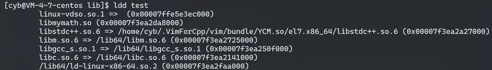

## **库概念**

我们在学习编程时，一定绕不过库的概念，我们从写第一段代码开始就在调用各种各样的库，如 C/C++ 标准库，STL 库，Python 的 numpy 库等等。

我们随便写的一个输出 hello world 程序也会用到很多库。我们可以使用 `ldd` 命令，查看一个可执行程序所用到的动态库：

<figure markdown="span">
  { width="850" }
</figure>

可以看有 `libstdc++.so.6` ，这就是 C++ 的标准库。


下面我们详细介绍一下库的概念、生成和使用，先写一个简单的加减数学库作为示例：

```cpp
// add.h
# pragma once
extern int add(int,int);
// -----------------------
// add.cpp
# include "add.h"
int add(int x,int y)
{
    return x + y;
}

```

```cpp
// sub.h
# pragma once
extern int sub(int,int);
// -----------------------
// sub.cpp
# include "sub.h"
int sub(int x,int y)
{
    return x - y;
}
```

将不同的功能采用分文件编写，得到上述四个文件，这样用户在将头文件包含后，就可以使用库的功能，但是这个库很简单，编译时间很短，如果是一个很庞大的库，用户在包含头文件后，每次都要编译整个库的源文件，那岂不是太费时了，所以我们不会直接将源码提供给用户，而是将源文件编译成目标文件打包给用户。

所以库是由两部分组成，一部分是库功能声明的头文件(`.h` 后缀)，方便其他模块的引用，一部分就是实现库功能的可执行程序。通过对可执行程序链接的方式不同，又可以将库分为两类：

- **静态库**：在使用静态库时，采用静态链接，会将编译产生的所以目标文件连同所用到的各种库合并形成一个可执行文件。这会使得可执行文件变得非常大，会占用更多的内存和磁盘空间。但是优点是稳定，即使静态库丢失，也不影响程序的运行。在 `Linux` 下静态库后缀为 `.a`，`Windows` 下后缀为 `.lib`。 

- **动态库**：使用动态库时，采用动态链接，只有当程序运行时，才会将动态库加载到内存，再由程序去使用，且多个程序可以共同使用内存中的动态库。这样不仅减小了可执行文件的体积，节省了内存和磁盘空间，也方便库的更新，这也是为什么现在编译器在链接时都是默认使用动态链接。但是当所需动态库丢失后，程序将不能运行。在 `Linux` 下静态库后缀为 `.so`，`Windows` 下后缀为 `.dll`。 

## **生成库**

### **生成静态库**

生成静态库时，我们使用编译器将源文件都编译为目标文件后，打包成静态库即可。

```shell
g++ -c [源文件列表]
```

在打包成静态库时，要使用 `ar` 命令：

```shell
ar -rc [静态库名] [目标文件列表]
```

ar 是 gnu 归档工具，除此之外的其他功能可以查看 `man` 手册。

这里要注意的是在 `Linux` 下，库的命名要以 `lib` 为前缀，动态库以 `.so` 为后缀，静态库以 `.a` 为后缀。

我们使用上述命令将上面写的数学库生成一下：

<figure markdown="span">
  { width="550" }
</figure>


### **生成动态库**

生成动态库使用的目标文件需要编译器向其中加一些其他信息，所以不能直接用 `-c` 生成，还要加上选项 `fPIC` 生成位置无关码，这里先知道怎么用，后文会详细介绍。

```shell
g++ -fPIC -c [源文件列表]
```

然后再使用编译器的 `shared` 选项将对应目标文件生成动态库，该选项就是告诉编译器，将要生成的是一个动态库，而非一般的可执行文件。

```shell
g++ -shared -o [动态库名] [目标文件列表]
```

我们可以将两步合为一步：

```shell
g++ -shared -fPIC -o [动态库名] [源文件列表]
```

使用上述命令创建一个动态库:

<figure markdown="span">
  { width="650" }
</figure>


## **使用库**

在使用官方库时，因为其头文件在系统的指定的目录下，编译器很容易找到，而且编译器会自动识别使用到的官方库，并去链接对应的库，所以我们在使用一些官方库时只需包含头文件即可。但是对于第三方库来说，就需要我们手动链接，并且要让程序能够找到头文件和库所在位置，那么我们就要知道编译器查找头文件和库的顺序。

### **编译器查找头文件和库的顺序**

使用 `gcc/g++` 编译 `C/C++` 程序时，会以一定的顺序搜索一些目录下的头文件和库，我们可以通过一些命令选项来指定搜索目录，来帮助我们找到需要的头文件和库。

#### **头文件查找顺序**

1. 先搜索当前目录(只有用 `""` 时才会搜索当前目录)。
2. 搜索 `-I` 选项指定的目录。
3. 然后找环境变量 `C_INCLUDE_PATH`，`CPLUS_INCLUDE_PATH`，`OBJC_INCLUDE_PATH` 指定的路径。
4. 再找内定目录: `/usr/include`，`/usr/local/include`。
5. 最后找gcc的一系列自带目录，如：`/usr/lib/gcc/x86_64-redhat-linux/4.8.5/include `。

#### **库查找顺序**

1. 搜索 `-L` 指定的路径。
2. 然后搜索环境变量 `LIBRARY_PATH` 指定的路径
3. 再找系统指定目录 `usr/lib64`，`usr/local/lib64`。


### **使用静态库**

对于静态库，我们只要在编译链接期间让编译器能找到对应库的对应文件即可，因为后续库会和用户代码合并到一个可执行文件中去，就不需要知道原本库的位置了。

以上面写的数学库为例，我们写下如下测试代码：

```cpp
# include <iostream>
# include <add.h>
# include <sub.h>
int main()
{
    std::cout << "call add: 1 + 1 = " << add(1,1) << std::endl;
    std::cout << "call sub: 1 - 1 = " << sub(1,1) << std::endl;
    return 0;
}
```

在编译时就要用 `-l` 选项指定我们链接的库，再采取上述的任意方式让编译器能找到头文件和库即可：

```shell
g++ -o test test.cpp -lmymath -I . -L .
```

`-I` 指定当前目录下查找头文件， `-L` 指定当前目录下查找库。这里要注意的是，`-l[库名]` ，这里的库名是去掉前缀和后缀的名字，并且要保证在库查找路径下不能出现同名动态库，因为编译器默认会使用动态链接来链接库，如果有动态库会忽略静态库。

程序正常运行：

<figure markdown="span">
  { width="650" }
</figure>

### **使用动态库**

使用动态库时，除了编译链接时要让编译器知道其路径外，在程序运行时也要让其能找到使用的库的位置。

我们使用和上面使用静态库相同的命令获得动态链接得到的可执行程序，注意要确保我们的动态库在编译器查找库的路径下，并且使用 `ldd` 命令查看其链接的动态库：

<figure markdown="span">
  { width="850" }
</figure>

可以看到我们自己写的库 `libmymath.so`。程序也可以正常运行。

这时如果把库移到上级目录，并且 `-L` 也指定上级目录，重新运行编译得到的程序，我们会发现运行不了了：

<figure markdown="span">
  { width="1050" }
</figure>


报错提示我们找不到 `libmymath.so` 这个动态库，但是我们编译的时候不是已经指定动态库的路径了嘛？这时因为刚刚指定的是编译链接时动态库的搜索路径，现在运行程序时同样要搜索动态库，运行时动态库搜索路径和增加搜索路径的方法如下：

- 当前目录下搜索。
- 编译目标代码时指定的动态库搜索路径；这是通过编译器的参数 `-Wl,-rpath=` 指定。当指定多个动态库搜索路径时，路径之间用冒号`:`分隔。
- 环境变量 `LD_LIBRARY_PATH` 指定的动态库搜索路径。
- 配置文件 `/etc/ld.so.conf` 中指定的动态库搜索路径。我们可以在 `/etc/ld.so.conf` 加入要增加搜索路径，也可也在 `/etc/ld.so.conf.d` 目录下新建一个 `.conf` 后缀的文件，在新建的文件中加入要增加的搜索路径，最后调用 `ldconfig` 命令加载配置即可。
- 默认的动态库搜索路径 `/usr/lib64`。将我们的动态库移到这些目录下即可。

所以我们想要运行时能找到动态库，使用上述任意一种方式都可以。 

## **位置无关码(PIC)**

在生成可执行文件的时候，会对代码进行编址，在这个过程中，会修正代码区函数指令间的跳转地址，让程序运行时能够移动到正确的指令位置，这个过程被叫做**重定位**。

而进行重定位的前提是：确定调用函数的地址。要确定一个函数的地址要么知道它的绝对位置，要么知道相对位置。对于我们自己程序的代码，都是在地址空间的代码区，我们是知道其绝对位置的，所以可以在编译时就完成重定位。

我们知道静态链接时，库中程序会和用户程序合并为一个可执行文件，所以在编译时就可以在该可执行文件内进行编址，并完成指令跳转的重定位。

但是对于动态链接来说，只有动态库在加载到内存中时，其地址才会真正确定，所以重定位会被推迟到程序运行的时候。此时重定位采用相对寻址的方式，在链接动态库时，记录调用库函数相对动态库首地址的偏移量，当动态库的首地址确定时，我们只需采用 **首地址 + 偏移量** 的方式就能马上确定库函数的绝对地址。而**我们在编译时 `-fPIC`  选项生成的位置无关码，就是这里的偏移量。**