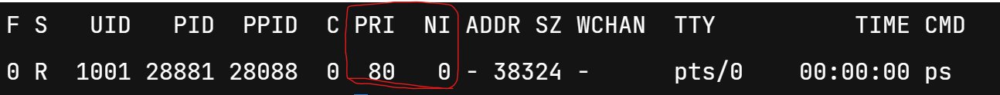
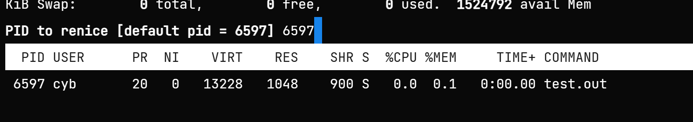
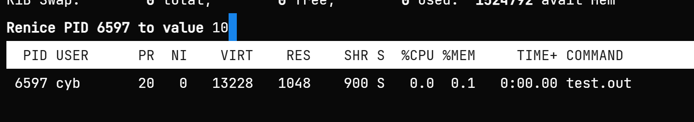
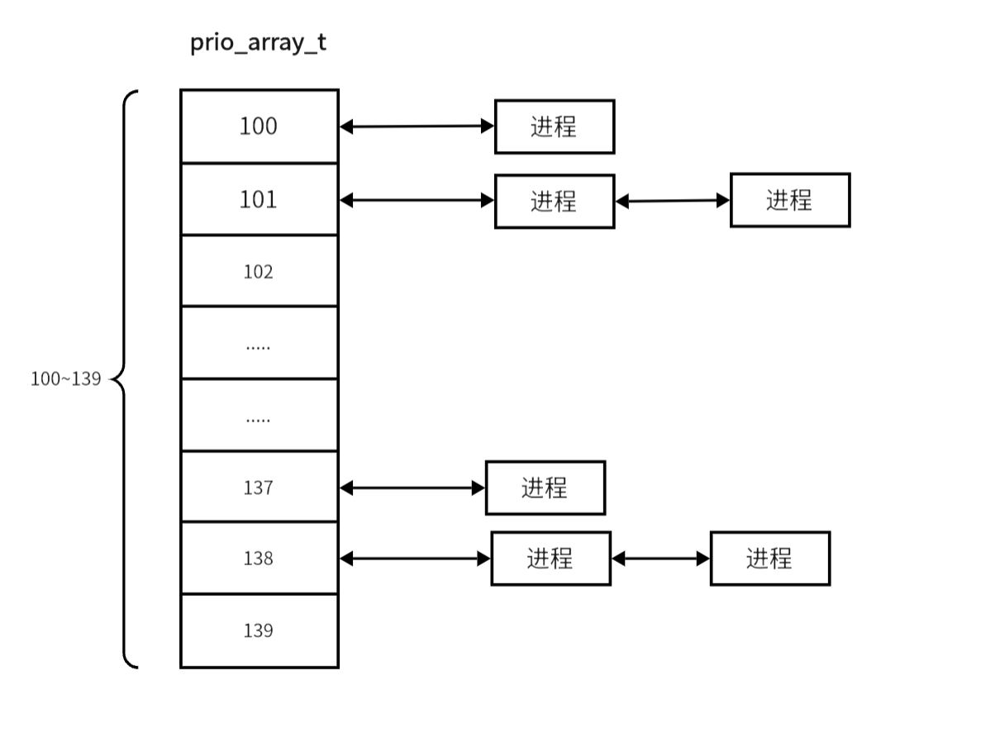

# 进程调度策略

一个系统的CPU资源一定是有限的，如单处理器系统，在同一时间内只能运行一个进程，这就导致不同进程之间存在竞争关系。那么如何合理分配每个进程所占用的资源，来使进程响应尽可能快，每个进程都可以公平的得到调度，是操作系统调度算法要实现的目标。


## **进程切换**

Linux 的调度基于分时技术，CPU的时间被分成 “片” ，每个可运行进程被分配一片。当进程对应的时间片结束或进程主动放弃CPU时，Linux 系统就会进行进程切换，CPU再推进的其他进程，这样的切换在操作系统中，每秒会进行成百上千次，最后给我们的感觉是所有的进程好像是同时推进运行的。

而进程切换的过程其实就是不断修改覆盖 CPU 寄存器的过程。当一个正在运行的进程要结束 CPU 调度时，对应进程就要把 CPU 中的寄存器数据都存储下来，新的进程直接把对应运行所需的数据直接覆盖到 CPU 对应的寄存器上，就完成了进程切换。

## **进程优先级**

而一个进程的时间片长短和占用CPU的先后，都是由**进程的优先级**决定的。

Linux 系统中的优先级分为**实时优先级**和**普通优先级**，普通优先级的范围是 $[100,139]$ 也就是 $40$ 个取值，对应优先级的值越小，优先级越高；实时优先级的范围是 $[0,99]$，实时优先级的值越大，其优先级越高，和普通优先级是相反的。下面我们只详细介绍普通优先级。

在 Linux 系统中进程优先级是动态的，会通过进程的行为周期性的进行改变，如进程的运行时间，休眠时间等。在较长时间没有被调度的进程的优先级会有所提高；而在CPU上运行较长时间的进程的优先级会有所降低。

所以一个进程的优先级分为**静态优先级**和**动态优先级**，正真用于调度算法的优先级是动态优先级。而静态优先级决定了进程的基本时间片，一个进程的静态优先级的值越小获得的时间片长度越长。

我们可以通过一系列手段来改变一个进程的静态优先级。本质上都是通过修改其 $nice$ 值来改变其静态优先级。

### **静态优先级**

#### **查看**

我们可以通过 $ps$ 命令加 $-la$ 参数来查看一个进程的优先级。

<figure markdown="span">
  { width="550" }
</figure>

<!-- <div align="center"></div> -->

这里的 $PRI$ 的范围是 $[-40,99]$ ，是从优先级范围 $[0,139]$ 转换而来的。

$PRI$默认是$80$，也就是普通优先级的 $120$ ，我们可以通过修改$NI$值来改变$PRI$的值。

$NI$的修改范围是$[-20,19]$，也就是说一个进程的$PRI$的范围是$[60,99]$，修改后的 $PRI$ 值就是 $PRI$ 的默认值（$80$）加上 $NI$ 的值。

#### **修改**

- **top 任务管理器**

我们可利用通过$top$命令来修改一个进程的$NI$值，来改变其优先级。

首先打开$top$任务管理器，按$r$，输入进程$pid$，输入要修改的$NI$值。
```
top -p [pid]
在任务管理器中显示对应进程的信息
```

<figure markdown="span">
  { width="550" }
</figure>

<figure markdown="span">
  { width="550" }
</figure>

<figure markdown="span">
  { width="550" }
</figure>

<!-- <div align="center"></div>

<div align="center"></div>

<div align="center"></div> -->

如果我们没有管理员权限的话，就只能将进程优先级降低，不能增加。

- **nice\ renice命令**

在启动时设定进程优先级

```
nice -n 要修改NI值 进程名
```

进程运行时修改进程优先级

```
renice -n 要修改NI值 进程pid
```

- **库函数**

```cpp
getpriority() // 获取进程静态优先级
setpriority() // 设置进程的静态优先级
```

### **动态优先级**

动态优先级是静态优先级用下面的公式计算得来的：

$$
动态优先级 = max(100,min(静态优先级-bonus+5,139))
$$

这里 $bonus$ 值大小取决于进程的休眠时间，范围是 $[1,10]$ ，休眠时间越长 $bonus$ 值越大。

也就是说一进程的动态优先级会随着其休眠时间的增加而升高。这样就实现了不同优先级的进程都尽可能公平的得到CPU的调度。


## **活动和过期队列**

理解了优先级，就要具体介绍 Linux 是如何利用优先级实现调度策略的。

首先一个 CPU 一定是有一个运行队列 runqueue ，用来记录等待调度的进程的各种信息，而 runqueue 中有两个指针字段 active 和 expired，它们的定义如下：

```cpp
prio_array_t*   active  // 活动进程队列
prio_array_t*   expired // 过期进程队列
```

它们指向两个指针数组，大小是 $140$ ，没错就是优先级的范围。这里我们只考虑普通优先级的话，就只会用到下标为 $[100,139]$ 的 $40$ 给指针，这每个指针都是一个双向链表头，每个链表代表一个进程优先级。结构如下：

<figure markdown="span">
  { width="750" }
</figure>

<!-- <div align="center"></div> -->

CPU每次只会调度活动队列中的进程，当将整个活动队列中进程的时间片都运行完成后，将活动队列的指针和过期队列的指针交换，也就是说现在的活动队列变为过期队列，刚才的过期队列变为活动队列。

在 CPU 调用活动队列时，时间片结束的进程或新的就绪状态的进程会被加入到过期队列中去。当然有一些情况下，时间片结束的进程还会被加入到活动队列中，如：一些实时进程，交互式进程。
