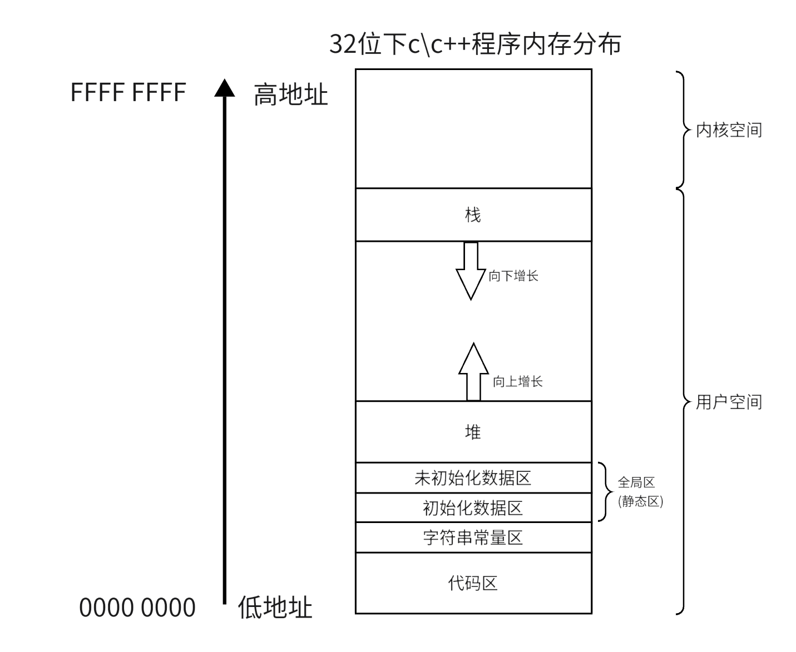
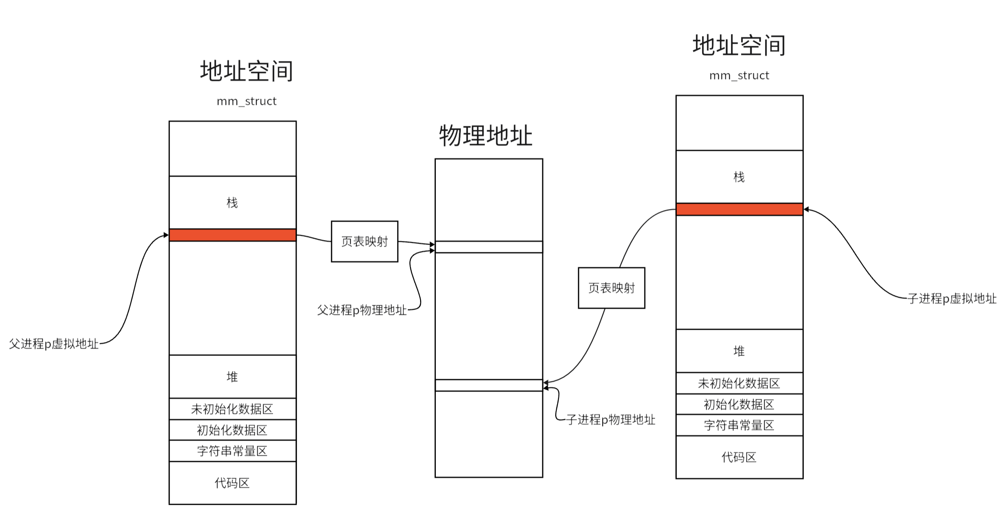

# 进程地址空间

## **虚拟地址**

在学习c\c++ 时，我们对下面的内存分布一定很熟悉：

<figure markdown="span">
  { width="550" }
</figure>

<!-- <div align="center"></div> -->

我们可以用程序检验一下上面的内存分布：

```cpp
#include <stdio.h>    
#include <stdlib.h>    
#include <unistd.h>    
int init_gval = 10;    
int unin_gval;    
int main()    
{    
    printf("code addr:%p\n",main);    
    const char* str = "Hello Linux!\n";    
    printf("str addr:%p\n",str);    
    printf("unin g addr:%p\n",&unin_gval);    
    printf("init g addr:%p\n",&init_gval);    
    void* heap_addr = malloc(10);    
    printf("heap addr:%p\n",heap_addr);    
    printf("stack addr:%p\n",&str);               
    return 0;    
}  
```
运行结果（这里使用的是64位的系统，所以地址会更大）：

<figure markdown="span">
  { width="450" }
</figure>

<!-- <div align="center"></div> -->

很明显可以看出，代码区地址最小，依次上升。是符合上面的程序内存分布的。

但事实上物理内存并不是这样的。用下面的代码来说明。

```cpp
// test.cpp    
#include <stdio.h>    
#include <stdlib.h>    
#include <unistd.h>    
int main()    
{    
    pid_t id = fork();    
    int p = 10;    
    if(id)    
    {    
        // 父进程    
        printf("address:%p\tval:%d\n",&p,p);    
    }    
    else    
    {    
        // 子进程    
        p = 20;    
        printf("address:%p\tval:%d\n",&p,p); 
    }    
    return 0;    
}
```
运行结果如下：

<figure markdown="span">
  { width="550" }
</figure>
<!-- 
<div align="center"></div> -->

我们会发现一个很奇怪的事，相同的地址，却有不同的值，而且我们学习进程创建时了解到，子进程修改变量时，会进行写时拷贝，地址应该和父进程的不同才对。但这里是相同的就说明这个输出的地址并不是一个物理地址，而是虚拟地址。

虚拟地址，顾名思义它不是数据在内存上的确切地址，而是操作系统提供给用户的一种抽象地址。用户是没办法看到物理地址的，物理地址由操作系统同一管理，并且负责物理地址与虚拟地址的相互转化。


## **进程的地址空间**

地址空间是指允许进程使用的全部线性地址组成，也就是一个进程所能使用的所有虚拟地址。对于 $32$ 位系统，指针的大小是 $4$ 字节，也就是说所能所索引的地址范围就是 $2^{32}$ ,也就是  $4GB$ 内存，所以在$32$位机器中，一般一个进程所能使用的最大内存就是 $4GB$（当然内核也会使用一部分虚拟地址，所以用户可使用的内存往往更小）。而对于 $64$ 位系统，地址空间要大得多。

对于每一个进程它都有一个属于它自己的地址空间（所以上面才会出现父子进程在相同虚拟地址上有不同的值），每个进程的地址空间单独管理着该进程所使用的地址。这些虚拟地址又通过各个进程的**页表**映射到对应的物理地址。在Linux中每个进程的地址空间由进程描述符（task_struct）中的一个mm_struct 结构体类进行管理。这样就很好的保证了进程间内存管理的独立性。

对于上面的程序，当子进程对变量 p 进行写入时，发生写时拷贝，操作系统便会在物理地址上重新开辟空间，但是它的虚拟地址并没有改变，所以才会输出相同的地址却有着不同的值。

<figure markdown="span">
  { width="900" }
</figure>

<!-- <div align="center"></div> -->

### **地址空间的意义**

通过地址空间来管理各个进程的内存使用，有很多好处：

- 操作系统在物理内存中开辟内存可能是随机无序的，通过地址空间来统一管理一个进程使用的物理，可以变无序为有序，让进程以一个连续的视角使用内存。

- 实现进程间的相互独立，每个进程都有独立的地址空间和页表。

- 存在虚拟地址，可以有效的进行进程访问内存的安全检查。在进行页表映射时会对访问地址的数据权限和进程对该地址的操作进行检查，保证只读数据不会被修改。

