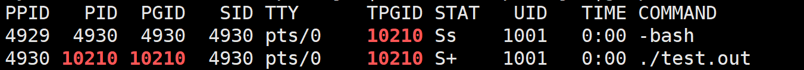

## **概念**

**定义：** 进程是程序的一个执行实例，是一个正在执行的程序。

**进程管理：** 在操作系统中，进程的一系列信息被封装到 **PCB(Process Control Block)** 中，操作系统就通过管理这些 PCB 来对进程进行管理。在 Linux 下 PCB 是一个被命名为 `task_struct` 的结构体。Linux 用 `task_struct` 来描述进程的各种状态、记录进程的各种信息。

`task_struct` 的基本内容：

- **PID(Process ID)**：用于标识进程，在操作系统中每个进程的 ID 都是不同的。
- 进程当前的状态：标识当前进程运行状态。
- 优先级：决定该进程被 CPU 调度的优先级。
- 程序计数器：程序中即将被执行的下一条指令的地址。
- 内存指针：包括程序代码和进程相关数据的指针，还有和其他进程共享的内存块的指针。
- ....

在 Linux 内核中会有进程队列，以链表的方式组织起来，来管理内存中的进程。所以在操作系统视角，**进程 就是 对应可执行程序 + 进程 PCB**。


## **查看进程信息**

## **查看进程**

<!-- **方法一：**
在Linux下我们可以访问根目录下的/proc文件夹，每当创建一个新的进程，都会在该目录下创建对应的文件夹，对应进程的文件夹里会有许多信息文件，我们先来认识两个。


**exe**就相当于Windows下的快捷方式，记录的是该进程可执行文件的路径。

**cwd**(current working director)就是该文件的工作目录，也就是文件操作时所说的当前目录，我们可以通过chdir()函数来改变一份代码的工作目录，其函数原型为：
```cpp
void chdir(const char* newdir)
```

**方法二：** -->

我们可以通过 `ps` 命令来直接查看进程。语法：

```
ps [选项]
```

常用选项：

-a：显示所有进程

-u: 显示详细信息

-x: 显示没有控制终端的进程


一般我们用 `ps -aux` 或 `ps -ajx` 来显示所有进程信息，并用行过滤 `grep` 快速获取目标进程的信息。

显示的信息的部分含义如下：
```
PID:进程 ID
PPID：父进程 ID
STAT：进程状态
%CPU：该进程的CPU占用率
%MEM: 该进程物理内存占用率
```

## **查看 PID**

获取进程的 PID 除了上面使用 `ps` 命令外，还可以程序中使用下述系统调用:

```cpp
#include <sys/types.h>
#include <unistd.h>
pid_t getpid(void);     // 获取当前进程 PID
pid_t getppid(void);    // 获取当前进程的父进程 PID
```


## **创建进程**

在Linux中创建一个进程的方式有两种：

- 启动一个可执行程序。
- 通过代码创建一个进程。

而一个进程一般都是通过父进程创建的。我们启动的可执行程序的父进程都是命令行解释器 -bash。

我们在命令行中运行下述程序，通过ps命令来查看对应进程。

```cpp
#include <stdio.h>    
#include <sys/types.h>    
#include <unistd.h>    
int main()    
{    
    while(1)    
    {    
        printf("my pid is :%d\n",getpid());     
        sleep(2);    
    }       
    return 0;    
}  
```

我们可以使用行过滤命令grep在进程列表中查找对应pid找到对应进程，如下

<figure markdown="span">
  { width="750" }
</figure>

<!-- <div align="center"></div> -->

这个我们创建的test.out的进程ppid就是-bash外壳程序的pid，证明该程序是-bash的子进程。


### **代码创建进程**

用代码创建进程就要使用库函数fork()，它在头文件 <unistd.h\> 中。

fork()函数会创建一个子进程，如果成功创建，会在父进程中返回子进程的pid，在子进程中返回0；如果创建失败，会返回-1。

所以在fork()后一般要加一个判断，来区分父子进程，来完成不同的任务。下面是fork使用的一般代码。


```cpp
pid_t  id =  fork();  
if (id < 0)return 1;  
else if (id == 0)  
{  
    // 子进程代码  
}  
else                                           
{                   
    // 父进程代码 
}
```

那么fork是怎么为我们创建的子进程呢？

首先我们在fork函数执行前，父进程的可执行程序已经加载到内存中，并且创建了对应的task_struct，来维护这个内存空间。

fork函数所做的就是，以父进程的task_struct为模板，创建子进程的task_struct，其中内存指针，程序计数器等都是相同的。这也就解释了为什么子进程会和父进程一起从fork函数后开始运行。

并且它们是共享数据和代码的，也就是说子进程不会再重新拷贝一份代码和数据到内存中。

但是如果数据是共享的，那 `id` 会在父子进程中有不同的值呢？这里操作系统是用写时拷贝来实现的，就是当子进程对某个与父进程共享的变量进行写入时，操作系统就会重新开辟一片空间，将对应变量值拷贝过去，让子进程去修改拷贝出的变量，从而实现父子进程的数据不互相干扰。