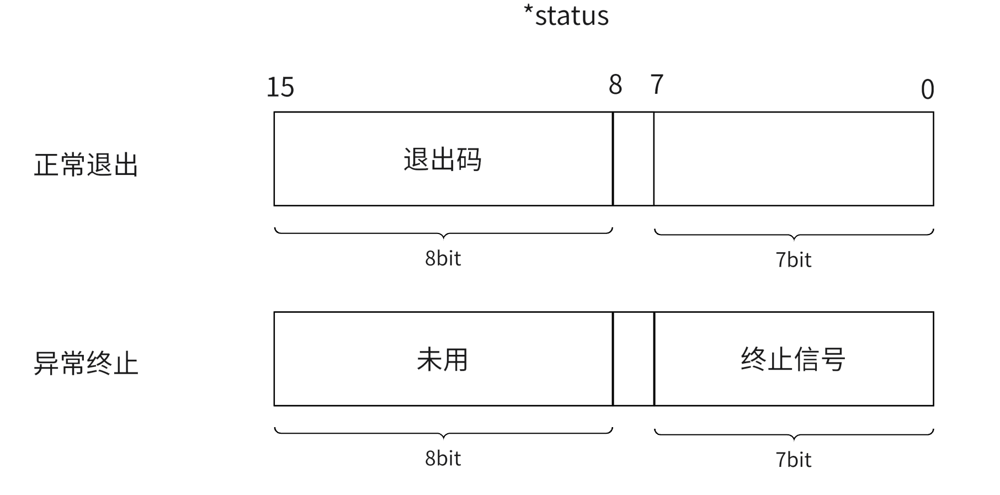

## **进程创建 — fork 函数**

fork函数前面已经见过，这里就简短说。

我们使用 fork 函数来创建一个子进程

```cpp
#include <unistd.h>
pid_t fork(void);
```

当创建成功时，为父进程返回子进程的 pid，为子进程返回 $0$ ，如果失败则会返回 $-1$，fork 函数通常不会失败，但当系统中进程太多或创建的进程数超过限制，就会导致创建子进程失败。

fork 函数被调用后会做以下这些事，也就是创建进程要做的：

- 分配新的内核数据结构（进程描述符等）和内存块。
- 将父进程的部分内核数据结构的内容拷贝给子进程。
- 将子进程假如进程队列中。
- fork返回，开始调度器调度

fork 函数后的代码会被父子进程都执行，因为子进程会和父进程共享代码，并且子进程的 eip （程序计数器，记录CPU下一个需要执行的指令）是从父进程拷贝而来，所以不会从头重新执行程序。


### **线程安全问题**

系统调用 `fork` 并不是线程安全的。在多线程程序中调用 `fork` 时，只会复制调用 `fork` 的线程，而其他线程不会被复制，这回导致很多麻烦的问题：

如果父进程中的其他线程持有锁，调用 `fork` 后，这些锁可能会在子进程中被保持住，但这些锁不会被其他线程释放（因为其他线程没有被复制）。这可能会导致死锁。

许多内存分配器使用锁来管理内部状态。如果 `fork` 后在子进程中调用 `malloc` 等函数，可能会导致内存分配器状态不一致，导致崩溃或未定义行为。

要解决这些问题，可以结合使用 `fork` 和 `exec` 系统调用，但是在调用 `exec` 之前只能调用 async-signal-safe functions。

通常是在 `fork` 后立即调用 `exec` 系列函数之一，以执行新的程序。这种方法可以避免大多数线程相关的问题，因为 `exec` 会用新的程序映像替换当前的进程映像，不会继承父进程的线程状态和锁。

## **进程终止 — exit 函数**

一般情况下进程终止时会有几种情况：

- 代码运行完成，结果正确。
- 代码运行完成，结果错误。
- 代码异常终止。

进程正常退出有以下几种方式：

- 从main函数return
- 调用exit函数
- 调用_exit函数

异常退出一般是信号终止。

对于一个进程正常终止的进程，它会返回它的退出码，来表示该进程的运行情况，可以通过在命令行上输入 `echo $?` 来查看上一个进程退出时返回的退出码。

### **exit 函数和 _exit 函数**

下面是这两个函数的函数原型：

```cpp
#include <unistd.h>
void _exit(int status);
void exit(int status);
```

这里传入的 status 就是结束后返回给父进程的退出码。这里exit是一个库函数，而_exit是一个系统调用。

_exit只会结束程序。exit是对 _exit 的一个封装，除了结束程序外还会进行一些清理和缓冲区的刷新，关闭流等操作。

### **return 退出**

在main函数中使用return n这样的语句，就相当于调用 exit(n)。但是在其他函数中使用return只会结束函数。而exit在任何地方调用都会直接结束程序。


## **进程等待 — wait 和 waitpid 函数**

我们在子进程退出时，会进入僵尸状态，等待父进程读取其退出信息，如果父进程一直不读取就会造成“僵尸进程”的问题，导致内存泄漏。

父进程通过进程等待的方式，获取子进程的退出信息，并回收子进程的资源。

父进程会通过 wait 或 waitpid 两个函数进行进程等待。

### **wait 函数**

```cpp
#include <sys/type.h>
#include <sys/wait.h>
pid_t wait(int* status);
```

当等待成功时 wait 返回被等待子进程的pid，失败时返回 -1。wait 函数是一种阻塞等待，即当子进程没有等待成功时，父进程会一直卡在阻塞状态直到子进程等待成功。并且 wait 函数会等待所以的子进程，只要有一个子进程等待成功就会结束阻塞状态。

status 是一种输出型参数，等待成功时会将子进程的退出信息通过该变量返回，如果不关心退出信息可以将值设置为 NULL。

<figure markdown="span">
  { width="600" }
</figure>

<!-- <div align="center"></div> -->

这里 status 只用到 int 的低 16bit ，如果时异常终止的，低 7 比特位就会存放终止信号。如果是正常终止的在高的 8bit 位来存放退出码。所以当我们要获取这两个值时要进行一些位运算：

```cpp
int status
wait(&status);
int exit_code = (status >> 8) & (0xff)  // 获取退出码
int exit_signal = status & (0x7f)       // 获取终止信号
```

系统还给我们提供了几个相关的宏：

```cpp
WIFEXITED(status)   // 判断进程是否正常结束，如果是返回为真
WEXITSTATUS(status) // 如果子进程正常结束，返回子进程退出码

WIFSIGNALED(status) // 判断进程是否异常结束，如果是返回真
WTERMSIG(status)    // 如果是异常结束，返回终止信号
```

### **waitpid 函数**

```cpp
#include <sys/type.h>
#include <sys/wait.h>
pid_t waitpid(pid_t pid,int* status,int options);
```

waitpid 函数可以指定等待的子进程，只需将对应进程的 pid 传给第一个参数即可，当将该参数设为 -1 时，它就会和 wait 函数一样等待任意一个子进程。第二个参数和 wait 函数同理。

第三个参数提供了无阻塞的等待方式，当我们将宏 WNOHANG 传入时，waipid 就会采用无阻塞等待，当没有子进程退出时，会直接结束函数。当然当我们将该值赋为 0 时，waitpid 会和 wait 一样采用阻塞式等待。

waitpid 的返回值有两种情况：

- 阻塞式等待和 wait 函数相同

- 非阻塞式等待时，当等待成功时返回被等待的子进程 pid ，如果没有退出的子进程时返回 0，如果调用时出现错误返回-1。


## **进程程序替换 - exec 类函数**

### **替换原理**

我们使用 fork 函数创建的子进程是和父进程共用的同一份代码，当我们想要执行一些不一样的代码时，就可以调用一种 exec 函数，来进行进程程序的替换，它会为重新加载我们指定的代码和数据，重新开始执行另一个程序，这个程序不一定时c\c++ 程序，其他任何编程语言都可以。

但是需要注意的是，exec 函数不会创建新的进程，只是对子进程的进程描述符进行修改，将该进程的代码和数据替换成新的。

### **替换函数**

exec 不是一个函数，而是一类函数，如下：

```cpp
#include <unistd.h>
// 库函数
int execl(const char* path,const char* arg,...);
int execlp(const char *file, const char *arg, ...);
int execle(const char *path,const char* arg,...,char* const envp[]);
int execv(const char *path,char* const argv[]);
int execvp(const char* file,char* const argv[]);

// 系统调用
int execve(const char* path,char* const argv[],char* const envp[]);
```

exec 函数有不同的后缀，这些后去区别了这些函数的调用方法：

- l(list) 以参数列表的形式，将命令行参数一一传入。
- v(vector) 以数组的形式将命令行参数一一传入。

无论是以参数形式还是数组形式都要以 NULL 为结尾。

- e(env) 传入自定义的环境变量，其他都是默认传入当前的环境变量。
- p(path) 自动从环境变量 PATH 中搜索对应程序，不需要写绝对路径。

调用 exec 函数成功时，会加载新的程序，并从新程序开始重新执行，不再返回。当执行失败时会返会 -1。
