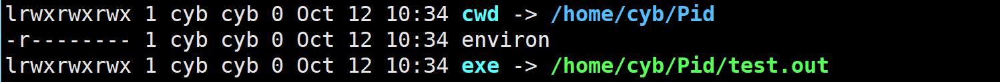

# 进程状态


<strong>定义:</strong>程序的一个执行实例，是一个正在执行的程序。

<strong>进程管理:</strong>在操作系统中，进程的一系列信息被封装到**PCB**(Process Control Block)中，操作系统就通过管理这些PCB来对进程进行管理。

在Linux下PCB就是被命名为task_struct的结构体。Linux用task_struct来描述进程的各种状态、记录进程的各种信息。

task_struct的基本内容：

- 进程id、父进程id
- 状态：任务状态
- 优先级：相对于其他进程的优先级
- 程序计数器：程序中即将被执行的下一条指令的地址
- 内存指针：包括程序代码和进程相关数据的指针，还有和其他进程共享的内存块的指针
- 上下文数据
- I/O状态信息


## **查看进程**

**方法一：**
在Linux下我们可以访问根目录下的/proc文件夹，每当创建一个新的进程，都会在该目录下创建对应的文件夹，对应进程的文件夹里会有许多信息文件，我们先来认识两个。



**exe**就相当于Windows下的快捷方式，记录的是该进程可执行文件的路径。

**cwd**(current working director)就是该文件的工作目录，也就是文件操作时所说的当前目录，我们可以通过chdir()函数来改变一份代码的工作目录，其函数原型为：
```cpp
void chdir(const char* newdir)
```

**方法二：**

访问文件的方式还是太繁琐了，还需要我们输入文件路径，我们可以通过ps命令来直接查看进程。
语法：

ps [选项]

常用选项：<br>
-a：显示所有进程<br>
-u: 显示详细信息<br>
-x: 显示没有控制终端的进程<br>

一般我们用 ps -aux 或 ps -ajx 来显示所有进程信息

显示的信息的含义如下：
```
PID:进程ID
PPID：父进程ID
STAT：进程状态
%CPU：该进程的CPU占用率
%MEM: 该进程物理内存占用率
```

## **创建进程**

因为进程 = 可执行程序 + PCB，所以对于操作系统创建一个进程的本质其实就是，向内存申请空间，将程序的可执行程序加载到内存中，并创建其PCB，并将它的PCB加到进程列表中。


在Linux中创建一个进程的方式有两种
- 启动一个可执行程序
- 通过代码创建一个进程

而一个进程一般都是通过父进程创建的。我们启动的可执行程序的父进程都是命令行解释器-bash。

为了验证上面的结论，我们可以通过系统函数getpid()，getppid()获取一个进程的pid和父进程的pid。

这两个函数在头文件 <sys/types.h\> 和 <unistd.h\> 中

我们在命令行中运行该程序，通过ps命令来查看对应进程。

```cpp
#include <stdio.h>    
#include <sys/types.h>    
#include <unistd.h>    
int main()    
{    
    while(1)    
    {    
        printf("my pid is :%d\n",getpid());                                         
        sleep(2);    
    }       
    return 0;    
}  
```

我们可以使用行过滤命令grep在进程列表中查找对应pid找到对应进程，如下

<figure markdown="span">
  { width="750" }
</figure>

<!-- <div align="center"></div> -->

这个我们创建的test.out的进程ppid就是-bash外壳程序的pid，证明该程序是-bash的子进程。


### **代码创建进程**

用代码创建进程就要使用库函数fork()，它在头文件 <unistd.h\> 中。

fork()函数会创建一个子进程，如果成功创建，会在父进程中返回子进程的pid，在子进程中返回0；如果创建失败，会返回-1。

所以在fork()后一般要加一个判断，来区分父子进程，来完成不同的任务。下面是fork使用的一般代码。


```cpp
pid_t  id =  fork();  
if (id < 0)return 1;  
else if (id == 0)  
{  
    // 子进程代码  
}  
else                                           
{                   
    // 父进程代码 
}
```

那么fork是怎么为我们创建的子进程呢？

首先我们在fork函数执行前，父进程的可执行程序已经加载到内存中，并且创建了对应的task_struct，来维护这个内存空间。

fork函数所做的就是，以父进程的task_struct为模板，创建子进程的task_struct，其中内存指针，程序计数器等都是相同的。这也就解释了为什么子进程会和父进程一起从fork函数后开始运行。

并且它们是共享数据和代码的，也就是说子进程不会再重新拷贝一份代码和数据到内存中。

但是如果数据是共享的，那id会在父子进程中有不同的值呢？这里操作系统是用写时拷贝来实现的，就是当子进程对某个变量进行写入时，操作系统就会对该变量进行拷贝，从而实现父子进程的数据不互相干扰。

## **进程状态**

### **操作系统进程**

再操作系统的概念中，进程状态可以分成一下几类：

<figure markdown="span">
  { width="750" }
</figure>

<!-- <div align="center"></div> -->

- **创建**：进程创建时申请一个空白PCB，向其填写控制和管理进程的信息，完成资源分配。
- **就绪**：进程已经准备好，已分配到所需资源，只要分配到CPU就能立即运行。即在CPU的运行队列中的进程。
- **执行**：进程处于就绪状态被调度后，进程进入执行状态。
- **阻塞**：正在执行的进程遇到某些事件（I/O请求等）而暂时无法运行，进程受到阻塞。在满足请求时进入就绪状态等待系统调用。
- **终止**：进程结束，或出现错误，或被系统终止，进入终止状态。无法再执行。

除此之外还有一种**挂起**状态，这种状态一般出现在操作系统负载很高，内存资源很紧张的时候，这时操作系统会将一些进程的数据和代码从内存移动到磁盘的 swap 分区里，当CPU调度该进程时，再将代码和数据换回到内存中，这样虽然可以降低内存的压力，但是速度会很慢，因为会和磁盘进行IO，效率很低。


进程的状态大致可以分为以上几类，在不同操作系统中的具体实现时，会有更多细分。

### **Linux进程状态**

下面是Linux实现时设置的进程状态：

```c
/*
 * The task state array is a strange "bitmap" of
 * reasons to sleep. Thus "running" is zero, and
 * you can test for combinations of others with
 * simple bit tests.
 */
static const char *task_state_array[] = {
	"R (running)",		/*  0 */
	"S (sleeping)",		/*  1 */
	"D (disk sleep)",	/*  2 */
	"T (stopped)",		/*  4 */
	"t (tracing stop)",	/*  8 */
	"Z (zombie)",		/* 16 */
	"X (dead)"		/* 32 */
};
```

- **R**:运行状态，这里的运行状态不是操作系统概念中的运行状态，而是在CPU运行队列中进程的状态。
- **S**：休眠状态，就是阻塞状态，此时进程在某个外设或其他进程的等待队列中。
- **D**：磁盘睡眠状态，也叫不可中断式睡眠状态，在这个状态的进程不能被杀死，操作系统也不能。
- **T**：停止状态。这个被暂停的进程可以通过发送 SIGCONT 信号让进程继续运行。
- **t**：追踪停止状态。GDB调试的进程会是这样的状态。
- **X**：这个这个状态只是一个返回状态，你不会在任务列表里看到这个状态。
- **Z**：僵尸进程，父进程还未读取该进程的进程退出状态时，该进程进入Z状态。

下面对上面的进程状态进程详细介绍。

首先是R状态，这个很容易理解，就是在CPU运行队列中准备被CPU调度的进程，就是就绪状态和运行状态的合体。

我们以下面的代码做演示

```cpp
#include <stdio.h>    
#include<sys/types.h>    
#include<unistd.h>    
int main()    
{    
    while(1)    
    {    
        printf("My pid is :%d\n",getpid());    
    }    
    return 0;    
}  
```

并且用下述Xshell脚本指令，监视对应进程的情况
```
while :; do ps ajx |head -1 && ps ajx |grep test.out |grep -v grep;sleep 1;echo ----------------------;done
```
我们可以看到如下进程信息

<figure markdown="span">
  { width="550" }
</figure>

<!-- <div align="center"></div> -->

我们发现一直在命令行输出的进程test.out，为什么状态却是S睡眠状态。

原因就是CPU对进程调度的速度是很快的，轮到test.out进程运行一瞬间就完成了对应指令，然后该进程就被加入到了对显示器进行IO请求的等待队列中，所以我们会一直看道它是在S睡眠状态。如果运气好是可以观察到该进程在R状态的。但是出现的概率很小。

如果我们想一直看到一个进程实在R状态，可以写下面代码

```cpp
#include <stdio.h>     
int main()    
{    
    while(1);  
    return 0;    
}  
```

进程没有对其他外设都没有请求，所以不会到其他外设硬件的等待队列中，进程也就会一直在CPU运行队列中。

<figure markdown="span">
  { width="550" }
</figure>

<!-- <div align="center"></div> -->

还有一个问题这个S和R后面的+是什么，这个+是指这个进程是一个前台进程，如果是后台进程就没有+。


之后是D状态。对于这个状态，我们首先要知道一件事情，操作系统在负载很大，资源很紧张时是会杀死一部分处于S状态的进程的。但是万一有一些进程在等待磁盘的IO响应，并且进行操作的数据非常重要，如果这时操作系统将该进程杀死会造成很严重的后果。所以要有D状态，防止操作系统杀死一些重要的进程。

这种状态不容易模拟出来，因为出现这种状态时，计算机负载就已经很大了，这时计算机离崩溃也就不远了。

T需要使用命令`kill -19 [进程pid]`来暂停进程。

<figure markdown="span">
  { width="550" }
</figure>

<!-- <div align="center"></div> -->

t就是在gdb调试时进程的状态，这里就不做演示了。

### **僵尸进程**

最后来到Z状态，处于该状态的进程被称为僵尸进程。

在介绍僵尸进程时，我们首先要明确一件事，我们创建一个进程，一定是要让这个进程为我们完成一定的事情，那么在这个进程运行结束后，我们一定想知道这个进程完没完成我们交代给它的任务，或者说完成的怎么样。所以一个进程在退出时，要有一些退出信息，表明自己任务完成的怎么样。

而这些退出信息会被操作系统写入到该进程的进程PCB中，所以在该进程终止时，他的数据和代码会被释放，但是进程PCB依然会被操作系统维护，直到其退出信息被父进程读取后，才将其PCB释放。

下面时Linux内核源码中task_structo的几个字段，其中的exit_code就是退出信息，一般c/c++程序main函数的返回值会被存储到这个变量中。

```cpp
/* task state */
	struct linux_binfmt *binfmt;
	int exit_code, exit_signal;
	int pdeath_signal;  /*  The signal sent when the parent dies  */
	/* ??? */
```

我们可以用以下代码简单模拟一下僵尸进程。

```cpp
//test.cpp
#include <stdio.h>  
#include<sys/types.h>  
#include<unistd.h>  
#include <stdlib.h>  
int main()  
{  
    int id = fork();
    if(id == 0){                               
        // 子进程          
        int cnt = 5;      
        while(cnt--){                          
            printf("I am son,my id:%d\n",getpid());  
            sleep(1); 
        }             
        exit(0);       
    }else { 
        while(1){            
            printf("I am father,my id:%d\n",getpid()); 
            sleep(1);
        }  
    } 
    return 0
}  
```
使用上文的脚本对该进程进行监视

```
while : ;do ps ajx | head -1 && ps ajx | grep test.out | grep -v grep ;echo -------------------------------;sleep 1;done
```

监视结果如下

<figure markdown="span">
  { width="550" }
</figure>

<!-- <div align="center"></div> -->

我们可以看道当子进程退出后进程状态就变成了Z，变成了僵尸进程，后面也多了一个修饰< defunct >，就是失效的意思，表面该进程以死，但是其进程PCB还在被操作系统维护。


**僵尸进程危害**：僵尸进程的的PCB，在其退出信息未被读取时，会一直存在。如果一个进程创建了很多子进程，而不读取它们的退出信息，操作系统就会维护大量死亡的进程的PCB，导致内存泄漏。

### 孤儿进程

到这里还有一个疑问，一个进程的退出信息要被其父进程读取后，它的PCB才会被操作系统回收，那如果一个进程的父进程先结束怎么办。而这样的进程被我们叫做孤儿进程。

而孤儿进程的父进程会被修改为1号进程，这个一号进程其实就是操作系统。

我们用下面的代码测试。

```cpp
#include <stdio.h>    
#include<sys/types.h>    
#include<unistd.h>    
#include <stdlib.h>    
int main()    
{          
    int id = fork();    
    if(id == 0){    
        // 子进程    
        while(1){    
            printf("I am son,my id:%d\n",getpid());    
            sleep(1);    
        }    
    }else {    
        int cnt = 5;    
        while(cnt--){    
            printf("I am father,my id:%d\n",getpid());    
            sleep(1);    
        }    
        exit(0);                                                                  
    }                                                           
    return 0;                                                   
}  
```

<figure markdown="span">
  { width="550" }
</figure>

<!-- <div align="center"></div> -->

我们可以看道当子进程的父进程结束时，子进程的ppid就变为了1，也就是操作系统，同时这个子进程被改为了后台进程。


>退出后台进程需要依靠kill指令
> ```
> kill -9 [pid]
> ```


