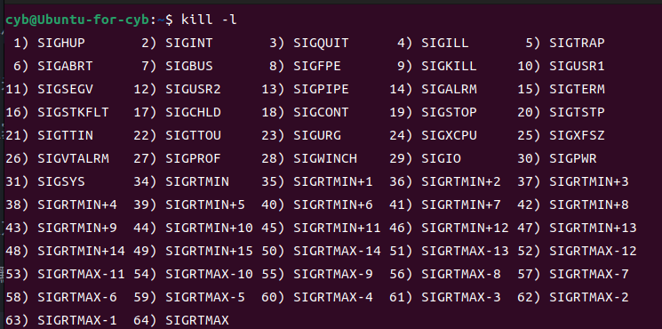

## **定义**

信号的定义：信号是 Linux 操作系统中用于进程间通信、处理异常等情况的一种机制。它是由操作系统向一个进程或者线程发送的一种异步通知，用于通知该进程或线程某种事件已经发生，需要做出相应的处理。

在 Linux 中，信号被分类为标准信号和实时信号，每个信号都有一个唯一的编号。标准信号是最基本的信号类型，由整数编号表示，编号范围是 1 到 31。实时信号是 Linux 中的扩展信号类型，由整数编号表示，编号范围是 32 到 64。

我们可以使用 `kiil -l` 指令来查看所有信号及其编号。

<figure markdown="span">
  { width="550" }
</figure>

## **产生信号**

### **按键**

比如上面的ctrl + c 就给前台进程发送了 2 号信号 SIGINT。而 ctrl + \ 可以给进程发送3号信号 SIGQUIT。

### **系统调用**

使用 `kill` 函数，向指定进程发送指定信号。

```cpp
#include <sys/types.h>
#include <signal.h>

int kill(pid_t pid, int sig);
```

使用 `raise` 函数，向当前进程或线程发送指定信号。

```cpp
#include <signal.h>

int raise(int sig);
```

使用 `abort` 函数，向当前进程发送 6 号信号，使其异常终止。

```cpp
#include <stdlib.h>

void abort(void);
```

`abort` 函数一定会终止程序，不管有没有重新捕捉 6 号信号的处理函数，重新捕捉后，依然会退出进程。


### **软件条件**

在匿名管道中，当读进程关闭时，写进程会收到系统发来的 13 号信号 SIGPIPE，终止写进程。系统发给写进程的 13 号信号就是软件条件生成的信号。

当子进程退出时会向父进程发出 SIGCHLD(14) 号信号，当父进程忽略该信号时，子进程退出会自动被操作系统回收，不会出现僵尸进程。                                                                                                   

同时我们可以使用 `alarm` 函数，定时的给当前进程发送 SIGALRM 信号。

```cpp
#include <unistd.h>

unsigned int alarm(unsigned int seconds);
```

在 `seconds` 秒后向当前进程发送 14 号信号，如果在次之前调用 `alarm(0)` ，会取消尚未完成的闹钟，并返回当上一个闹钟剩余的时间。

### **硬件异常**

硬件异常产生信号就是硬件发现进程的某种异常，而硬件是被操作系统管理。硬件会将异常通知给系统，系统就会向当前进程发送适当的信号。

如：野指针，除 0 等。

## **处理信号**

这里补充一些名词概念：

- 实际执行信号的处理动作叫信号**递达**

- 信号从产生到递达之间的状态叫信号**未决**

- 一个进程可以自己选择阻塞某个信号

- 被阻塞的信号，产生号就保持在未决状态，直到进程解除阻塞，才会进行递达操作。

- 注意：阻塞和忽略信号不同，阻塞信号，信号处于未决状态，并不是递达信号。忽略，是在递达信号。

### **信号处理**

处理信号有三种方式：1.使用默认方法；2.忽略此信号；3.自定义捕捉。

对于系统定义的普通函数，进程有默认的处理函数，在接收到信号以后会自动调用该处理函数。当然我们也可以自己重新定义这些信号的处理函数，通过 `signal` 函数来重定义处理函数，这被称作注册自定义处理函数。

```cpp
#include <signal.h>
typedef void (*sighandler_t)(int);
sighandler_t signal(int signum, sighandler_t handler);
```

将 `signum` 信号的处理函数绑定为 `handler` 函数。但是一些信号的处理函数是无法被自定义的，如：`SIGKILL(9)`。

操作系统还提供了 `sigaction` 函数，用于设置信号处理器。

```cpp
#include <signal.h>

// 成功返回 0,失败返回 -1，signum 要设置的信号，act 新的信号处理器，oldact 输出型参数，返回旧的信号处理器
int sigaction(int signum, const struct sigaction *act,struct sigaction *oldact);
struct sigaction {
    void     (*sa_handler)(int);  // 信号处理函数
    void     (*sa_sigaction)(int, siginfo_t *, void *); // 与实时信号有关
    // 之前有说到过当在处理一个信号的自定义函数时，这个信号会被系统阻塞，
    // 直到处理完。如果还想阻塞其它的信号，可以设置sa_mask。
    sigset_t   sa_mask;    
     
    int        sa_flags;
    void     (*sa_restorer)(void);
};
```

要注意的是处理函数并不是在接受到信号就立即执行的，而是在一个合适的时间将接收到的信号统一执行。所以会在进程 PCB 中要存储接受到的信号，用到两个位图：未决位图（pending bitmap）和阻塞位图（block bitmap），用于记录还未处理的信号和进程主动阻塞的信号，还有一个中断向量表，用于记录进程处理对应信号和函数指针，默认的处理函数是 `SIG_DEF`，忽略信号的函数是 `SIG_IGN`。

信号被称为**软中断**，事实上，还是没有真正的硬件中断那样能随时改变 cpu 的执行流，硬件中断之所以能一发生就得到处理是因为处理器在每个指令周期的结尾都会去检查中断，这种粒度是很细的，但是信号的实现只是在进程的 `task_struct` 里面有一个成员用于标识当前收到了哪些信号？而这个成员的检查显然只能在特定时间点：**从内核模式返回到用户模式的时候**，当进程从一个硬件中断中返回、从系统调用中返回或者正在休眠或者刚刚得到了调度，都会从内核态返回用户态，此时就会进行一次统一的信号处理。

要注意的是如果处理函数是用户自定的， OS 会在执行处理函数时转换为用户态，处理结束后再转为内核态，再跳回用户中断位置，并再次转为用户态。在这个过程中处理信号的阻塞位图会被改为 1 ，所以每个信号一次处理只会处理一次。


### **core dump**

dump core （核心转储），对于一些异常终止的进程，系统会将其终止信息存储到磁盘上。 会将终止时的内存 image 存到磁盘上，可以通过 debugger 工具来查看终止原因。如：

```cpp
gdb [异常终止的可执行程序] [core dump file]
```

这些信息会被存在 core dump file 中，该文件的大小是有限制的，我们可以使用 `ulimit -a` 指令来查看，使用 `ulimit -c [大小]`，可以修改该文件的大小。

## **信号集操作**

### **信号集（sigset_t）**

`sigset_t` 是操作系统提供的一个位图结构体，用来实现信号的未决和阻塞位图，也可以说 `sigset_t` 就是信号集。操作系统提供了一系列接口来操作信号集：

```cpp
#include <signal.h>

int sigemptyset(sigset_t *set); // 全置 0

int sigfillset(sigset_t *set);  // 全置 1

int sigaddset(sigset_t *set, int signum);   // 将信号 signum 对应位置 1

int sigdelset(sigset_t *set, int signum);   // 将信号 signum 对应位置 0

int sigismember(const sigset_t *set, int signum);   // 判断信号是否存在。
```

上面4个的返回值都是成功返回 1 ，失败返回 0 。
 

### **修改进程阻塞位图**

使用函数 `sigprocmask` 修改进程的阻塞位图。

```cpp
#include <signal.h>
int sigprocmask(int how, const sigset_t *set, sigset_t *oldset);
```

how 有三种取值：

- SIG_BLOCK:将 set 中阻塞的信号加入到进程阻塞位图中。
- SIG_UNBLOCK:将 set 中阻塞的信号从进程阻塞位图中去除。
- SIG_SETMASK: 将进程阻塞位图设置为 set。
 
如果 set 置为 nullptr 的话，会将当前阻塞位图从 oldset 参数中输出。

set：配合修改进程阻塞位图。

old：旧的进程阻塞位图。

返回值：成功返回 0，失败返回 -1。


### **获得进程未决位图**

```cpp
#include <signal.h>

int sigpending(sigset_t *set);
```

set 是输出型参数，输出当前进程的未决位图。

??? code "实验"
    ```cpp
    // 实验内容：
    // 先对信号 2 进行阻塞，在给当前进程发送 2 号信号，再解除对 2 号信号的阻塞，观察未决位图的变化。
    // 观察信号 2 的捕捉和处理过程。
    #include <iostream>
    #include <unistd.h>
    #include <sys/signal.h>
    #include <signal.h>
    #include <sys/types.h>
    using namespace std;

    void print(sigset_t* set)
    {
        for(int i = 1;i <= 31;++i)
        {
            if(sigismember(set,i)) cout << "1";
            else cout << "0";
        }
        cout << endl;
    }

    void handle_SIGALRM(int signum)
    {
        sigset_t set,oldset;
        sigemptyset(&set);
        sigaddset(&set,SIGINT);
        cout << "解除对 SIGINT 的阻塞" << endl;
        sigprocmask(SIG_UNBLOCK,&set,&oldset);
    }


    int main()
    {
        sigset_t set,oldset;
        signal(SIGALRM,handle_SIGALRM);
        // 忽略 2 号信号，防止进程退出
        signal(SIGINT,SIG_IGN);
        sigemptyset(&set);

        // 定时解除对信号 2 的阻塞
        alarm(10);

        // 阻塞 2 号信号
        sigaddset(&set,SIGINT);
        sigprocmask(SIG_BLOCK,&set,&oldset);
        cout << "对 SIGINT 的进行阻塞" << endl;
        sigset_t pending_set;

        cout << getpid() << endl;
        while(1)
        {
            // 打印未决位图
            sigpending(&pending_set);
            print(&pending_set);
            sleep(1);
        }
        return 0;
    }
    ```


## **异步信号安全**

在系统处理信号时，是会终止当前执行流，进而去执行信号处理程序，如果这时在信号处理函数中，访问了与原执行流中共享的数据，就会发生数据竞争或死锁。

- 数据竞争：如果信号处理程序和被中断的代码访问相同的全局变量，可能会发生数据竞争。

- 死锁：如果信号处理程序调用的函数获取了一个已经被中断的代码持有的锁，就会发生死锁。

`async-signal-safe` 函数是指那些可以安全地在信号处理程序中调用的函数。这意味着当信号处理程序执行时，即使信号中断了其他程序的执行，这些函数也能安全地工作，而不会引起数据竞争或死锁等问题。

POSIX 标准定义了一组 async-signal-safe 函数，这些函数可以在信号处理程序中安全地调用。async-signal-safe 函数不会引起数据竞争和死锁，并且它们的行为在信号处理程序中是可预测的。

我们可以通过 man 手册来查看这些函数：

```shell
man signal-safety
```
