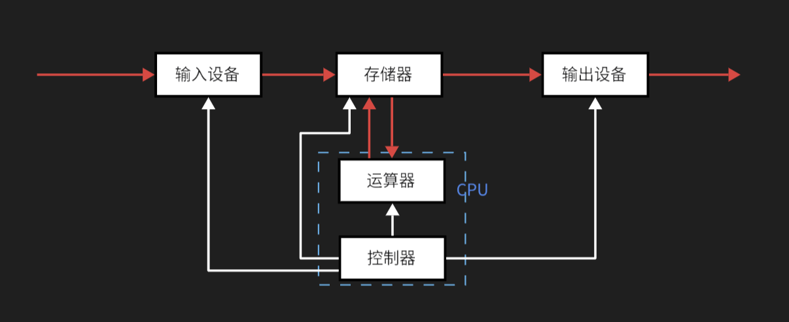
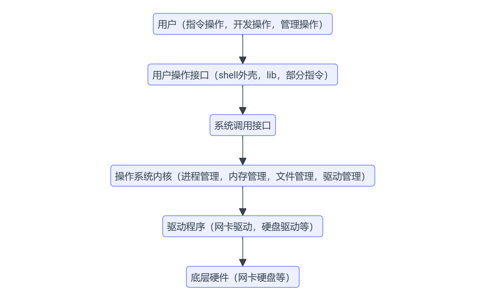

## **体系结构**

### **冯诺依曼体系结构**

<figure markdown="span">
  { width="750" }
</figure>

<!-- 

 -->

<strong>各个元件作用：</strong>

1. 存储器用来存储数据和程序。
   
2. 运算器进行数字运算和逻辑运算，并将中间结果暂存到运算其中。
   
3. 控制器主要来控制和指挥程序和数据的输入运行，以及处理运算结果。
   
4. 输入设备将输入信息转化为二进制信息。
   
5. 输出设备将二进制信息转化为人们熟悉的信息形式。
   
## **操作系统(Operator System)**

<strong>定义</strong>：操作系统是控制管理计算机系统的硬软件，分配调度资源的系统软件。

广义的操作系统包括：
- 内核（进程管理，内存管理，文件管理，驱动管理）
- 其他程序（函数库，shell外壳程序）

狭义的操作系统只包括系统内核。

<strong>作用</strong>：管理软硬件资源，为用户提供稳定、便捷的执行环境

### <strong>操作系统与用户和硬件之间的关系</strong>

<figure markdown="span">
  { width="750" }
</figure>

操作系统内核通过驱动程序获取硬件的实时数据信息，并用内核数据结构将其管理起来，为了防止用户随意修改这些数据，操作系统不允许用户直接访问这些数据，而是提供若干系统调用接口，便于用户对硬件进行操作，但是系统接口的使用较为复杂，有一定的门槛，所以操作系统会提供shell外壳程序（如Linux的命令行解释器，Windows的图形化界面）降低操作系统的使用难度；同时一些开发者会将一些系统接口封装起来提供一系列系统函数库（动态库，静态库），方便其他开发者进行开发。