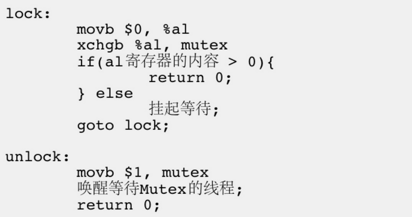

## **线程互斥**

当一个线程要对临界资源进行一些非原子性操作时，就要对该临界资源加锁，来实现在任意时刻临界区内只有一个线程在执行，这样行为被称作**线程互斥(Thread Mutex)**。

??? info "如何理解原子性"
    对于原子性操作，我们可以粗略的理解为不会被执行流的替换所打断的操作。
    
    CPU 对于硬件中断的检测是在每次指令执行结束后，而时间片结束的检测是在每次收到时钟中断后，也就是说在一条指令结束后，系统才要判断是否要进行执行流的替换，所以我们可以说一条汇编指令是原子性的。

### **互斥锁的使用**

#### **初始化**

被加锁的临界资源是不允许其他执行流进行访问的。原生线程库为我们提供了互斥锁

```cpp
#include <pthread.h>

int pthread_mutex_init(pthread_mutex_t *restrict mutex,
    const pthread_mutexattr_t *restrict attr);
```

函数参数列表中的类型 `pthread_mutex_t` 称为互斥锁。定义完互斥锁后，使用函数 `pthread_mutex_init` 对互斥锁初始化，使锁变为可工作状态。锁用完之后，需要使用 `pthread_mutex_destroy` 函数销毁锁。

初始化锁还有一种静态分配的方法：

```cpp
pthread_mutex_t mutex = PTHREAD_MUTEX_INITIALIZER;
```

使用 `PTHREAD_ MUTEX_ INITIALIZER` 初始化的互斥量不需要销毁。

#### **加锁与解锁**

初始化锁后，就要使用锁：

```cpp
#include <pthread.h>

int pthread_mutex_lock(pthread_mutex_t *mutex);
int pthread_mutex_trylock(pthread_mutex_t *mutex);
int pthread_mutex_unlock(pthread_mutex_t *mutex);
```

当锁变为可用状态后，需要使用 `pthread_mutex_lock` 函数对相关线程进行加锁操作。返回值：成功返回0，失败返回错误号。一旦加锁成功，就可以继续执行对应的执行流，如果加锁失败，则会把对应执行流阻塞住。执行流完成后，需要使用 `pthread_mutex_unlock` 函数进行解锁。

使用 `pthread_mutex_trylock` 非阻塞的申请锁，如果锁被占用会继续执行下面的代码。

??? code "互斥锁"
    ```cpp
    /*
    4 个线程模拟抢票，ticket 就是临界资源
    在不同线程访问 ticket 时，就要加锁，保证线程安全
    */
    #include <pthread.h>
    #include <iostream>
    #include <string>
    using namespace std;


    int ticket = 100000;

    // ticket_mutex 也是临界资源，但是对锁的操作都是原子性的。
    pthread_mutex_t ticket_mutex = PTHREAD_MUTEX_INITIALIZER;

    void* get_ticket(void* args)
    {
        string thread_name = (char*)args;
        int* cnt = new int(0);
        for(;;)
        {
            // 线程要进入临界区，要申请锁
            pthread_mutex_lock(&ticket_mutex);
            // ============临界区===============
            if(ticket > 0)
            {
                ticket--;
                (*cnt)++;
                cout << thread_name << " get ticket ,tickets left: " << ticket << '\n';
            // ============临界区===============
                pthread_mutex_unlock(&ticket_mutex);
            }
            else
            {
                // 防止资源死锁
                pthread_mutex_unlock(&ticket_mutex);
                break;
            }
        }
        return (void*)cnt;
    }


    int main()
    {
        // 创建 4 个线程，去抢票
        pthread_t tids[4];
        for(int i = 0;i < 4;++i)
        {
            string* tid_name = new string("thread-" + to_string(i));
            pthread_create(&tids[i],nullptr,get_ticket,(void*)tid_name->c_str());
        }

        // 线程回收
        for(int i = 0;i < 4;++i)
        {
            int* res;
            pthread_join(tids[i],(void**)&res);
            cout << "thread-" + to_string(i) << " get: " << *res << '\n';
        }
        return 0;
    }
    ```

加锁操作有几点注意事项：

- 凡是访问同一个临界资源的线程，都要进行加锁保护，并且必须加同一把锁，这是规则，不能有例外。

- 在给执行流加锁时，只需要给临界区加锁就可以了。加锁的本质是让代码串行化，因此让临界区的代码越少越好，这样比较节省运行时间。

- 线程访问临界区的时候，需要先加锁，这意味着所有的线程都可以先看到同一把锁，因此锁本身就是一个公共资源，锁需要保证自己的安全。所以加锁和解锁本身就是原子性的。

- 临界区可以是一行代码，也可以是一批代码。 在执行临界区代码的时候，线程有可能会被切换，但是因为锁并没有被释放，所以其他线程都无法成功的申请到锁，会被阻塞起来。因此线程被切换不会导致资源被别的执行流更新替换。这也是互斥带来的串行化的体现。

- 对于线程而言，有意义的状态只有两种：持有锁、不持有锁，不存在其他中间状态。只有当线程的工作做完之后，才会归还锁。原子性就体现在这里。

### **互斥锁的实现原理**

为了实现互斥锁操作，大多数体系结构都提供了 swap 或 exchange 指令，该指令的作用是把寄存器和内存单元的数据相交换，由于只有一条指令，保证了原子性，即使是多处理器平台，访问内存的 总线周期也有先后，一个处理器上的交换指令执行时另一个处理器的交换指令只能等待总线周期。

<figure markdown="span">
  { width="550" }
</figure>

加锁代码的 movb 指令本质上是调用线程，向自己的上下文写入 0 。 xchgb 指令本质上是将共享数据交换到自己的私有上下文中，即加锁操作，因为这里是一条汇编指令，就保证了加锁操作的原子性。假设共享资源 mutex 中存放的是 1 ，那么交换操作并没有新增任何的 1 ， 1 只会进行流转，保证了锁的唯一性。

### **其他常见锁**

- **悲观锁：**在每次访问临界资源时都上锁。

- **乐观锁：**每次访问数据先假定数据不会被其他线程修改，因此不上锁，在更新数据时在查看数据是否被修改。

- **自旋锁：**自旋锁是互斥锁的一种。这种锁在申请失败时，不会将线程挂起，而是直接返回，再重新申请锁。这样做的目的时减少挂起唤醒锁的消耗。适用于频繁加锁解锁的场景。但是在一些加锁后解锁较慢的场景会浪费 CPU 资源。


### **常见概念**

#### **线程安全**

线程安全是指在多线程环境下，多个线程同时访问同一资源时，不会产生意外结果或导致数据出错的状态。一个线程安全的程序能够正确地处理并发请求，不论线程执行的顺序如何。

**常见线程不安全的情况：**

- 不保护共享变量的函数。

- 函数状态随着被调用，状态发生变化的函数。

- 返回指向静态变量指针的函数。

- 调用线程不安全函数的函数。

#### **可重入函数**

同一个函数被不同的执行流调用，当前一个流程还没有执行完，就有其他的执行流再次进入，我们称之为重入。一个函数在重入的情况下，运行结果不会出现任何不同或者任何问题，则该函数被称为可重入函数，否则，是不可重入函数。

可重入函数一定是线程安全的，但线程安全的不一定是可重入的。

**常见可重入的情况：**

- 不使用全局变量或静态变量。

- 不使用用malloc或者new开辟出的空间。

- 不调用不可重入函数。

- 不返回静态或全局数据，所有数据都有函数的调用者提供。

- 使用本地数据，或者通过制作全局数据的本地拷贝来保护全局数据。

#### **死锁** 

死锁是指在一组进程中的各个线程均占有不会释放的资源，但因互相申请被其他线程所占用的不会释放的资源而处于的一种永久等待状态。

死锁四个必要条件：

- 互斥条件：一个资源每次只能被一个执行流使用。

- 请求与保持条件：一个执行流因请求资源而阻塞时，对已获得的资源保持不放。

- 不剥夺条件：一个执行流已获得的资源，在末使用完之前，不能强行剥夺。

- 循环等待条件：若干执行流之间形成一种头尾相接的循环等待资源的关系。


避免死锁的算法：**死锁检测算法，银行家算法**

## **线程同步**

线程饥饿：一个线程频繁连续的申请锁，但是申请到锁之后什么都不做。导致其他进程无法申请到锁，其他进程就处于饥饿状态。

同步：在保证数据安全的前提下，让线程能够按照某种特定的顺序访问临界资源，从而有效避免饥饿问题，叫做同步。互斥可以保证资源的安全性，同步可以帮助我们更高效的使用的资源，而不会被单一执行流长期占用。同步的实现类似的队列，每次只能由队首位置的执行流去申请锁，当执行流释放锁以后，会回到队尾。

竞态条件：即计算的正确性取决于多个线程的交替执行时序。当多个线程或进程在没有适当同步的情况下访问和修改共享数据时，就可能出现竞态条件。这可能导致不可预测的结果，因为线程或进程的调度顺序通常是不确定的。

### **条件变量**

条件变量是利用线程间共享的变量进行同步的一种机制，在多线程程序中的表现为：当共享资源（条件变量）满足某种条件时，部分线程队列才会被从等待中唤醒，去申请锁。

也就是说锁是控制线程申请资源的，条件变量是控制线程申请锁的。每次只允许一个线程访问资源是线程互斥，限制线程申请锁的顺序是线程同步。

#### **初始化**

原生线程库为我们实现了条件变量：

```cpp
#include <pthread.h>

int pthread_cond_destroy(pthread_cond_t *cond);
// cond 要销毁的条件变量

int pthread_cond_init(pthread_cond_t *restrict cond,
        const pthread_condattr_t *restrict attr);
// cond 要初始化的条件变量，attr 初始化选项，填 nullptr

pthread_cond_t cond = PTHREAD_COND_INITIALIZER;
```

对于局部条件变量要使用 `pthread_cond_destroy` 和 `pthread_cond_init` 来销毁和初始化，全局的条件变量使用 `PTHREAD_COND_INITIALIZER` 来初始化，不需要手动销毁。


#### **线程等待**

当多个线程要进行锁的竞争时，我们要想实现线程同步，就要将要同步的线程放到同一个等待队列下，这时就要用到下面这个函数：

```cpp
#include <pthread.h>
int pthread_cond_wait(pthread_cond_t *restrict cond,
    pthread_mutex_t *restrict mutex);
```

这里线程在被加入到等待队列后，会将传入的锁释放，直到条件变量满足条件时，线程会被唤醒，重新去竞争传入的锁，这样做的是为了防止死锁和优先级反转。

#### **唤醒线程**

```cpp
#include <pthread.h>

// 唤醒在条件队列中等待的所有线程，他们一同去竞争锁
int pthread_cond_broadcast(pthread_cond_t *cond);

// 唤醒等待队列队首线程
int pthread_cond_signal(pthread_cond_t *cond);
```

唤醒的队列会重新加入到锁的竞争中。


??? code "线程同步"
    ```cpp
    /*
    4 个线程以一定的顺序依次拿票
    */
    #include <pthread.h>
    #include <iostream>
    #include <unistd.h>
    #include <string>
    using namespace std;


    int ticket = 10;
    pthread_mutex_t ticket_mutex = PTHREAD_MUTEX_INITIALIZER;
    pthread_cond_t ticket_cond = PTHREAD_COND_INITIALIZER;

    void* get_ticket(void* args)
    {
        string thread_name = (char*)args;
        for(;;)
        {
            pthread_mutex_lock(&ticket_mutex);
            // 内部会将锁释放，当返回时会重新持有锁
            // 当条件变量满足时，才会继续运行
            pthread_cond_wait(&ticket_cond,&ticket_mutex); 
            if(ticket > 0)
            {
                ticket--;
                (*cnt)++;
                cout << thread_name << " get ticket ,tickets left: " << ticket << '\n';
                pthread_mutex_unlock(&ticket_mutex);
            }
            else
            {
                cout << thread_name << " no ticket." << endl;
                pthread_mutex_unlock(&ticket_mutex);
                break;
            }
        }
        return nullptr;
    }


    int main()
    {
        // 创建 4 个线程，去抢票
        pthread_t tids[4];
        for(int i = 0;i < 4;++i)
        {
            string* tid_name = new string("thread-" + to_string(i));
            pthread_create(&tids[i],nullptr,get_ticket,(void*)tid_name->c_str());
        }

        for(;;)
        {
            sleep(1);
            pthread_cond_signal(&ticket_cond);
        }

        return 0;
    }
    ```

### **信号量**

信号量的概念在 [进程间通信](../IPC/IPC.md#_15) 的篇章介绍过了，这里不再赘述。

以下是POSIX信号量的主要接口及其功能：

`sem_t`：这是POSIX信号量的数据类型，用于声明一个信号量变量。

#### **初始化**

```cpp
#include <semaphore.h>
int sem_init(sem_t *sem, int pshared, unsigned int value);
```

`sem`：指向要初始化的信号量的指针。

`pshared`：指定信号量的作用域。如果`pshared`为0，则信号量用于线程间同步；如果为非0值，则信号量可用于进程间同步。

`value`：信号量的初始值。

#### **销毁**

```cpp
#include <semaphore.h>
int sem_destroy(sem_t *sem);
```

- 销毁指定的信号量。如果信号量正在被使用，此操作将失败。

#### **等待（P操作）**

```cpp
#include <semaphore.h>

int sem_wait(sem_t *sem);

int sem_trywait(sem_t *sem);
```

- 如果信号量的值大于0，则将其减1并立即返回。
- 如果信号量的值为0，则调用线程将被阻塞，直到信号量的值变为非零。

`sem_trywait` 是非阻塞版本的`sem_wait`。如果信号量的值大于0，则将其减1并立即返回；如果信号量的值为0，则不阻塞当前线程，而是立即返回错误。

#### **发布（V操作）**

```cpp
#include <semaphore.h>

int sem_post(sem_t *sem);
```

将信号量的值加1。如果有线程在等待该信号量（即信号量的值为0且有线程被阻塞），则唤醒其中一个线程。

## **生产者消费者模型**

生产者消费者模型（Producer-Consumer Problem）是一个常见的并发编程问题，它描述了两个或多个执行流共享一个公共缓冲区的合作问题。


在该模型中，有两类执行流，生产者和消费者，生产者负责产生数据，消费者负责消费数据，生产者和消费者之间的中介就叫做缓冲区。生产者之间是互斥关系，消费者之间也是互斥关系，生产者和消费者之间是同步关系。

**优点：**

1. 可以将生产者和消费者解耦，降低生产者和消费者之间的依赖关系。

2. 并且支持并发（concurrency），即生产者和消费者可以是两个独立的并发主体，互不干扰的运行。

3. 支持忙闲不均，如果制造数据的速度时快时慢，缓冲区可以对其进行适当缓冲。当数据制造快的时候，
消费者来不及处理，未处理的数据可以暂时存在缓冲区中。等生产者的制造速度慢下来，消费者再慢慢处理掉。


### **阻塞队列**

基于阻塞队列实现一个生产者消费者模型，阻塞队列是一块有大小的队列，作为生产者和消费者之间的缓冲区。


??? code "Block Queue"
    ```cpp
    /*
    生产者消费者模型，一个消费者一个生产者，和一个阻塞队列实现数据交换缓存区。
    生产者一直生产数据，消费者每秒消费一个数据
    实验现象：
    生产者先将队列输出满，然后消费者每消费一个数据，生产者就补充一个任务。
    */
    #include <pthread.h>
    #include <iostream>
    #include <unistd.h>
    #include <string>
    #include <queue>
    #include <random>

    // 随即数
    std::random_device rdd;
    std::mt19937 rd(rdd());

    /**
    * @brief   阻塞队列实现的生产者消费模型，
    *          生产者之间互斥，消费者之间互斥，生产者与消费者之间同步
    * @tparam Tp 交换的数据类型
    */
    template<class Tp>
    class block_queue
    {
        std::queue<Tp> _q;
        int _cap;
        int _sz;
        pthread_mutex_t _mut;
        pthread_cond_t _c_cd;   
        pthread_cond_t _p_cd;   
    public:

        block_queue(int capcity)
            :_cap(capcity)
            ,_sz(0)
        {
            pthread_mutex_init(&_mut,nullptr);
            pthread_cond_init(&_c_cd,nullptr);
            pthread_cond_init(&_p_cd,nullptr);
        }

        void put(const Tp& in)
        {
            pthread_mutex_lock(&_mut);
            while(_sz == _cap)
            {
                // 队列满了生产者阻塞
                pthread_cond_wait(&_p_cd,&_mut);

            }
            _q.push(in);
            _sz++;
            pthread_mutex_unlock(&_mut);
            pthread_cond_signal(&_c_cd);
        }

        Tp get()
        {
            pthread_mutex_lock(&_mut);
            while(_sz == 0)
            {
                // 队列空了消费者阻塞
                pthread_cond_wait(&_c_cd,&_mut);
                /**
                *  这里使用 while 是为了防止 pthread_cond_wait() 出现伪唤醒
                *  伪唤醒：对应的条件并不满足，但是线程却被唤醒了。
                *  当 pthread_cond_wait() 调用失败可能会出现这种情况。
                *  或者当使用 pthread_cond_broadcast 将线程都唤醒，所有线程都离开阻塞队列，开始竞争锁。
                *  但是只有一个数据时，第一个消费者将数据消费掉，后面的线程在消费数据就会出现错误。
                */
            }

            Tp _ret = _q.front();
            _q.pop();
            _sz--;

            pthread_mutex_unlock(&_mut);
            pthread_cond_signal(&_p_cd);
            return _ret;
        }

        ~block_queue()
        {
            pthread_mutex_destroy(&_mut);
            pthread_cond_destroy(&_c_cd);
            pthread_cond_destroy(&_p_cd);
        }
    };

    void* producer(void* args)
    {
        block_queue<int>* q = static_cast<block_queue<int>*>(args);
        for(;;)
        {
            // 生产数据
            int data = (rd() % 1000 + 1000) % 1000;
            q->put(data);   
            std::cout << "Put data: " << data << std::endl;
        }
    }

    void* consumer(void* args)
    {
        block_queue<int>* q = static_cast<block_queue<int>*>(args);
        for(;;)
        {
            // 消费数据
            int data = q->get();
            std::cout << "Get data: " << data << "--" << std::endl;
            sleep(1);
        }
    }

    int main()
    {
        // 十个数据的阻塞队列
        block_queue<int> q(10);

        // 一个消费者，一个生产者
        pthread_t p;
        pthread_t c;
        pthread_create(&p,nullptr,producer,(void*)&q);
        pthread_create(&c,nullptr,consumer,(void*)&q);

        for(;;);

        pthread_join(p,nullptr);
        pthread_join(c,nullptr);
        return 0;
    }
    ```

基于阻塞队列实现的 PC 模型，消费者和生产者是互斥且同步的，因为他们把队列当作一个整体使用，生产和消费是串行的，但事实上，存数据和取数据是可以并发执行的，因为访问的是队列不同的位置，所以只要保证生产者和消费者是同步的即可，只有在队列满或空的时候保证线程互斥即可。要维护这样的关系就需要用到信号量。

### **环形队列**

基于环形队列实现 PC 模型，消费者和生产者之间满足同步关系。

??? code "Ring Queue"
    ```cpp
    #include <iostream>
    #include <unistd.h>
    #include <string>
    #include <thread>
    #include <vector>
    #include <mutex>
    #include <semaphore.h>
    #include <random>
    #include <chrono>
    std::random_device rdd;
    std::mt19937 rd(rdd());

    /**
    *  循环队列，使用信号量实现生产者和消费者之间的同步关系。
    *  可以边放数据边取数据
    */
    template<class Tp>
    class ring_queue
    {
        std::vector<Tp> _rq;  // 数组实现循环队列
        int _p_pos;     // 生产者当前可以放数据的位置
        int _c_pos;     // 消费者当前可以取的数据位置
        int _capcity;   // 队列容量 
        sem_t _p_sem;   // 剩余空间
        sem_t _c_sem;   // 队列中的数据量
        std::mutex _p_mt;   // 实现生产者间的互斥
        std::mutex _c_mt;   // 实现消费者间的互斥

        int P(sem_t* _sem) 
        { return sem_wait(_sem); }

        int V(sem_t* _sem)
        { return sem_post(_sem); }
        
    public:
        ring_queue(int n)
            :_rq(n)
            ,_p_pos(0)
            ,_c_pos(0)
        {
            sem_init(&_p_sem,0,n);
            sem_init(&_c_sem,0,0);
            _capcity = n;
        }

        void put(const Tp& in)
        {
            P(&_p_sem); // 先申请空间
            _p_mt.lock();   // 放数据时加锁
            _rq[_p_pos] = in;
            (_p_pos += 1) %= _capcity;
            std::cout << "Put data @" << in << std::endl;
            _p_mt.unlock();
            V(&_c_sem);
        }

        Tp get() 
        {
            P(&_c_sem); // 先申请数据
            _c_mt.lock();   // 取数据时加锁
            Tp ret = std::move(_rq[_c_pos]);
            (_c_pos += 1) %= _capcity;
            std::cout << "Get Data #" << ret << std::endl;
            _c_mt.unlock(); 
            V(&_p_sem);
            return ret;
        }

        ~ring_queue()
        {
            sem_destroy(&_c_sem);
            sem_destroy(&_p_sem);
        }
    };

    std::vector<std::thread> consumer_ths;
    std::vector<std::thread> producer_ths;


    void producer(ring_queue<int>& rq)
    {
        for(;;)
        {
            // 生产数据
            int data = (rd() % 1000 + 1000) % 1000;
            rq.put(data);
            std::this_thread::sleep_for(std::chrono::milliseconds(500));
        }
    }

    void consmer(ring_queue<int>& rq)
    {
        for(;;)
        {
            // 消费数据
            int ret = rq.get();
            std::this_thread::sleep_for(std::chrono::milliseconds(100));
        }
    }


    int main()
    {
        ::ring_queue<int> rq(10);
        
        // 5 个消费者
        for(int i = 0;i < 5;++i)
            consumer_ths.push_back(std::thread(consmer,std::ref(rq)));

        // 2 个生产者
        for(int i = 0;i < 2;++i)
            producer_ths.push_back(std::thread(producer,std::ref(rq)));

        for(auto&th:consumer_ths)
            th.join();
        
        for(auto&th:producer_ths)
            th.join();

        return 0;
    }
    ```


## **无锁编程（Lock-Free）**

要实现线程安全，除了使用锁以外，还可以实现对临界资源的原子操作，这样的做法被称作无锁编成。

无锁编程的实现要依赖 CAS 操作（Compare And Swap），**现在几乎所有的CPU指令都支持CAS的原子操作，X86下对应的是 CMPXCHG 汇编指令。（by：陈皓）**。

关于无锁编程可以参考文章：[无锁队列的实现 - 陈皓](https://coolshell.cn/articles/8239.html){target="_blank"}

CAS 简单来说，就是当我们要修改临界资源时，要先**比较（Compare）**内存中的该数据是否被其他执行流修改过，如果未被修改，那么就将这次修改**同步（Swap）**到内存，否则就撤回这次修改，将内存中的数据重新加载到寄存器，并重新执行操作。


