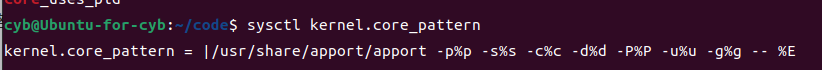

代码编译生成的可执行文件有两个版本，`release` 版和 `debug` 版，g++/gcc编译器默认生成的是 `release` 版，`release` 版是发行版，是给客户使用的，编译器会对其进行很多优化，会使我们的代码面目全非，而且也没有我们调试所需的信息，我们需要给编译指令添加上 `-g` 选项，来编译生成 `debug` 版，编译器会为可执行文件中添加调试信息，以便我们使用 `gdb` 调试器来对代码进行调试。

## **基本指令**

下面给出gdb基本指令，括号中是对应指令的简写
```
gdb [被调试文件]  //开始对该文件进行调试
quit(q) //退出调试是
```

利用上面指令可以开始和结束对某个文件的调试。


```
list(l) 行号 //显示调试文件源码，接着上次位置开始，每次10行
list(l) 函数名//显示对应函数源码
run(r) //运行程序
next(n) //逐语句执行，类似F10
setp(s) //逐步执行，类似F11
break(b) 行号 //在某一行打断点
break(b) 函数名 //在某个函数开头打断点
info break //查看断点信息
finsh //执行到当前函数返回，然后停下来等待命令
print(p) 变量//打印表达式的值
set var 表达式 //通过表达式可以修改变量的值
delete(d) 断点序号 //删除对应序号的断点
disable 断点序号 //禁用对应断点
enable 断点序号 //启用对应断点
display 变量名 //跟踪对应变量，每次停下来都显示其值
undisplay 变量名 //取消跟踪
until 行号 //运行至对应行
bt // backtrace）来查看堆栈回溯
info threads // 查看线程信息
thread [thread_id] // 切换调试线程
info locals // 显示所有局部变量
frame [frame_id] // 查看切换栈帧
```

## **核心转储**

[核心转储](https://blog.csdn.net/weixin_43729127/article/details/131856080){target="_blank"}

当进程崩溃时，会生成一份进程异常终止时各个信息的文件，我们可以使用 gdb 调试工具来查看该文件。

使用命令 ulimit -c 查看当前的核心转储文件大小限制。如果为 0 代表不允许生存核心转储。

Linux 内核有一个参数 kernel.core_pattern，用于指定生成核心转储文件时的文件名和路径模式，相关的配置文件为/proc/sys/kernel/core_pattern。而在 Linux 中，可以使用 sysctl 命令来检查和更改核心转储文件的生成路径限制。

使用 `sysctl kernel.core_pattern` 命令来查看当前的核心转储文件生成路径。

<figure markdown="span">
  { width="750" }
</figure>

usr/share/apport/apport 是一个用于 Ubuntu 系统的工具，它可以收集有关崩溃和故障的信息，并生成相应的错误报告。

%p: 进程 ID。

%s: 目前正在运行的线程 ID。

%c: 产生核心转储文件的信号代码。

%d: 序列号，用于确保在同一目录中生成的核心转储文件具有唯一的名称。

%P: 父进程 ID。

%u: 用户名。

%g: 组名。

%E: 产生核心转储文件的可执行文件全路径。
