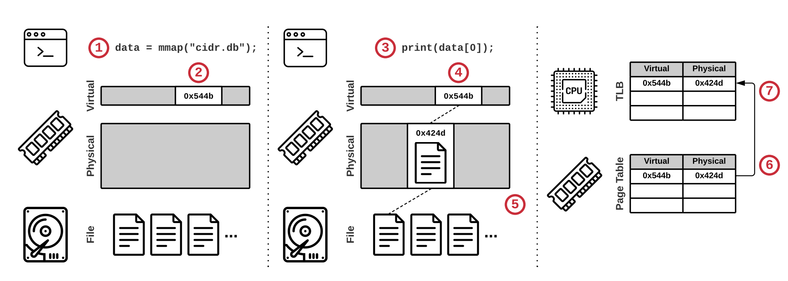

**详细查看 man 手册，这里将接口列出。**

## **mmap**

将一个文件或者其它对象映射进内存。

```cpp
void *mmap(void *addr, size_t length, int prot, int flags,
                  int fd, off_t offset);

// 取消映射
int munmap(void *addr, size_t length);
```

参数解释：

- start：指向欲映射的内存起始地址，通常设为 `NULL`，代表让系统自动选定地址，映射成功后返回该地址。

- length：代表将文件中多大的部分映射到内存。最好是 `PAGE_SIZE` 的整数倍，如果不是整数倍，也会返回整数倍的空间。

- prot：映射区域的保护方式。

`PROT_EXEC` 映射区域可被执行

`PROT_READ` 映射区域可被读取

`PROT_WRITE` 映射区域可被写入

`PROT_NONE` 映射区域不能存取

- flags：影响映射区域的各种特性。在调用 `mmap()` 时必须要指定 `MAP_SHARED` `或MAP_PRIVATE`。

`MAP_SHARED` 对映射区域的写入数据会复制回文件内，而且允许其他映射该文件的进程共享。

`MAP_PRIVATE` 对映射区域的写入操作会产生一个映射文件的复制，即私人的“写入时复制”（copy on write）对此区域作的任何修改都不会写回原来的文件内容。

- fd：要映射到内存中的文件描述符。

- offset：文件映射的偏移量，通常设置为0，代表从文件最前方开始对应，offset必须是分页大小的整数倍。

返回值：若映射成功则返回映射区的内存起始地址，否则返回MAP_FAILED(－1)，错误原因存于errno 中。

工作原理：当我们调用 `mmap` 后，操作系统会为我们分配一片虚拟内存，但并不加载文件到内存中，当我们真正要使用或访问该内存时，操作系统会触发缺页中断，调用缺页异常处理程序，到磁盘中加载对应的数据到物理内存中，并为我们简历虚拟内存到物理内存的映射，放入 TLB 中（这是为了加速下一次的访问，不必要到内存中查页表）。

<figure markdown="span">
  { width="650" }
</figure>

## **关闭 Socket 的读端或写端**


```c
#include <sys/socket.h>
int shutdown(int sockfd, int how);
```

shutdown（）调用会关闭与 sockfd 关联的套接字上的全部或部分全双工连接。如果 how 是 SHUT_ RD，就关闭 socket 的读端。如果how 是 SHUT_WR，就关闭写端。如果 how 是 SHUT_RDWR ，读写都被关闭，类似 `close()`。

## **删除文件**

删除指定文件

```c
#include<unistd.h>
int unlink(const char* pathname);
```

## **设置/获取资源限制**

```cpp
#include <sys/time.h>
#include <sys/resource.h>

int getrlimit(int resource, struct rlimit *rlim);
int setrlimit(int resource, const struct rlimit *rlim);
```

[linux下getrlimit()与setrlimit()函数说明及使用](https://blog.csdn.net/wgl307293845/article/details/106897131/){target="_blank"}


## **c 语言执行命令接口**

通过管道在两个进程间传递消息。

```cpp
#include <stdio.h>

FILE *popen(const char *command, const char *type);

int pclose(FILE *stream);
```

该接口将 fork 一个子进程执行命令 `command` ，如果 `type` 是 "r"，被调用程序的输出就可以被调用程序使用，调用程序利用popen函数返回的FILE＊文件流指针。如果 `type` 是 "w"，调用程序就可以用 `fwrite` 调用向被调用程序发送数据，而被调用程序可以在自己的标准输入上读取这些数据。
