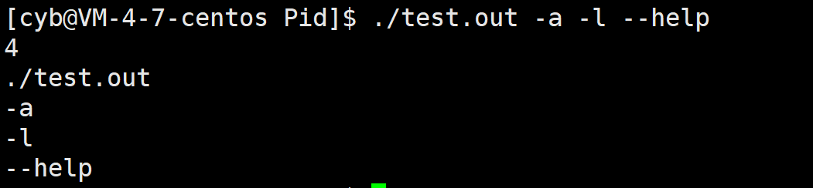
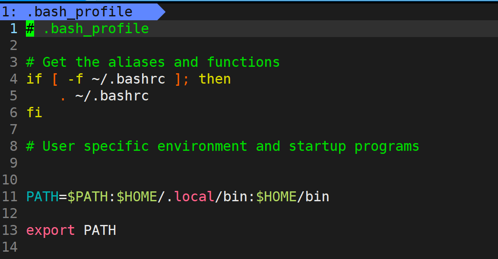

# 环境变量

## **命令行参数**

我们在 shell 程序上运行指令时，这些指令往往有限可选项 ，如 `ls -a` 中的 `-a`，这些可选项是如何让让程序获得的？

就是通过命令行参数，操作系统会将命令行参数以字符串数组的形式传递给程序的 mian 函数，也就是我们主函数的两个参数：

```cpp
// test.cpp      
#include <stdio.h>                                        
int main(int argc,char* argv[])         
{                                       
    printf("%d\n",argc); 
    for(int i = 0;i < argc;++i)      
        printf("%s\n",argv[i]);
    return 0;
}
```

其中 $argc$ 是参数的个数（以空格为分割），$argv$ 就是具体命令行参数。我们用上面的程序输出一下看看，顺便加几个参数
```
./test.out -a -l --help
```
运行结果如下：

<figure markdown="span">
  { width="400" }
</figure>

<!-- <div align="center"></div> -->

我们发现第一个参数是程序名，其他的就是后续的参数。

其实到这里那些基础的指令我们就都可以自己实现了，如用 touch 创建文件、cat查看文件内容等。我们只要有参数实现这些都很简单。

## **环境变量**

环境变量(environment variables)一般是指在操作系统中用来指定操作系统运行环境的一些参数，环境变量通常具有某些特殊用途，还有在系统当中通常具有全局特性。

如：查找可执行程序的路径，我们在运行一些内置程序时往往不需要输入对应程序的具体路径，直接输入程序名即可，但是运行自己的程序却要加上 `./` 来表示当前目录下，这就因为操纵系统运行内置程序时都配置好了环境变量 `PATH` 用来查找程序，每次输入程序名如果不带路径的话会先到这戏的位置去查找，如果没有就会报错，提示指令未找到。

系统中不同环境变量有不同的作用，但这些作用往往都是通用且全局的。

### **获取环境变量**

我们可以通过很多种方式获取环境变量

#### **env命令 / echo命令$**

我们在命令行下输入指令 `env` 可以直接打印出所有环境变量，再通过 `grep` 行过滤指令查找指定的环境变量。

我们也可以使用 `echo` 指令查看指定的变量。这里的变量不止环境变量，还有 bash 运行时的本地变量。

```
echo $变量名
```


#### **getenv 函数**

在程序是我们也可以调用库函数 getenv 来获取指定环境变量，该函数位于头文件 `stdlib.h`。

```cpp
char* getenv(const char* name);
```

#### **main函数参数**

操作系统其实还会向 main 函数传入一个参数，也是一个字符串数组，里面记录的就是环境变量

```cpp
int main(int argc,char* argv[],char* env[])
{
    return 0;
}
```

#### **第三方变量**

在链接时，会有一个文件自带一个全局变量 environ ，里面也存储着环境变量，我们可以直接使用给变量获取环境变量。

```cpp
#include <stdio.h>    
#include <stdlib.h>
int main(int argc,char* argv[])    
{    
    extern char** environ;    
    for(int i = 0;environ[i];++i)    
        printf("%s\n",environ[i]);
    return 0; 
} 
```

### **修改环境变量**

shell进程中的环境变量，是在创建shell进程时，通过一些脚本配置文件载入到shell进程中的，我们可以通过一些指令修改shell进程中的环境变量，但是这样只能更在shell进程中的环境变量，重启shell进程后，又会刷新，恢复到脚本中设定的环境变量。

#### **增加环境变量**

export命令可以将一个变量导入到当前环境变量中：

```
TEXT=1      //创建本地变量  
export TEXT //将本地变量导入环境变量

echo $TEXT  //使用echo查看导入的环境变量
1           //输出结果
```

当然这样的修改是暂时，当我们重启bash后，该变量就不存在了。

想要永久更改一个环境变量，就要修改用于环境变量初始化的脚本配置文件。在我们的家目录下有一个隐藏文件 `.bash_profile` ，这就是一个环境变量的脚本配置文件，查看其内容

<figure markdown="span">
  { width="400" }
</figure>

<!-- <div align="center"></div> -->

文件中还会调用别的配置文件 `.bashrc` 等等，修改这些文件内容就可以在每次启动 bash 时，将我们自定义的环境变量加入到bash进程中。

#### **删除环境变量**

我们可以使用 `unset` 命令删除掉一个变量。`unset` 命令也不止可以删除环境变量，还能删除 bash 运行时的本地变量。

```
unset 变量名
```
当然使用 `unset` 命令删除的环境变量，也是临时的，当重启 bash 又会重新加载回来，想要永久删除就要修改上述的配置文件。

### **本地变量与环境变量**

**本地变量**：只在bash进程中有效，不会被子进程继承下去，在bash下运行的大部分命令都是bash创建的子进程，也就是说这些命令是不能对bash的本地变量进行操作的。

**环境变量**：所以子进程都会进程，所以在bash下运行的进程都可以获取到一份环境变量。

但是这里有个问题，我们在bash下创建一个本地变量，我们是可以通过echo将该变量打印出来：

<figure markdown="span">
  { width="500" }
</figure>

<!-- <div align="center"></div> -->

如果 echo 是bash的子进程的话，他一定不会知道有 `DATA` 这样一个本地变量，这就说明 echo 命令在调用时不是创建子进程的方式，而是直接在bash进程中运行的。这样的命令被叫做内建命令。

Linux系统中命令分为两种：

- 常规命令：shell通过fork创建子进程去执行的命令。
- 内建命令：shell命令行内的一个函数。

我们使用`set`指令可以将本地变量和环境变量都输出到屏幕上。


  


