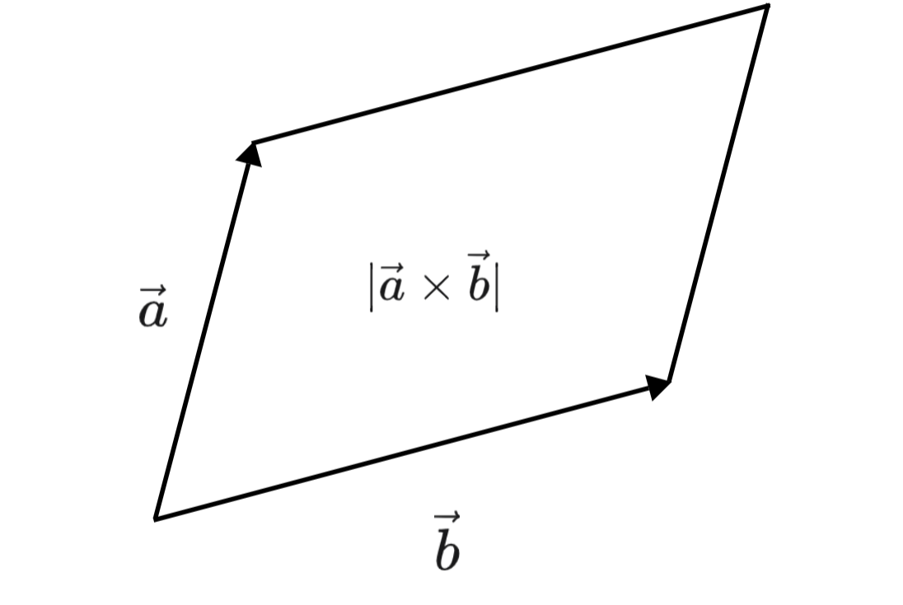
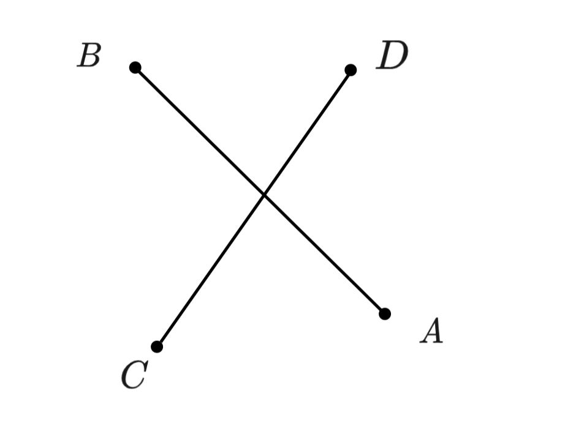
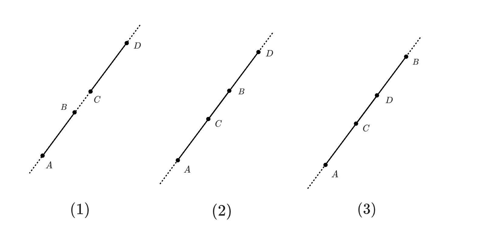

# 二维计算几何基础

## **点**

平面直角坐标系下的点，一般用一个结构体来维护其横纵坐标 $x,y$。与其说是点，不如说它是一个二维向量。因为我们常常会直接拿两个点做向量加减运算，得到我们想要的向量。

### **二维向量**

由于向量的坐标表示与点相同，所以只需要像点一样存向量即可（当然点不是向量）。

#### **向量运算**

- **向量加减**

就是向量坐标对应位置的值进行加减即可。
```cpp
// 向量+
Point Point::operator+(const Point &a) const 
{
    return Point{x + a.x, y + a.y}; 
}
// 向量-
Point Point::operator-(const Point &a) const
{ 
    return p{x - a.x, y - a.y}; 
}
```
向量加减的几何意义通过下面两图很好理解：

<figure markdown="span">
  { width="500" }
</figure>

<!-- <div align="center"></div> -->

- **点乘（内积）**

我们知道点乘的结果是一个数，其几何意义为 $\vec{b}$ 在 $\vec{a}$ 上的投影与 $|\vec{a}|$ 的乘积。

计算公式：

$$
\vec{a}\cdot \vec{b}=|\vec{a}|\cdot|\vec{b}|\cos{\theta}
$$

换成坐标的形式，那么 $\vec{a}=(x_1.y_1)$，$\vec{b}=(x_2.y_2)$ 点乘就是对应坐标相乘：

$$
\vec{a}\cdot \vec{b}=x_1x_2+y_1y_2
$$

```cpp
// 我们将点乘重载为 | 符号
double Point::operator|(const Point &a) const 
{ 
    return x * a.x + y * a.y; 
} // 点乘
```

- **叉乘（外积）**

叉乘的结果是一个向量，其方向遵循右手法则。叉乘结果的模是由两个向量围成的平行四边的面积。

<figure markdown="span">
  { width="250" }
</figure>

<!-- <div align="center"></div> -->

叉乘模的计算公式：

$$
\vec{a}\times \vec{b}=|\vec{a}||\vec{b}|\sin{\theta}
$$

换成坐标形式，那么 $\vec{a}=(x_1.y_1)$，$\vec{b}=(x_2.y_2)$ 叉乘就是坐标交叉相乘：

$$
\vec{a}\times \vec{b}=x_1xy_2-x_1y_2
$$

```cpp
double Point::operator*(const Point &a) const 
{ 
    return x * a.y - y * a.x; 
} // 叉乘
```

利用坐标在程序中运算点乘叉乘，对于判断几何位置关系时非常有用。

- **向量取模**

向量取模就是取向量的长度。我们可以将任何一个向量平移到远点，那么向量 $\vec{a}=(x,y)$ 的长度就是点 $(x,y)$ 到原点的距离。

$$
|a|=\sqrt{x^2+y^2}
$$

我们可以计算向量和自己的点乘再开平方即可


```cpp
// 向量取平方
double Point::pow() const 
{ 
    return x * x + y * y; 
}                    
// 向量取模
double abs(const Point &p) 
{ 
    return sqrt(p.pow()); 
}
```


### **点到点的距离**

两个点之间的距离有两种定义法：**曼哈顿距离，欧式距离**。

#### **欧式距离**
其中欧式距离（欧几里德距离）就是直线距离。点 $A(x_1,y_1),B(x_2,y_2)$ 的欧式距离为：

$$
|AB|=\sqrt{(x_1-x_2)^2+(y _1-y_2)^2}
$$

```cpp
// 点到点的欧式距离
double Point::disPoint(const Point &a) const
{
    return sqrt((x - a.x) * (x - a.x) + (y - a.y) * (y - a.y));
}
```


#### **曼哈顿距离**

在二维空间内，两个点之间的曼哈顿距离为它们横坐标之差的绝对值与纵坐标之差的绝对值之和。点 $A(x_1,y_1),B(x_2,y_2)$ 的曼哈顿距离为：

$$
d(A,B) = |x_1-x_2|+|y_1-y_2|
$$

### **点到直线的距离**

#### **公式法**

已知直线 $l$ 方程为 $ax+by+c=0$，平面上任意一点 $(x_0,y_0)$ 到该直线距离 $d$ 为:

$$
d = \frac{|ax_0+by_0+c|}{\sqrt{a^2+b^2}}
$$

#### 向量法

我们也可以通过向量叉乘得到点到直线的距离公式。我们以点 $p$ 到直线 $ab$ 为例。我们可以通过坐标计算出向量 $\vec{ap},\vec{ab}$ 和它们叉乘的模。

因为叉乘的模是对应向量所围成平行四边形的面积，而$\left | \vec{ab} \right |$是底边长度，面积除以底就是高，就可以得到对应距离。

<figure markdown="span">
  { width="300" }
</figure>

<!-- <div align="center"></div> -->

很容易就可以写出下面的公式：

$$
d=\frac{\left | \vec{ap}\times \vec{ab} \right | }{\left | \vec{ab}\right |}
$$

因为一般题目只会给我们一些点做数据，所以我们一般采用这个方法计算点到直线的距离 $d$ 更方便。

```cpp
// 点到直线的距离
// a,b为直线上两点
double Point::disline(const Point &a, const Point &b) const
{
    Point ap = (*this) - a, ab = b - a;
    return abs(ap * ab) / abs(ab);
}
```

### **点到线段的距离**

求点到线段的距离就要先判断点和线段的位置关系，才能计算点到线段的距离。

#### **点与线段的位置关系**

首先我们设一个点 $p$ 和一个线段 $s_{a,b}$ ，其中 $a,b$ 是线段的端点。


我们可以将点和线段的位置关系分为以下四种，我们可以通过向量的点积叉积来判断具体位置关系：

<figure markdown="span">
  { width="500" }
</figure>
<!-- 
<div align="center"></div> -->


我们很容易发现当点在 $3，4$ 区域时，点和线段的夹角总是有一个钝角($\angle pab\space or \space \angle pba$)，我们可以通过计算这两个角的 $\cos$ 值的正负来判断他们中是否有钝角。余弦值计算公式可以由向量点积推导出来：

$$
\cos{\theta}=\frac{\vec{ab}\cdot \vec{ap}}{|\vec{ab}||\vec{ap}|}
$$

应为两个向量的模的乘积一定为整数，所以只需判断两个向量点积的正负。

判断完余弦正负后，如果两个角都是锐角，则点就可能在 $1$ 或 $2$ 区域，这时我们就要判断 $\angle{pab}$ 是正角还是负角，也就是判断 $\sin{\theta}$ 的正负。我们通过向量叉积可以推导出正弦的计算公式：

$$
\sin{\theta}=\frac{\vec{a}\times \vec{b}}{|\vec{a}||\vec{b}|}
$$

和余弦类似的，我们只需要计算两个向量的叉积的结果的正负即可。正数就在 $1$ 区域，负数在 $2$ 区域，为 $0$ 则在线段上。


#### **求点到线段的距离**

判断完点和线段的位置关系之后，计算点到线段的距离就很简单了。

当点在$3，4$区域时，点到线段的距离就是到其端点的距离，在$1，2$区域时，点到线段的距离就是到对应直线的距离。套用上文的公式即可。

```cpp
// 点到线段的距离
// a,b线段两端点
double Point::disSeg(const Point &a, const Point &b) const
{
    // 判断点和线段的位置关系
    if ((((*this) - a) | (b - a)) <= -eps || (((*this) - b) | (a - b)) <= -eps)
        return min(disPoint(a), disPoint(b));
    return disline(a, b);
}
```


### **利用向量求三角形面积**

我们了解的三角形面积公式有

$$
\begin{cases}
s=\frac{ah}{2} \\
 s=\frac{ab\sin \theta }{2}\\
s=\sqrt[]{p(p-a)(p-b)(p-c)} ,(p=\frac{a+b+c}{2} )  
\end{cases}
$$

而当给定三个顶点坐标$a=(x_1,y_1),b=(x_2,y_2),b=(x_3,y_3)$，求三角形面积，对计算机而言下面这个公式是最合适的：

$$
s=\frac{(x_2-x_1)(y_3-y_1)-(y_2-y_1)(x_3-x_1)}{2}
$$

众所周知，这个公式是由向量叉乘的来的，即我们求出向量$\vec{ab}，\vec{ac}$，二维向量叉乘的模的是以$ab，ac$为两条边，所围成的平行四边形面积，我们求得$ab，ac$，令其取二分之一即可得到上式

```cpp
double triangle(Point &a, Point &b, Point &c) 
{ 
    return (b - a) * (b - c) / 2.0; 
} // 求三角形面积
```

## **线**

### **直线**

对于直线，我们一般记录其方程，如一般式 $Ax+By+C=0$ ，斜截式 $y=kx+b$ 等，针对题目所需采取不同的形式。

更简便的，我们可以直接记录直线上的两点，这样在计算一些位置关系时更方便。

#### **求两直线交点**

首先我们要判断两直线是否相交，因为我们记录的是直线上两个点，很容易算出其方向向量，算出方向向量后取叉乘的模，如果为 $0$ 则两直线平行。

```cpp
// 判断直线是否平行
bool line::is_parallel(const line& b)const
{
    return abs(dVec * b.dVec) <= eps;
}
```

确定两直线相交后，我们就可以计算交点了。

计算过程需要初中三角形正弦定理的知识。

$$
\frac{a}{\sin{A}}=\frac{b}{\sin{B}}=\frac{c}{\sin{C}}
$$

首先我们用 $\vec{a}$ 表示向量 $\vec{pC}$ , 用 $\vec{b}$ 表示方向向量 $\vec{pD}$ 。

<figure markdown="span">
  { width="400" }
</figure>

<!-- <div align="center"></div> -->

但是这样好像看不出什么 ，连接 $D,C$ 两点。

<figure markdown="span">
  { width="400" }
</figure>

<!-- <div align="center"></div> -->

我们用正弦定义可以写出下式：

$$
\frac{|\vec{a}|}{\sin{\theta}}=\frac{|\vec{c}|}{\sin{\beta}}\\
~\\
|\vec{a}|=\left | \frac{|\vec{c}|\sin{\theta}}{\sin{\beta}} \right | 
$$

$\vec{c}$ 我们可以通过 $D，C$ 两点得到， $\sin{\theta}$ 和 $\sin{\beta}$ 角可以通过两直线方向向量 $\vec{AC},\vec{BD}$ 和 $\vec{c}$ 叉乘得到：

$$
\sin{\theta}=\frac{\vec{BD}\times \vec{c}}{|\vec{BD}||\vec{c}|}\\
$$

$$
\sin{\beta}=\frac{\vec{AC}\times \vec{BD}}{|\vec{AC}||\vec{BD}|}
$$

我们将两个正弦值带入上式，化简得：

$$
|\vec{a}|= |\vec{AC}| \cdot \frac{| \vec{BD}\times \vec{c}  |}{| \vec{AC}\times \vec{BD} |} 
$$

为了方便表示我们令 $K=\frac{| \vec{BD}\times \vec{c}  |}{| \vec{AC}\times \vec{BD} |}$，所以：

$$
|\vec{a}|=|\vec{AC}|\cdot K
$$

其中 $\vec{a}$ 和 $\vec{AC}$ 是平行的，那么 $\vec{a}$ 可以通过 $\vec{AC}$ 数乘得到：

$$
\vec{a} = K\cdot \vec{AC}
$$

知道 $\vec{a}$ 后，那么交点就相当于点 $C$ 沿着 $\vec{a}$ 移动 $|\vec{a}|$ 的长度，就得到交点 $p$。


沿着向量移动，我可以转化成向量加法，我们把点 $p$，看成向量 $\vec{Op}$，这里 $O$ 是原点，把点 $C$ 看成 $\vec{OC}$，那么 $\vec{Op}$ 可以写为：

$$
\vec{Op}=\vec{OC}+\vec{a}\\
$$

$$
\vec{Op}=\vec{OC}+K\cdot \vec{AC}
$$


```cpp
// 求两直线交点
Point line::get_intersection(const line& b) const
{
    // 直线平行返回无穷大
    if(is_parallel(b))
        return {INT_MAX,INT_MAX};
        
    // 带入公式
    Point c = x2 - b.x2;
    double K = (b.dVec * c) / (dVec * b.dVec);
    Point res = x2 + dVec * K;
    return res;
}
```

### **线段**

和存储直线的方式一样。

#### **求线段的交点**

求线段交点就要判断它们端点之间的位置关系。

- 所在直线相交

这里我们先不考虑平行的情况。两个不平行的的线段如果有交点，那么任意一个线段的两个端点一定在另一个线段的两侧，如下图：

<figure markdown="span">
  { width="200" }
</figure>

<!-- <div align="center"></div> -->

那么就要计算两对叉乘 $\vec{AB}\times\vec{AC}，\vec{AB}\times \vec{AD}$ 和 $\vec{CD}\times\vec{CA}，\vec{CD}\times\vec{CB}$ ，如果第一对叉乘是一正一负，那么说明 $C,D$ 在 $AB$ 直线的两端，第二对同理。

这里的 $\vec{AB},\vec{CD}$ 就是两个线段的方向向量，计算是拿方向向量替换即可。

如果两线段满足这个情况，那么直接调用直线交点计算即可。

- 所在直线平行

其次就考虑平行的情况，一般平行是没有交点的，但是要考虑共线的情况。这里我们规定当两个线段重合时，返回 $y$值最小的，$y$ 值相等就返回 $x$ 值最小的。

共线又分为下面几种情况：

<figure markdown="span">
  { width="700" }
</figure>

<!-- <div align="center"></div> -->

我们观察发现，这时我们只要判断线段 $AB$ 的上端点 $B$ 和线段 $CD$ 的下端点 $C$ 的位置关系即可。

如果 $C$ 位于 $B$ 的下端，则说明两个线段是有重合的。否则就是无重合的。

对于两个点位置的比较我们可以重载 $<$ 操作符

```cpp
// 重载 < 方便找线段交点
bool operator<(const Point &b) const
{
    if (y == b.y)
        return x < b.x;
    return y < b.y;
}
```

如此重载如果两个线段都是与 $x$ 轴平行重合也可以找出正确的端点。

```cpp
Point mi = max(min(x1, x2), min(b.x1, b.x2));
Point ma = min(max(x1, x2), max(b.x1, b.x2));
// 判断两线段是否重合
if (ma.x >= mi.x && ma.y >= mi.y)
    return mi;
```

---------------------

参考文章：

[Oi Wiki](https://oi-wiki.org/geometry/2d/#%E5%88%A4%E6%96%AD%E4%B8%80%E7%82%B9%E6%98%AF%E5%90%A6%E5%9C%A8%E4%BB%BB%E6%84%8F%E5%A4%9A%E8%BE%B9%E5%BD%A2%E5%86%85%E9%83%A8)

