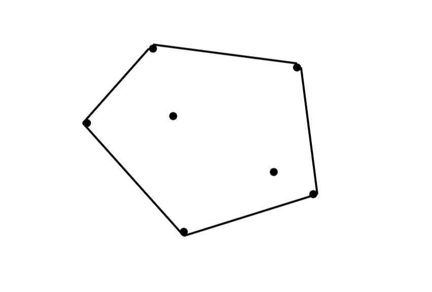
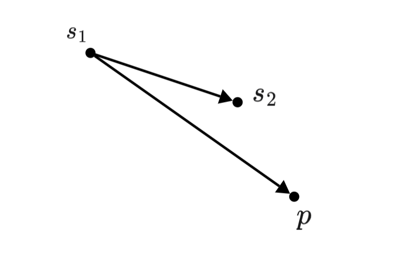
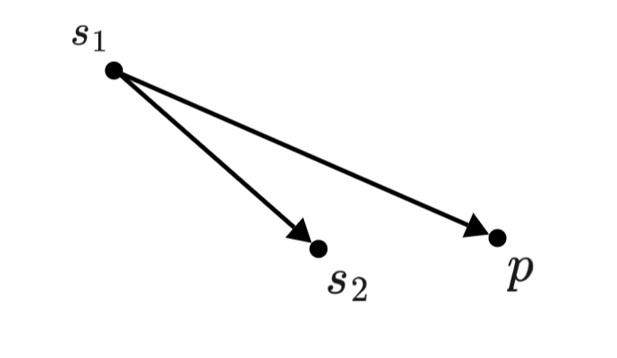

## **定义**

凸多边形：凸多边形是指所有内角大小都在 $[0,\pi]$ 范围内的 简单多边形。

凸包：在平面上能包含所有给定点的最小凸多边形叫做凸包。

更好理解的，在桌子上钉上若干钉子，拿一个橡皮筋将所有钉子围起来的图形就是凸包。

<figure markdown="span">
  { width="400" }
</figure>

## **单调栈求凸包**

首先对点进行排序，按横坐标排序，如果横坐标相等再按纵坐标排序。

显然排序后最小的元素和最大的元素一定在凸包上。而且因为是凸多边形，我们如果从一个点出发逆时针走，轨迹总是左拐的，一旦出现右拐，就说明这一段不在凸包上。因此我们可以用一个单调栈来维护上下凸壳。

因为从左向右看，上下凸壳所旋转的方向不同，为了让单调栈起作用，我们首先升序枚举求出下凸壳，然后降序求出上凸壳。

而左拐还是右拐可以通过向量计算得出。

<figure markdown="span">
  { width="350" }
</figure>

当 $\overrightarrow{s_1s_2}\times \overrightarrow{s_1p} \le 0$ 时，说明 $p$ 在直线 $s_1s_2$ 下方，此时就应该将 $s_2$ 从栈顶弹出。

<figure markdown="span">
  { width="350" }
</figure>

当 $\overrightarrow{s_1s_2}\times \overrightarrow{s_1p} > 0$ 时，将 $p$ 直接加入到栈中即可。

并且在这个过程中，我们用数组 $f$ 标记在凸包上的点，$f[i] = 1$ 代表点 $p[i]$ 在凸包上，$f[i] = 0$ 则不在。

下面是求凸包记凸包周长的模板，$Point$ 的实现与[上节](../2DGeometry/2D.md)介绍的相同：

```cpp
void solve()
{
	int n;
	cin >> n;
	vector<Point> p(n);
	for(int i = 0;i < n;++i)
		cin >> p[i].x >> p[i].y;
	sort(p.begin(),p.end());
	vector<int> st(n);
	vector<bool> f(n);
	int tp = -1;
	for(int i = 0;i < n;++i)
	{
		while(tp > 0 and 
			(p[st[tp]] - p[st[tp - 1]]) * (p[i] - p[st[tp - 1]]) <= 0)
			f[st[tp--]] = 0;
		f[i] = 1;
		st[++tp] = i;
	}
	int cnt = tp;	// 记录下凸壳点数量
	for(int i = n - 1;i >= 0;--i)
	{
		while(tp > cnt and 
			(p[st[tp]] - p[st[tp - 1]]) * (p[i] - p[st[tp - 1]]) <= 0)
			f[st[tp--]] = 0;
		f[i] = 1;
		st[++tp] = i;
	}
	double s = p[st[0]].disPoint(p[st[tp - 1]]);
	for(int i = 0;i < tp - 1;++i)
		s += p[st[i]].disPoint(p[st[i + 1]]);
	printf("%.2lf\n",s);
}
```

## **练习**

[P2742 [USACO5.1] 圈奶牛Fencing the Cows /【模板】二维凸包](https://www.luogu.com.cn/problem/P2742)