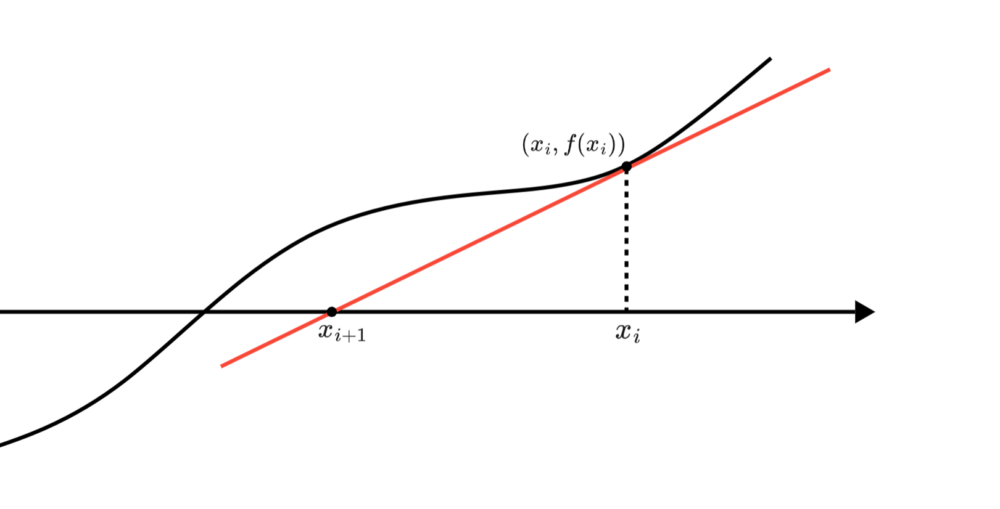

# 牛顿迭代法

## **引入**

牛顿迭代法，又叫牛顿-拉夫逊（拉弗森）方法，是牛顿在$17$世纪提出的，求解在值域范围内连续单调函数 $f(x)$ 近似零点的算法，即求方程 $f(x)=0$ 的近似解。

## **算法思路**

初始时我们从 $f(x) = 0$的一个近似解 $x_0$ 开始。我们做 $f(x)$在 $(x_0,f(x_0))$处的切线，将切线与 $x$ 轴交点定为 $x_1$，这个 $x_1$ 就是一个比 $x_0$ 更精确的点，我们照这个过程一直迭代下去，直到找到符号精度的解即可。

根据上面的思路我们可以写出递推公式，我们首先设当前近似解为 $x_i$ ，那么可以写出下面的式子：

$$
f'(x_i)=\frac{f(x_i)}{x_i-x_{i+1}}
$$

<figure markdown="span">
  { width="750" }
</figure>

<!-- <div align="center"></div> -->

这样我们可以写出递推下一个近似解的关系式：

$$
x_{i+1}=x_i-\frac{f(x_i)}{f'(x_i)}
$$


有了递推式代码写起来就容易了，只要一直用上式迭代，直到达到精度要求，就退出循环即可。

下面以求解平方根为例：

```cpp
constexpr double eps = 1e-10;
double Newton_sqrt(double n)
{
    double x = 1;
    while(1)
    {
        double next_x = (x + n / x) / 2;
        if(abs(next_x - x) < eps)break;
        x = next_x;
    }
    return x;
}
```

----------------------

参考文章：

[Oi-Wiki](https://oi-wiki.org/math/numerical/newton/)