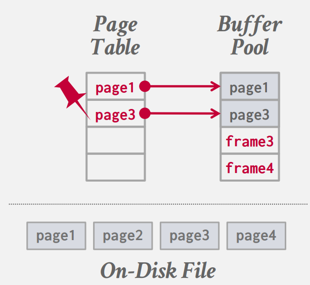

如何从磁盘获取所需数据页，将其载入内存，并在需要引入新数据时，如何做出移除决策以节省空间和时间。

要考虑两个方面：

- 空间控制：要考虑将数据写到磁盘的哪个位置，目标就是将可能会一起用到的数据，尽量在磁盘上也排列在一起，因为磁盘的顺序 IO 效率是高于随机 IO 的，这里就是要尽量增加顺序 IO 概率。

- 时序控制：何时将页面读入内存，何时写回磁盘。目标是减少读取磁盘的停顿。

## **缓存池管理器**

内存池是一块由若干帧（frame）组成的连续空间，每个帧的大小和页面大小相同，帧可以理解为存放页面的容器，当数据库需要一个新页面时，就会将磁盘上对应的数据拷贝到一个空的帧当中：


<figure markdown="span">
  { width="350" }
</figure>


并且管理器会维护一个页表，这个页表与 OS 中的不同，它记录此时在内存中的页面，以及页面所在位置的指针。

<figure markdown="span">
  { width="350" }
</figure>

除此之外每个页面都要维护一些元数据，如：脏标记、引用计数以及一些访问信息。在并发环境下，我们要记录引用对应页面的 worker 数量，只有数量为 0 的页面才能被剔除，并且在调入新页面时，要对页表加锁，来防止并发错误。

缓冲池通常是一块静态的内存空间，在数据库启动时就确定的，要改变缓存池大小就要重新启动数据库。

### **优化**

当并发量较大时，锁的申请和释放就成为了性能瓶颈。就需要一些优化：

- 多缓存池

- 预取策略

- 扫描共享

- 缓存池旁路

#### **multiple buffer pools**

很多数据库在整个系统中不会仅拥有一个缓存池，每个缓存池有独立的锁，这显而易见可以提高并发效率。Mysql、DB2、ORACLE、SQL Server，都采用了此策略。

甚至在 DB2 针对不同的访问情况，可以指定不同的缓冲策略，如：一些专门用于随机 IO 的表，可以使用一些针对随机访问优化的替换策略，该表的查询都使用该缓冲池。

那如何确定所需数据在哪个缓冲池中呢？

- 对象 ID：在每条记录的 ID 中加入一个对象 ID，根据对象 ID 找到所在的缓冲池：

<figure markdown="span">
  { width="250" }
</figure>

- 哈希函数：对页面 ID 进行哈希，映射到对应缓冲池中：

<figure markdown="span">
  { width="250" }
</figure>

#### **pre-fetching**

DBMS 会将之后可能用到的页面提前加载到缓存池中，减少了访问磁盘的停顿。

对于顺序读取，在引擎处理 page1 的时候，就会预先将需要 page2 和 page3 加载到缓存池中：

<figure markdown="span">
  { width="350" }
</figure>

对于索引读取，就要考虑具体的数据结构，针对数据结构进行预加载。在 B+ 树的结构中，对于如下查询：

```sql
select * from A 
    where val between 100 and 250;
```

就要针对数据所在的节点进行预加载：

<figure markdown="span">
  { width="450" }
</figure>

#### **scan sharing**

如果两次查询所需的页面是有重叠的，我们或许不需要重复访问这些重叠的页面。如果两次查询有重叠的数据，DBMS 会将后到的查询指针并到已经存在的指针中，读取两个查询的重叠部分，读取完重叠部分后，再读取剩余内容。

DB2、SQL Server、PostgreSQL 完全支持扫描共享的优化。

在 ORACLE 中只有两个查询完全一样才会执行该优化。


#### **buffer pool bypass**

在一些顺序查询中，我们要将顺序读取的数据都加载到磁盘中，但是如果只是扫描一遍表的话，前面读的数据后续也不会用到，但是我们还是要为其维护一系列的元数据，这些开销是可以避免的。

在并发环境下，与其让每个执行流不断调入页面，污染页表，不如在每个执行流中分配一块内存，专门将顺序读取到的数据放在里面，而不放在缓存池中。在这个本地缓存区中，只能读数据，不能写数据。

ORACLE、SQL Server、PostgreSQL 支持该优化。

## **缓存替换策略**

当 DBMS 需要清空一个 frame 来为新页面腾出空间时，就必须决定替换出哪个页面，能最小化磁盘 IO 的次数，不同的替换策略适用于不同的场景，但总归来说，我们使用替换策略的目标是：

- 缓存的命中率尽可能的高

- 替换策略的决策速度尽可能快

- 维护元数据的开销要尽可能的少

下面介绍以几种替换策略：

### **LRU**

Least-Recently Used，该策略很简单：替换最久没有使用的页面。我们需要维护一个链表，对每个页面我们维护一个时间戳：


<figure markdown="span">
  { width="250" }
</figure>

每次访问一个页面后就将其移动到列表开头。通常还会维护一个哈希表（page table），记录 page_id 到对应页所在的内存地址。

