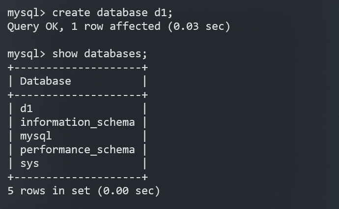
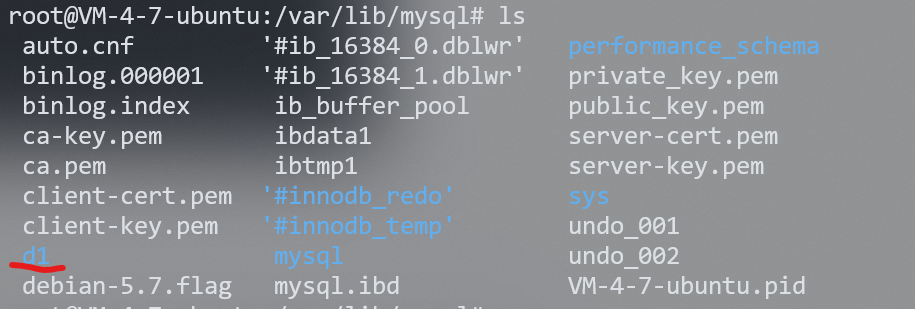
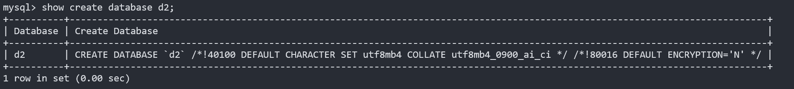
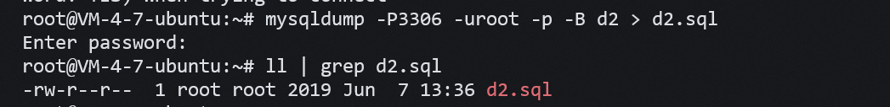
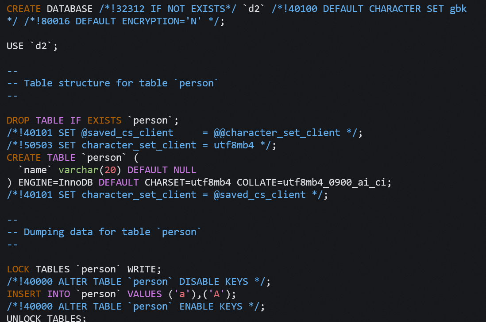
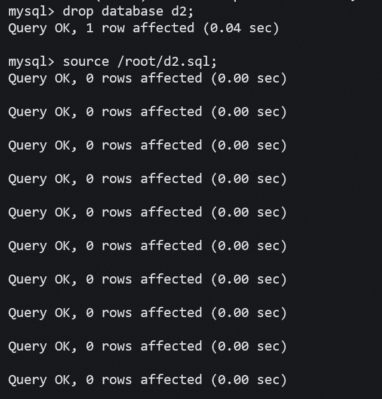
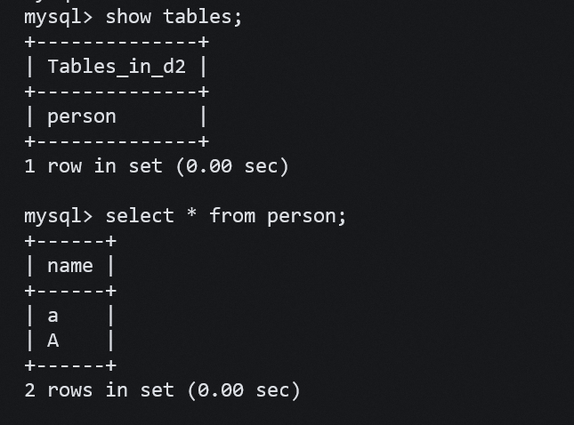

## **SQL 语句分类**

- DDL[data definition language] 数据定义语言，用来维护存储数据的结构。

如：create，drop，alter

- DML[data manipulation language] 数据操纵语言，用来对数据进行操作

如： insert，delete，update

DML中又单独分了一个DQL，数据查询语言，代表指令： select

- DCL[Data Control Language] 数据控制语言，主要负责权限管理和事务
  
如： grant，revoke，commit


## **库操作**

### **创建库**

```sql
create database [if not exists] db_name  [create_specification [,
create_specification] ...];

create_specification:
    [DEFAULT] character set charset_name
    [DEFAULT] collate collation_name
```

创建库在 Linux 就是一个文件目录，在路径 `/var/lib/mysql` 下。

<figure markdown="span">
  { width="550" }
</figure>

<figure markdown="span">
  { width="450" }
</figure>

数据库的编码集：字符集和校验集。

字符集：数据库存数据时采用的编码方式。

校验集：从数据库读数据时的编码方式。

查看系统默认字符集以及校验规则

```sql
show variables like 'character_set_database';
show variables like 'collation_database';
```

查看数据库支持的字符集

```sql
show charset;
```

查看数据库支持的字符集校验规则

```sql
show collation;
```

在创建数据库时，没有指定的话，会使用配置文件中的默认字符集和校验规则。指定的语法如下：

```sql
create database if not exists d2 charset=utf8mb4 collate utf8mb4_0900_ai_ci;
```

### **查看数据库**

显示所有数据库：

```sql
show databases;
```

显示创建语句：

```sql
show create database [数据库名];
```

<figure markdown="span">
  { width="850" }
</figure>


- MySQL 建议我们关键字使用大写，但是不是必须的。

- 数据库名字的反引号``,是为了防止使用的数据库名刚好是关键字

- /*!40100 default.... */ 这个不是注释，表示当前mysql版本大于4.01版本，就执行这句话。

使用 use 可以让我使用一个指定的数据库：

```sql
use [数据库名]
```

使用如下命令可以查看当前正在使用的数据库：

```sql
select database();
```

使用如下命令也可也查看当前状态。

```sql
status;
```


###  **删除库**


```sql
DROP DATABASE [IF EXISTS] db_name;
```


### **修改数据库**


语法：

```sql
alter database db_name [alter_spacification [,alter_spacification]...]

alter_spacification:
[DEFAULT] character set charset_name
[DEFAULT] collate collation_name
```

说明：
对数据库的修改主要指的是修改数据库的字符集，校验规则
实例： 将 mytest 数据库字符集改成 gbk

```sql
alter database d2 char set gbk;
```


### **备份和恢复**

这里使用到 mysql 自带的备份工具 mysqldump：

```sql
mysqldump -P[mysql服务端口号] -u[用户名] -p [密码] -B [数据库名] >  [数据库备份存储的文件路径]
```

示例：将mytest库备份到文件（退出连接）

```sql
mysqldump -P3306 -uroot -p -B d2 > d2.sql
```

<figure markdown="span">
  { width="550" }
</figure>

我们可以大致看一下 d2.sql 文件内容：


<figure markdown="span">
  { width="550" }
</figure>

就是我们创建数据库时的一条条指令。我们回复数据库时，就是让 mysql 一条一条执行这些 sql 语句。现在我们删掉 d2 数据库。只需要在 mysql 下使用 source 指令，mysql 就会执行上述的每一条指令，为我们回复源数据库：


<figure markdown="span">
  { width="350" }
</figure>
<figure markdown="span">
  { width="350" }
</figure>
除了数据库也可以备份表。

```sql
mysqldump -u root -p 数据库名 表名1 表名2 > [数据库备份存储的文件路径]
```

### **查询连接情况**

```sql
show processlist
```

可以告诉我们当前有哪些用户连接到我们的MySQL，如果查出某个用户不是你正常登陆的，很有可能你的数据库被人入侵了。以后大家发现自己数据库比较慢时，可以用这个指令来查看数据库连接情况。

## **表操作**

### **创建表**

```sql
CREATE TABLE table_name (
field1 datatype,
field2 datatype,
field3 datatype
) character set 字符集 collate 校验规则 engine 存储引擎;
```

- field 表示列名

- datatype 表示列的类型

- character set 字符集，如果没有指定字符集，则以所在数据库的字符集为准

- collate 校验规则，如果没有指定校验规则，则以所在数据库的校验规则为准

eg:

<figure markdown="span">
  { width="550" }
</figure>

这里我们以不同的 sql 引擎创建了不同的表，我们这是查看当前数据库的文件目录下，创建了若干文件：

<figure markdown="span">
  { width="550" }
</figure>

不同引擎索引数据的方式不同，所以创建的文件也有所不同。


### **查看表结构**

显示当前数据库下的所有表：

```sql
show tables;
```

查看一个表的详细信息：

```sql
desc [表名];
```

查看创建表时使用的 sql 语句：

```sql
show create table [表名];
```

<figure markdown="span">
  { width="550" }
</figure>

### **修改表结构**

```sql
ALTER TABLE tablename ADD (column datatype [DEFAULT expr][,columndatatype]...);

ALTER TABLE tablename MODIfy (column datatype [DEFAULT expr][,columndatatype]...);  

ALTER TABLE tablename DROP (column);    // 删除列
```


- 修改表名

```sql
alter table [原表名] rename to [新表名];
```

这里 to 可以省略。  

- 插入新列：

```sql
alter table [表名] add [新列的名字] [新行数据类型] [列表述] [列位置];
```


<figure markdown="span">
  { width="550" }
</figure>


- 修改列数据类型：

```sql
alter table [表名] modify [要修改类型的列名] [新类型];
```

<figure markdown="span">
  { width="550" }
</figure>


- 修改列名:

```sql
alter table [表名] change [旧列名] [新列名] [新列的数据类型] [列的默认值];
```

列默认值可以省略。

<figure markdown="span">
  { width="550" }
</figure>

- 删除列：

```sql
alter table [表名] drop [要删除的列名];
```

**注：**删除列会将列中的数据也都删除，删除列时要慎重。


### **删除表**

```sql
drop [TEMPORARY] table [if exists] [表名] ;
```


