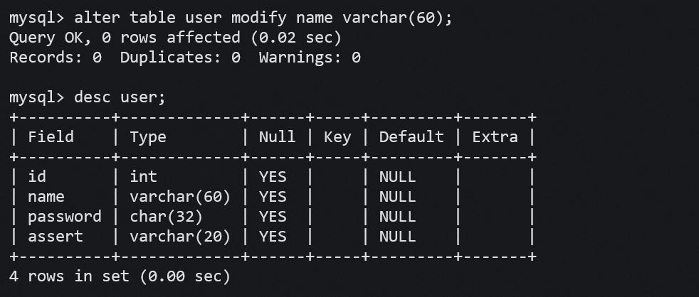

## **创建表**

```sql
CREATE TABLE table_name (
field1 datatype,
field2 datatype,
field3 datatype
) character set 字符集 collate 校验规则 engine 存储引擎;
```

- field 表示列名

- datatype 表示列的类型

- character set 字符集，如果没有指定字符集，则以所在数据库的字符集为准

- collate 校验规则，如果没有指定校验规则，则以所在数据库的校验规则为准

eg:

<figure markdown="span">
  { width="550" }
</figure>

这里我们以不同的 sql 引擎创建了不同的表，我们这是查看当前数据库的文件目录下，创建了若干文件：

<figure markdown="span">
  { width="550" }
</figure>

不同引擎索引数据的方式不同，所以创建的文件也有所不同。

### **从表创建表**

```sql
create table table_name1 select column,[column...] from table_name2 [where ...];
```

该语句可以从表 table_name2 中拷贝指定列指定行到表 table_name1; 

## **查看表结构**

显示当前数据库下的所有表：

```sql
show tables;
```

查看一个表的详细信息：

```sql
desc [表名];
```

查看创建表时使用的 sql 语句：

```sql
show create table [表名];
```

<figure markdown="span">
  { width="550" }
</figure>

## **修改表结构**

```sql
ALTER TABLE tablename ADD (column datatype [DEFAULT expr][,columndatatype]...);

ALTER TABLE tablename MODIfy (column datatype [DEFAULT expr][,columndatatype]...);  

ALTER TABLE tablename DROP (column);    // 删除列
```


- 修改表名

```sql
alter table [原表名] rename to [新表名];
```

这里 to 可以省略。  

- 插入新列：

```sql
alter table [表名] add [新列的名字] [新行数据类型] [列表述] [列位置];
```


<figure markdown="span">
  { width="550" }
</figure>


- 修改列数据类型：

```sql
alter table [表名] modify [要修改类型的列名] [新类型];
```

<figure markdown="span">
  { width="550" }
</figure>


- 修改列名:

```sql
alter table [表名] change [旧列名] [新列名] [新列的数据类型] [列的默认值];
```

列默认值可以省略。

<figure markdown="span">
  { width="550" }
</figure>

- 删除列：

```sql
alter table [表名] drop [要删除的列名];
```

**注：**删除列会将列中的数据也都删除，删除列时要慎重。


### **删除表**

```sql
drop [TEMPORARY] table [if exists] [表名] ;
```