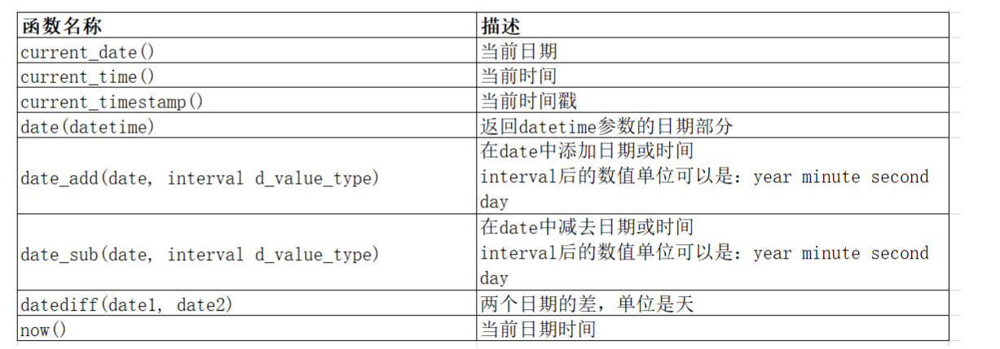

## **日期函数**

<figure markdown="span">
  { width="950" }
</figure>

## **字符串函数**

|函数名|描述|
|:-:|:-:|
charset(str)|返回字符串字符集|
concat(string[,...])|连接字符串|
instr(string,substring)|返回 substring 在string 中出现的位置，没有返回 0|
ucase(string)|转大写|
lcase(string)|转小写|
left(string,length)|从 string 中的左边截取 length 个字符|
length(string)| string 的长度|
replace(str,search_str,replace_str)|在 str 中的 search_str 用 replace_str 替换|
strcmp(str1,str2)|逐字符比较两个串|
SUBSTRING(s, start, length)|从字符串 s 的 start 位置截取长度为 length 的子字符串|
ltrim(string)，rtrim(string)，trim(string)|去除开头空格，去除结尾空格，去除开头和结尾的空格|

## **数学函数**

|函数名|描述|
|:-:|:-:|
abs(x)|返回 x 的绝对值|
bin(x)|十进制转二进制|
hex(x)|十进制转十六进制|
conv(x,from_base,to_base)|进制转换|
ceiling(x)，ceil(x)|上取整|
floor(x)|下取整|
format(x,decimal_places)|格式化，保留 decimal_places 位小数（四舍五入）|
rand()|返回 $[0,1)$ 的随机数|
mod(x,denominator)|取模，求余|
sqrt(x)|x 的平方根|
pow(x,y)，power(x,y)|返回 x 的 y 次方|
exp(x)|	返回 e 的 x 次方|
n DIV m|整除，n 为被除数，m 为除数|

## **其他函数**

|函数名|描述|
|:-:|:-:|
user()|查询当前用户|
VERSION()|返回数据库的版本号|
md5(str)|对一个字符串进行md5摘要，摘要后得到一个32位字符串|
database()|显示当前正在使用的数据库|
password()|MySQL数据库使用该函数对用户加密|
ifnull(val1， val2)|如果val1为null，返回val2，否则返回val1的值|
if(expr,v1,v2)|	如果表达式 expr 成立，返回结果 v1；否则，返回结果 v2。|

