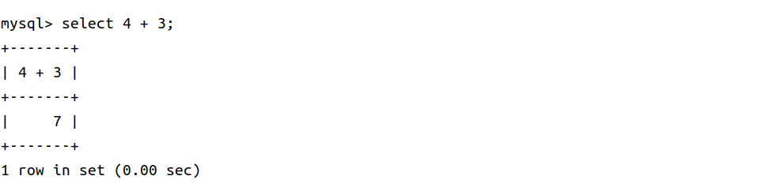
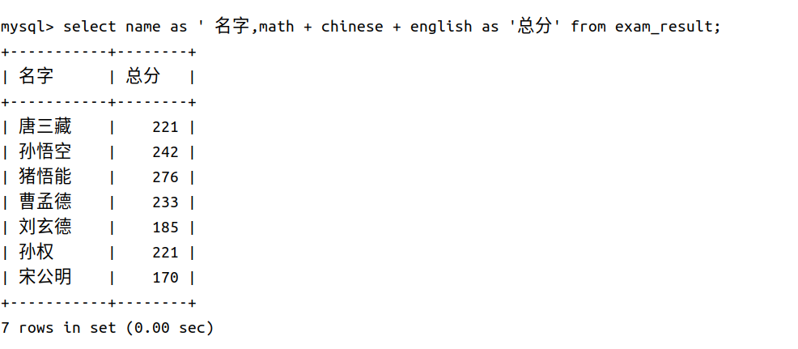
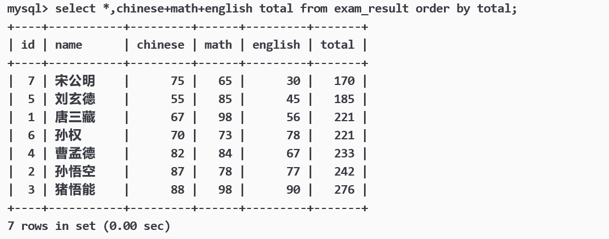
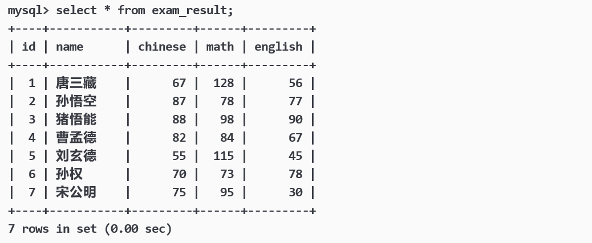

## **增**

```sql
INSERT [INTO] table_name
[(column [, column] ...)]
VALUES (value_list) [, (value_list)] ...


value_list: value, [, value] ...
```

values 左侧是我们指定的列属性，可以省略，values 右侧是对应列属性的值，如果左侧列属性省略，则按照表中的列顺序一一对应。

可以有多组 **VALUES** ，多组数据用逗号隔开，就可以一次插入多组数据。

<figure markdown="span">
  { width="750" }
</figure>

### **插入否则更新**

由于 **主键** 或者 **唯一键** 对应的值已经存在而导致插入失败，这时我们可能想更新对应行的值，这时可以选择性的进行同步更新操，语法如下：

```sql
INSERT ... ON DUPLICATE KEY UPDATE
column = value [, column = value] ...
```

<figure markdown="span">
  { width="750" }
</figure>

- 0 row affected:表中有冲突数据，但冲突数据的值和 update 的值相等

- 1 row affected:表中没有冲突数据，数据被插入

- 2 row affected:表中有冲突数据，并且数据已经被更新

### **替换**

replace 的语法和 insert 相同，用途和 ON DUPLICATE KEY UPDATE 相同：

- 主键 或者 唯一键 没有冲突，则直接插入；

- 主键 或者 唯一键 如果冲突，则删除后再插入

<figure markdown="span">
  { width="750" }
</figure>

- 1 row affected:表中没有冲突数据，数据被插入

- 2 row affected:表中有冲突数据，删除后重新插入

## **删**

drop 删除的表，要删除表的内容就要使用 delete 语句：

```sql
DELETE FROM table_name [WHERE ...] [ORDER BY ...] [LIMIT ...]
```

从表中删除选定行。

###  **截断表**

```sql
TRUNCATE [TABLE] table_name;
```

注意：这个操作慎用

1. 只能对整表操作，将整表的数据清空，不能像 DELETE 一样针对部分数据操作；

2. 实际上 MySQL 不对数据操作，所以比 DELETE 更快，但是 TRUNCATE 在删除数据的时候，并不经过真正的事物，所以无法回滚

3. 会重置 AUTO_INCREMENT 项

## **查**


```sql
SELECT
    [DISTINCT] {* | {column [, column] ...}
    [FROM table_name]
    [WHERE ...]
    [ORDER BY column [ASC | DESC], ...]
    LIMIT ...
```

### **select 列**

- **全列查询**

```sql
SELECT * FROM table_name;
```

- **指定列查询**

```sql
SELECT column[,column...] FROM table_name;
```

- **查询字段为表达式**

select 除了执行一些字句，也是可以执行表达式的，如下：

<figure markdown="span">
  { width="750" }
</figure>

我们在查询时，也可也对查询的列做计算，我们建如下的表作为例子：

```sql
CREATE TABLE exam_result (
id INT UNSIGNED PRIMARY KEY AUTO_INCREMENT,
name VARCHAR(20) NOT NULL COMMENT '同学姓名',
chinese float DEFAULT 0.0 COMMENT '语文成绩',
math float DEFAULT 0.0 COMMENT '数学成绩',
english float DEFAULT 0.0 COMMENT '英语成绩'
);

INSERT INTO exam_result (name, chinese, math, english) VALUES
('唐三藏', 67, 98, 56),
('孙悟空', 87, 78, 77),
('猪悟能', 88, 98, 90),
('曹孟德', 82, 84, 67),
('刘玄德', 55, 85, 45),
('孙权', 70, 73, 78),
('宋公明', 75, 65, 30);
```

<figure markdown="span">
  { width="750" }
</figure>


<figure markdown="span">
  { width="750" }
</figure>

这样列名不是很好看，我们可以将查询的列进行重命名：

```sql
SELECT column [AS] alias_name [...] FROM table_name;
```

这里的 as 可以省略。

<figure markdown="span">
  { width="750" }
</figure>

-  **结果去重**

如果想将某些查询的列去重就要使用 DISTINCT 关键字，语法如下

```sql
SELECT DISTINCT column [...] FROM table_name
```

### **where 条件**

where 类似 if 语句，可以从查询的列中，筛选出符合条件的行。

比较运算符：

|运算符|说明|
|:-:|:-:|
\>, >=, <, <= | 大于，大于等于，小于，小于等于
= | 等于，NULL 不安全，例如 NULL = NULL 的结果是 NULL
<=> | 等于，NULL 安全，例如 NULL <=> NULL 的结果是 TRUE(1)
!=, <> | 不等于
BETWEEN a0 AND a1 | 范围匹配，[a0, a1]，如果 a0 <= value <= a1，返回 TRUE(1)
IN (option, ...) | 如果是 option 中的任意一个，返回 TRUE(1)
IS NULL | 是 NULL
IS NOT NULL | 不是 NULL
LIKE | 模糊匹配。% 表示任意多个（包括 0 个）任意字符；_ 表示任意一个字符


要注意的是 NULL 在除 <=> 之外的运算符中，都是不参与运算的，即含 NULL 的运算符结果都为 NULL。

逻辑运算符与 Python 相同：

|运算符|说明|
|:-:|:-:|
AND |多个条件必须都为 TRUE(1)，结果才是 TRUE(1)
OR | 任意一个条件为 TRUE(1), 结果为 TRUE(1)
NOT | 条件为 TRUE(1)，结果为 FALSE(0)

要注意的是 where 后不能使用别名。

### **结果排序**

- ASC 为升序（从小到大）

- DESC 为降序（从大到小）

- 默认为 ASC

```SQL
SELECT ... FROM table_name [WHERE ...]
ORDER BY column [ASC|DESC], [...];
```

### **筛选分页结果**

```sql
-- 从 0 开始，筛选 n 条结果
SELECT ... FROM table_name [WHERE ...] [ORDER BY ...] LIMIT n;

-- 从 s 开始，筛选 n 条结果
SELECT ... FROM table_name [WHERE ...] [ORDER BY ...] LIMIT s,n;

-- 从 s 开始，筛选 n 条结果，比第二种用法更明确，建议使用
SELECT ... FROM table_name [WHERE ...] [ORDER BY ...] LIMIT n OFFSET s;
```

建议：对未知表进行查询时，最好加一条 LIMIT 1，避免因为表中数据过大，查询全表数据导致数据库卡死。

### **插入查询结果**

```sql
INSERT INTO table_name [(column [, column ...])] SELECT ...
```

将 select 查询得到的表，插入到 table_name 表中。

## **改**

```sql
UPDATE table_name SET column = expr [, column = expr ...]
[WHERE ...] [ORDER BY ...] [LIMIT ...]
```

对查询到的结果进行列值更新。通常都会加 where 条件，否则会将选中列的所有行都修改。需要注意的是 update 语句的 limit 子句的 offset 偏移量语法。

eg: 我们将上述表中总成绩后三名的数学成绩加 30 分：

<figure markdown="span">
  { width="750" }
</figure>

<figure markdown="span">
  { width="750" }
</figure>

<figure markdown="span">
  { width="750" }
</figure>

## **聚合函数**

|函数|说明|
|:-:|:-:|
COUNT([DISTINCT] expr)| 返回查询到的数据的 数量
SUM([DISTINCT] expr)  |返回查询到的数据的 总和，不是数字没有意义
AVG([DISTINCT] expr)  |返回查询到的数据的 平均值，不是数字没有意义
MAX([DISTINCT] expr)  |返回查询到的数据的 最大值，不是数字没有意义
MIN([DISTINCT] expr)  |返回查询到的数据的 最小值，不是数字没有意义

###  **group by子句的使用**

在 select 中使用 group by 子句可以对指定列进行分组查询，配合聚合函数使用，可以实现对数据的分组计算：

```sql
select column1, column2, .. from table group by column [,column ...] having [exper];
```

该语句会将各列按照 column 中的值进行分组，值相同的分到一组。也可以选中多列做分组条件。having 子句是对聚合后的统计数据，进行条件筛选，支持重命名。

SQL查询中各个关键字的执行先后顺序 from > on> join > where > group by > with > having > select > distinct > order by > limit

## **练习**

1. 删除下表中重复元素：

```sql

CREATE TABLE duplicate_table (id int, name varchar(20));

INSERT INTO duplicate_table VALUES
(100, 'aaa'),
(100, 'aaa'),
(200, 'bbb'),
(200, 'bbb'),
(200, 'bbb'),
(300, 'ccc');
```

<figure markdown="span">
  { width="750" }
</figure>

这里要注意的是，我在对一些数据做更新时，最好都时采用原子性的操作进行。因为如果现在有其他用户正在访问 duplicate_table 表的话，我们直接对表进行修改，可能会造成数据的错乱，所以更推荐先将去重的数据保存到一个临时表中，再通过原子的 rename 操作进行表的更新。
