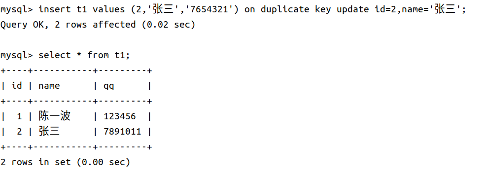

## **增**

```sql
INSERT [INTO] table_name
[(column [, column] ...)]
VALUES (value_list) [, (value_list)] ...


value_list: value, [, value] ...
```

values 左侧是我们指定的列属性，可以省略，values 右侧是对应列属性的值，如果左侧列属性省略，则按照表中的列顺序一一对应。

可以有多组 **VALUES** ，多组数据用逗号隔开，就可以一次插入多组数据。

<figure markdown="span">
  { width="750" }
</figure>

### **插入否则更新**

由于 **主键** 或者 **唯一键** 对应的值已经存在而导致插入失败，这时我们可能想更新对应行的值，这时可以选择性的进行同步更新操，语法如下：

```sql
INSERT ... ON DUPLICATE KEY UPDATE
column = value [, column = value] ...
```

<figure markdown="span">
  { width="750" }
</figure>

- 0 row affected:表中有冲突数据，但冲突数据的值和 update 的值相等

- 1 row affected:表中没有冲突数据，数据被插入

- 2 row affected:表中有冲突数据，并且数据已经被更新

### **替换**

replace 的语法和 insert 相同，用途和 ON DUPLICATE KEY UPDATE 相同：

- 主键 或者 唯一键 没有冲突，则直接插入；

- 主键 或者 唯一键 如果冲突，则删除后再插入

<figure markdown="span">
  { width="750" }
</figure>

- 1 row affected:表中没有冲突数据，数据被插入

- 2 row affected:表中有冲突数据，删除后重新插入

## **删**

```sql

```


## **查**


```sql
SELECT
    [DISTINCT] {* | {column [, column] ...}
    [FROM table_name]
    [WHERE ...]
    [ORDER BY column [ASC | DESC], ...]
    LIMIT ...
```

### **select 列**

- **全列查询**

```sql
SELECT * FROM table_name;
```

- **指定列查询**

```sql
SELECT column[,column...] FROM table_name;
```

- **查询字段为表达式**

select 除了执行一些字句，也是可以执行表达式的，如下：

<figure markdown="span">
  { width="750" }
</figure>

我们在查询时，也可也对查询的列做计算，我们建如下的表作为例子：

<figure markdown="span">
  { width="750" }
</figure>


<figure markdown="span">
  { width="750" }
</figure>

这样列名不是很好看，我们可以将查询的列进行重命名：

```sql
SELECT column [AS] alias_name [...] FROM table_name;
```

这里的 as 可以省略。

<figure markdown="span">
  { width="750" }
</figure>

-  **结果去重**

如果想将某些查询的列去重就要使用 DISTINCT 关键字，语法如下

```sql
SELECT DISTINCT column [...] FROM table_name
```

### **where 条件**

where 类似 if 语句，可以从查询的列中，筛选出符合条件的行。


## **改**

