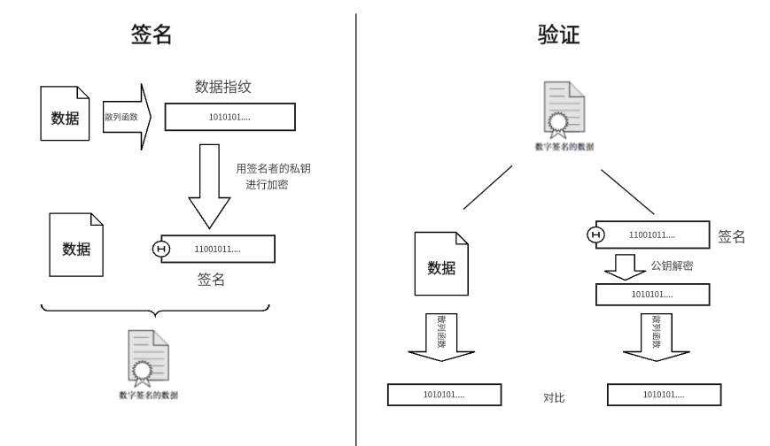
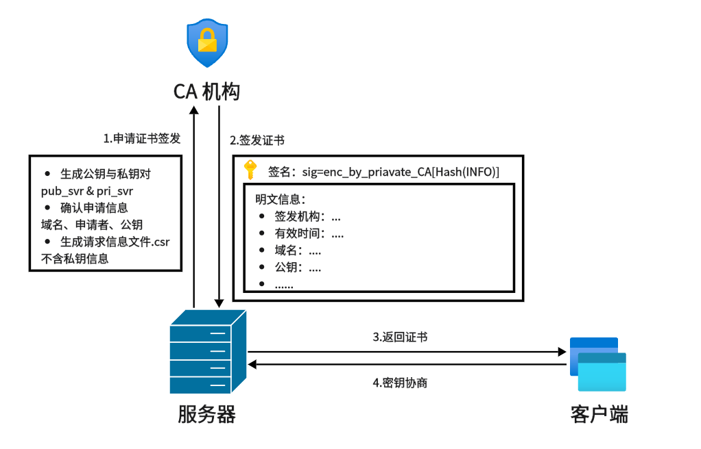

## **简介**

HTTP 是超文本传输协议，也就是HyperText Transfer Protocol。HTTP 是一种无状态无连接的基于 TCP/IP 的用户层传输协议。

## **内容**

### **Header**


HTTP 报文的头部是一系列的 Key-Value 的键值对，如下就是一个 HTTP 请求报文头部：

```
GET / HTTP/1.1
Host: 127.0.0.1:8888
Connection: keep-alive
Cache-Control: max-age=0
sec-ch-ua: "Google Chrome";v="125", "Chromium";v="125", "Not.A/Brand";v="24"
sec-ch-ua-mobile: ?0
sec-ch-ua-platform: "Windows"
Upgrade-Insecure-Requests: 1
User-Agent: Mozilla/5.0 (Windows NT 10.0; Win64; x64) AppleWebKit/537.36 (KHTML, like Gecko) Chrome/125.0.0.0 Safari/537.36
Accept: text/html,application/xhtml+xml,application/xml;q=0.9,image/avif,image/webp,image/apng,*/*;q=0.8,application/signed-exchange;v=b3;q=0.7
Sec-Fetch-Site: cross-site
Sec-Fetch-Mode: navigate
Sec-Fetch-User: ?1
Sec-Fetch-Dest: document
Accept-Encoding: gzip, deflate, br, zstd
Accept-Language: zh-CN,zh;q=0.9
```

- **第一行：**标识了 HTTP 请求的类型，有 GET，POST，PUT，DELETE 等。还有 HTTP 协议的版本，有 1.0，1.1，2，3 等。

#### **请求头/响应头**

如果是请求头，会标识 HTTP 请求的类型，有 GET，POST，PUT，DELETE 等，会有访问的资源路径，这里是 `\`。还有 HTTP 协议的版本，有 1.0、1.1、2、3 等。

- 请求类型：

GET：向特定的资源发出请求。

POST：向指定资源提交数据进行处理请求（例如提交表单或者上传文件）。数据被包含在请求体中。POST请求可能会导致新的资源的创建和/或已有资源的修改。

PUT：向指定资源位置上传其最新内容。 


DELETE：请求服务器删除Request-URI所标识的资源。 

如果是响应头，会指名 HTTP 协议版本和状态码。

- 状态码：

状态码是服务器对我们该次请求处理的结果状态，状态码分为 5 类：

|状态码|类别|原因|
|:-:|:-:|:-:|
1xx|信息响应|接收的请求正在处理|
2xx|成功响应|请求正常处理完毕|
3xx|重定向|需要进行附加操作以完成请求|
4xx|客户端错误|服务器无法处理请求|
5xx|服务器错误|服务器处理请求出错|

最常见的状态码, 比如 200(OK), 404(Not Found), 403(Forbidden), 302(Redirect, 重定向), 504(Bad Gateway)。

这里的状态码，和 HTTP 的无状态无关。HTTP 的无状态意味着每个请求都是独立的，与之前的请求没有任何关联，服务器不会保留任何客户端请求的状态信息，这也就是说我们重复的向服务器申请同一资源时，服务器并不会识别出，我们曾多次申请过该数据。

但是浏览器可以能会对历史资源进行缓存，对针对缓存过的资源，并不会真的向服务器发送请求。

有一点对不上的是，我们在一个网站第一次登录之后，后续访问网站就不需要再次登录，这是因为使用了 Cookie，在后文介绍。


#### **Host**

客户端发送请求时，用来指定服务器的域名。

#### **Connection**

和服务器的连接方式，有长连接和短连接。HTTP 长连接的特点是，只要任意一端没有明确提出断开连接，则保持 TCP 连接状态，便于其他请求复用。而短连接是在接收完数据后，就断开 TCP 连接。

这里的连接，也和 HTTP 的无连接无关，HTTP 的无连接是每个请求/响应对在完成之后，客户端与服务器之间的连接就会关闭。每次请求时都需要重新建立连接，这样的做法使得服务器无需维持大量持久连接，减少了服务器资源的消耗。

#### **Location**

搭配3xx状态码使用, 告诉客户端接下来要去哪里访问。

#### **User-Agent**

声明用户的操作系统和浏览器版本信息。

#### **Cookie**

用于在客户端存储少量信息. 通常用于实现会话 (session) 的功能。

一般是当我们第一次登录一个网站时，服务器的响应 HTTP 报文中汇包含一个 `set-cookie` 字段，来让本地浏览器缓存一些用户信息，如密码，用户名等，当下次用户再次向该网站发送请求时，浏览器会自动将之前缓存的用户信息加到 HTTP 报文的 `cookie` 字段，来交给服务器进行验证，就可以避免用户多次重复的输入信息，以优化用户体验。

但是这个过程中有一个问题，就是服务器在进行 `set-cookie` 的响应中，用户信息是直接写在 HTTP 报文中的，这样的做法是很不安全的，用户的信息极易被盗取，这里就要提到 session，这时另一种记录客户状态的机制，不过 session 的用户信息被保存在服务器中，并且给每一个用户的信息分配一个独一无二 session ID 来标识每个用户，在服务器的响应 HTTP 报文中，也要进行 `set-cookie` ，不过这里让浏览器缓存的是 session ID，之后客户端再次访问时只需要将 session ID 交给服务器，即可辨别出用户。

但是这还没解决问题，只要抓包捕获到 session ID，就可以冒充用户。


#### **数据相关**

- **Accept**：请求头内容，声明自己可以接受哪些数据格式。

- **Content-Type**：响应头的内容，标识返回的数据类型，还有编码方式，如： `text/html; Charset=utf-8`。

- **Accept-Encoding**：请求头内容，说明自己可以接受哪些压缩方法。

- **Content-Encoding**：响应头的内容，说明数据的压缩方法。表示服务器返回的数据使用了什么压缩格式。如：gzip。

- **Content-Length**：响应头内容，标识数据长度。HTTP 协议通过设置回车符、换行符作为 HTTP header 的边界，通过 Content-Length 字段作为 HTTP body 的边界，这两个方式都是为了解决“粘包”的问题。


其他头部，后文再详细介绍。

### **Body**

要传输的内容，可以没有，长度不限。


### **GET 和 POST 的区别**

RFC 规定中 HTTP 协议中的安全是指请求方法不会修改服务器上的资源。

还有幂等的概念：多次执行相同的操作，结果都是相同的。

如果从 RFC 规范定义的语义来看：

GET 方法就是**安全且幂等的**，因为它是「只读」操作，无论操作多少次，服务器上的数据都是安全的，且每次的结果都是相同的。

POST 方法是 **不安全且不幂等的** ，因为是新增或提交数据的操作，会修改服务器上的资源，所以是不安全的，且多次提交数据就会创建多个资源，所以不是幂等的。

但实际开发中，并不一定会遵循上述规范，具体的情况要看具体的实现。

在 RFC 的规范中并没有规定 GET 方法不能有请求体，而且 URL 中的查询参数并不是只能出现在 GET 请求中，POST 请求也可以。


## **缓存**

对于一些重复的 HTTP 请求，效率更高的做法是把对应的响应数据在本地缓存一份，下次再请求该数据时，直接在读取本地的数据即可。在本地缓存就要处理如何与服务器同步的问题。

HTTP 采用**强制缓存 + 协商缓存**的做法。浏览器会在本地维护一份数据的有效时间，在有效时间范围内的，都直接使用本地缓存，当数据失效后，会向服务器发起一个协商缓存的请求，由服务器判断该本地数据是否失效，没有失效就返回状态码为 304 的响应，失效就返回新的数据。采用强制缓存获取到的数据的状态码与第一次获取到该响应时的状态码相同，并且会标识由 （from disk cache）。


### **强制缓存**

强制缓存的实现使用了两个 HTTP 头部：

- Cache-Control， 是一个相对时间，它提供了多种指令来控制缓存行为。以下是一些常见的指令：

```
public：响应可以被任何缓存存储。
private：响应仅针对单个用户，不能被共享缓存存储。
no-cache：强制每次请求直接到服务器验证响应。
no-store：禁止任何缓存存储请求或响应数据。
max-age=<seconds>：指定响应在缓存中可以存储的最大时间（以秒为单位）。
must-revalidate：在缓存过期后，强制要求缓存重新验证。
```

下面是一个使用 Cache-Control 头部字段的 HTTP 响应示例：

```http
HTTP/1.1 200 OK
Content-Type: text/html
Cache-Control: public, max-age=3600
```

它标识了该响应可以被任何缓存存储，并且可以存储 3600 秒。

- Expires，是一个绝对时间

下面是一个使用 Expires 字段的示例：

```http
HTTP/1.1 200 OK
Content-Type: text/html
Expires: Wed, 21 Oct 2024 07:28:00 GMT
```

Expires 字段指定了资源的过期时间为 2024年10月21日 07:28:00 GMT。在此时间之前，浏览器和缓存服务器可以直接从缓存中读取该资源，而无需向服务器再次请求。

如果 HTTP 响应头部同时有 Cache-Control 和 Expires 字段的话，Cache-Control 的优先级高于 Expires。

### **协商缓存**

实现协商缓存有两种方式，一种是基于资源修改时间的，一种是基于资源标识符的。

基于资源修改时间的会使用到请求头部的 If-Modified-Since 字段和响应头部的 Last-Modified 字段。

- If-Modified-Since：发送上次缓存的日期，询问服务器自该日期后资源是否修改。

- Last-Modified：服务器返回资源的最后修改时间。

当本地的资源超过了强制缓存的有效时间，会向服务器发送一个带有 If-Modified-Since 字段的请求，服务器收到后，会比对该资源在服务器上的最后修改时间，如果服务器端的数据更新，就会将资源返回，否则就返回状态码 304 告知本地可以使用缓存。

但是这会有一些问题，可能系统时间会被修改，导致出现不可靠的问题，而且在没有修改文件内容的情况下，修改时间也可能改变，这会导致服务器重传数据。

基于资源标识符的会使用到请求头部的 If-None-Match 字段和响应头部的 ETag 字段。

- If-None-Match：发送缓存资源的 ETag（实体标签），询问服务器资源是否改变。

- ETag：服务器返回资源的唯一标识符。

当浏览器第一次请求访问服务器资源时，服务器会在返回这个资源的同时，在 Response 头部加上 ETag 唯一标识，这个唯一标识的值是根据当前请求的资源生成的；

当本地的资源超过了强制缓存的有效时间，会在 Request 头部加上 If-None-Match 字段，该字段的值就是 ETag 标识；服务器再次收到请求后，会根据请求中的 If-None-Match 值与当前请求的资源生成的唯一标识进行比较：如果值相等，则返回 304 Not Modified，不会返回资源；如果不相等，则返回 200 状态码和资源，并在 Response 头部加上新的 ETag 标识；本地再更新 ETag 标识。

ETag 的优先级是高于 Last-Modified 的。

## **HTTPS**

HTTP 都是明文传递数据，数据都是不安全的。HTTPS 就是在 HTTP 的基础上加了一层 SSL\TLS 的加密层。在介绍 HTTPS 前，我们先介绍一点数据加密的基础概念

### **加密**

#### **对称加密**

采⽤单钥密码系统的加密⽅法，同⼀个密钥可以同时⽤作信息的加密和解密，这种加密⽅法称为对称加密，也称为单密钥加密，特征：加密和解密所⽤的密钥是相同的。

常⻅对称加密算法(了解)：DES、3DES、AES、TDEA、Blowfish、RC2等

特点：算法公开、计算量⼩、加密速度快、加密效率⾼

对称加密其实就是通过同⼀个 "密钥" , 把明⽂加密成密⽂, 并且也能把密⽂解密成明⽂.


#### **非对称加密**

需要两个密钥来进⾏加密和解密，这两个密钥是公开密钥（public key，简称公钥）和私有密钥（private key，简称私钥）。

常⻅⾮对称加密算法(了解)：RSA，DSA，ECDSA

特点：算法强度复杂、安全性依赖于算法与密钥但是由于其算法复杂，⽽使得加密解密速度没有对称加密解密的速度快。

⾮对称加密要⽤到两个密钥, ⼀个叫做 "公钥", ⼀个叫做 "私钥"，公钥和私钥是配对的，被公钥加密的数据只能由私钥解密，被私钥加密的内容只能被公钥解密。

### **数据摘要**

数据摘要（数据指纹），其基本原理是利⽤单向散列函数(Hash函数)对信息进⾏运算,⽣成⼀串固定⻓度的数字摘要。数字指纹并不是⼀种加密机制,但可以⽤来判断数据有没有被窜改。

摘要常⻅算法：有MD5、SHA1、SHA256、SHA512等，算法把⽆限的映射成有限，因此可能会有碰撞（两个不同的信息，算出的摘要相同，但是概率⾮常低）

摘要特征：和加密算法的区别是，摘要严格意义不是加密，因为没有解密，只不过从摘要很难反推原信息，通常⽤来进⾏数据对⽐。


### **数字签名**

就是对原数据进行依次散列计算，得到其数据指纹，再将数据指纹用签名者的私钥进行加密，加密得到的密文就是签名。

当用户端拿到带签名的数字后，只需拿公钥解密签名，对比签名和拿到的数据指纹是否相同，就可以知道数据是被被篡改过。


<figure markdown="span">
  { width="650" }
</figure>


### **HTTPS**

<!-- 我们先来想想，如果是我们，该怎么用上面的方法，来对 HTTP 进行加密。

最简单也是效率最高的加密方式是使用对称加密，服务器和客户端约定一个密钥，双方通过 密钥 来进行数据交换，每个用户的 密钥 都是不同的，都存到服务器是不现实的，⽐较理想的做法, 就是能在客户端和服务器建立连接的时候, 双⽅协商确定这次的密钥是啥，每次通信时将密钥发给服务器。但是如果在密钥传递过程中，被中间人截获密钥的话，这种加密就形同虚设了。方案一 pass。


既然对称加密不行，我们使用非对称加密，鉴于⾮对称加密的机制，如果服务器先把公钥以明⽂⽅式传输给浏览器，之后浏览器向服务器传数据
前都先⽤这个公钥加密好再传，从客⼾端到服务器信道似乎是安全的(有安全问题)，因为只有服务器有
相应的私钥能解开公钥加密的数据。
但是服务器到浏览器的这条路怎么保障安全？ -->


服务器申请证书：

<figure markdown="span">
  { width="650" }
</figure>

用户的浏览器和电脑都会内置许多 CA 机构的证书的公钥，在收到服务端发来的证书后会将。

TLS 握手：


------

参考：

[小林coding 图解网络](https://xiaolincoding.com/network/){target="_blank"}

[从点击网页到显示需要多少步-DNS、HTTP、CA、TLS、HTTPS](https://www.bilibili.com/video/BV1Tx421m7Hv/?spm_id_from=333.337.search-card.all.click&vd_source=0de771c86d90f02a6cab8152f6aa173f){target="_blank"}
