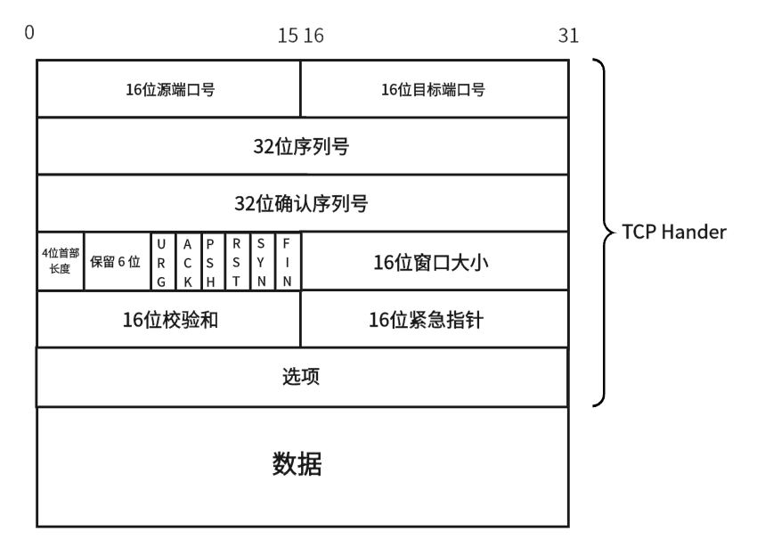
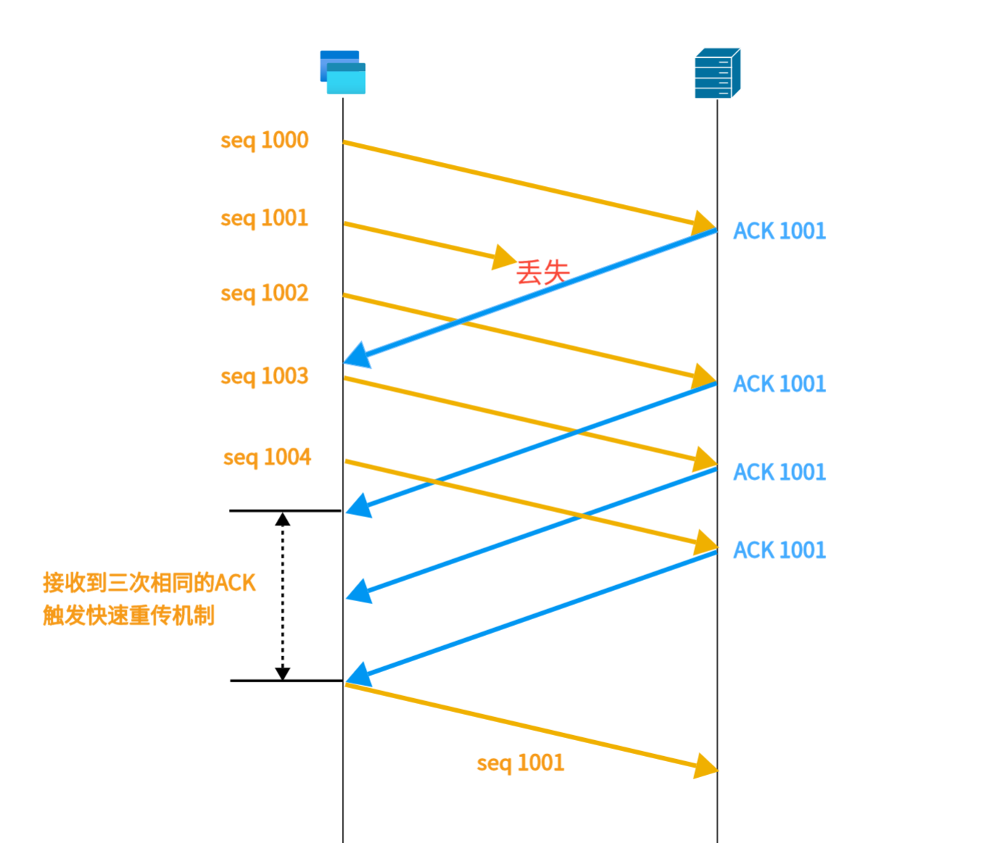
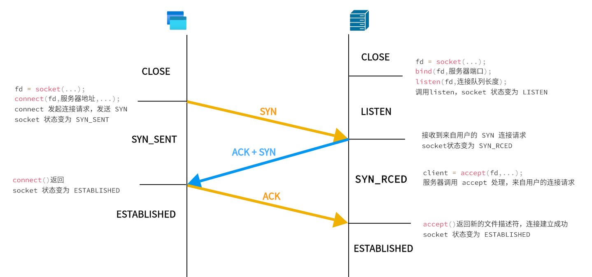
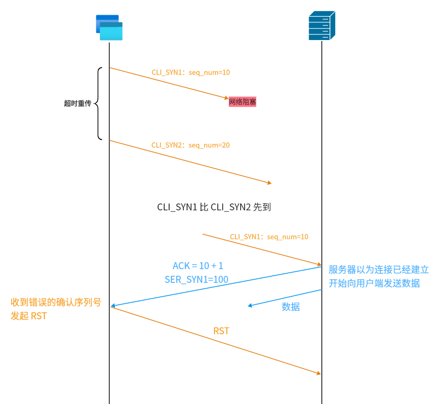
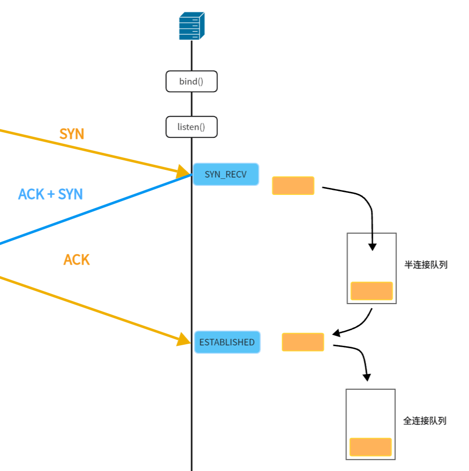
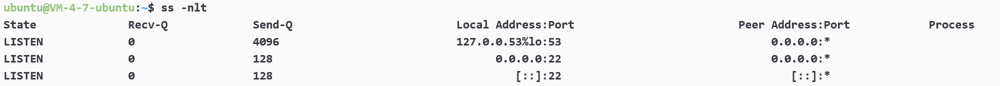
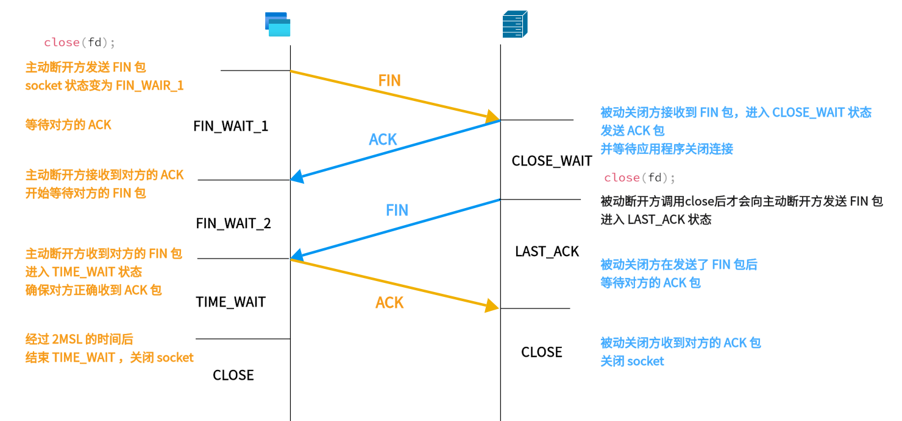
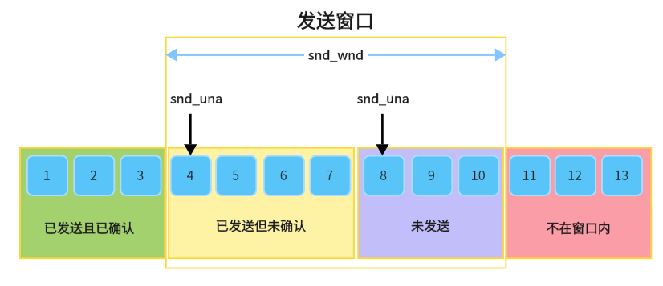
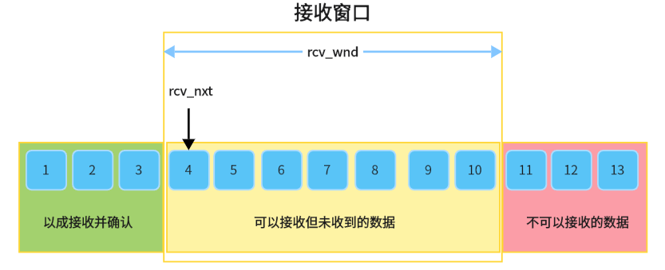

## **简介**

TCP全称为 传输控制协议(Transmission Control Protocol)。

TCP 是提供可靠传输的有连接面向字节流的全双工的传输层通信协议。

- 面向连接：在通过 TCP 进行信息交换时，必须先建立连接。且连接是一对一的，一个连接只能用于一组计算机的信息交换。

- 可靠：保证数据的无差错、不丢失、不重复、按序到达。

- 字节流：将应用程序的数据看作一个连续的字节流，而不是离散的数据包。也就是说，在 TCP 的视角下，发送和接收的数据是一串无结构的字节，这些字节在传输过程中可以被分成多个 TCP 段（segment），但在接收端会重新组装成原始的字节流。


## **协议格式**

<figure markdown="span">
  { width="500" }
</figure>

??? note "Linux Kernel tcphdr"
    ```c
    struct tcphdr {
      __u16	source;
      __u16	dest;
      __u32	seq;
      __u32	ack_seq;
    #if defined(__LITTLE_ENDIAN_BITFIELD)
      __u16	res1:4,
        doff:4,
        fin:1,
        syn:1,
        rst:1,
        psh:1,
        ack:1,
        urg:1,
        ece:1,
        cwr:1;
    #elif defined(__BIG_ENDIAN_BITFIELD)
      __u16	doff:4,
        res1:4,
        cwr:1,
        ece:1,
        urg:1,
        ack:1,
        psh:1,
        rst:1,
        syn:1,
        fin:1;
    #else
    #error	"Adjust your <asm/byteorder.h> defines"
    #endif	
      __u16	window;
      __u16	check;
      __u16	urg_ptr;
    };
    ```

- **源端口号、目标端口号**：同 UDP。

- **序列号、确认序列号**：这两个字段用于实现 TCP 的确认应答机制，后文详细介绍。

- **首部长度**：标识了 TCP Header 的长度，单位是 4Byte，也就是说首部长度是 $len \times 4$Byte。一个没有选项的首部这里的值是 $(0101)_2$。

- **控制位**：

URG（Urgent）：该位为 1 时，表示该报文为紧急报文，紧急指针有效（紧急指针标识了紧急数据在有效载荷中的偏移量），TCP 会从数据流中分离出紧急数据并立即传递给应用程序。

ACK（Acknowledgment）：该位为 1 时，确认应答的字段变为有效，TCP 规定除了最初建立连接时的 SYN 包之外该位必须设置为 1 。

PSH（Push）：要求接收方立即将数据推送给应用程序，而不是在缓冲区中等待。

RST（Reset）：该位为 1 时，表示连接中断或发生严重错误，需要立即重新连接。当接收到 RST 标志时，接收方会立即终止连接，并且不会进行任何重传或重试操作。

SYN（Synchronize）：该位为 1 时，表示同步序列号，希望建立连接，并在其序列号的字段进行序列号初始值的设定。

FIN（Finish）：该位为 1 时，表示发送方已经完成发送数据，请求关闭连接。

- **窗口大小**：接收窗口是接收方告诉发送方可以接收的最大字节数。这是 TCP 流量控制机制的一部分，用于防止发送方发送的数据超过接收方的处理能力。

- **校验和**：同 UDP。

- **紧急指针**：同上文 URG 中的介绍。

- **选项**：最大 40Byte，这里先跳过。


TCP 首部中没有明确的数据大小字段，TCP 包的大小要用 IP 数据报中算出来，IP 头部中有整个数据报的长度：

TCP 包中数据大小 = IP 报总长度 - IP 头部长度 - TCP 头部长度。

对于 TCP 包的长度通常不宜过大，因为链路层的 MAC 帧的 MTU（Maximum Transmission Unit，最大传输单元）是 1500Byte，所以 IP 报如果超过 MTU 的话，IP 是会对数据进行分片的，分片又会导致数据重传的概率，所以整个 IP 报的长度最好不超过 MTU，这也是 TCP 要分包的原因。（详细会在 [IP 章节](/Network/network/ip) 详细说明）

## **可靠传输**

### **确认应答**

TCP 协议为了确保数据被接受方收到，接收方每收到一份数据都要告知发送方，我接收到了该数据。

发送方可能一次发送若干个数据包，每个数据包中有若干个字节，因为 TCP 是面向字节流的协议，所以为了保证接收方按序且正确的接收到数据的每一个字节，TCP 使用序列号来标识数据流中的每一个字节。每个数据包的序列号是该数据包中最后一个字节的序列号。

为了能告知发送方，接收方已经正确接收到数据包，返回的确认信号中要包含确认数据的标号，也就是确认序列号。这里确认序列号表示的是：下一次接收方期望收到的，这表明确认序列号之前的所有数据已经被接收方收到了。也就是说 TCP 的 ACK 应答机制是累计确认的。

由此我们可以得到每次数据包的序列号计算公式和确认序列号计算公式：

**<font color=#3399FF>序列号 = 上一次发送的序列号 + 上一次发的数据包的长度 len。</font>**


特殊情况，如果上一次发送的报文是 SYN 报文或者 FIN 报文，则改为 上一次发送的序列号 + 1。

**<font color=#3399FF>确认号 = 上一次收到的报文中的序列号 + 上一次收的数据包的长度 len。</font>**

特殊情况，如果收到的是 SYN 报文或者 FIN 报文，则改为上一次收到的报文中的序列号 + 1。

TCP 在内核实现时，会将 SYN 和 FIN 包看作 1Byte 数据，但事实上其数据段并无数据。这样做是为了赋予 SYN 和 FIN 一个序列号，来确保其被对端接收。


??? question "为什么报文序列号和确认序列号是两个字段？"
    **问题：**我们明明可以通过 ACK 字段，来区分报文是确认报文还是数据报文，为什么还要把序列号划分位两个字段，这样增加了数据的长度，不会造成网络资源的浪费吗？

    **回答：**TCP 是一种全双工的通信方式，当接收方在接收数据的同时，也会发送数据，如果用 ACK 将确认报文和数据报文划分开，那么当接收端同时想发数据和确认一个数据时，就要分两次来发数据，这样反而更浪费资源。用两个字段的话自己发送的数据就用序列号标注，确认序列号是发送方的数据。就可以在一个 TCP 数据包中完成数据的发送和确认。
    
    这样的做法被叫做捎带应答。它的基本思想是在发送数据包时捎带上对对方数据包的确认信息，从而减少单独发送确认包的次数。

在每次建立 TCP 连接时，连接双方会交换对方的序列号初始值，来同步序列号。只有同步了序列号，接收方才能正确的处理数据的接收情况和顺序，才能给发送方返回正确的应答报文。发送方接收了正确的应答报文，才能标识哪些数据包是已经被对方接收的，哪些是待发送的，哪些是发送但未应答的。

通常连接双方在发送 SYN 时，会随机生成一个初始序列号值，放在 TCP 报头的序列号中。每次采用随机初始序列号的目的是防止历史报文被下一个相同 TCP 连接接收。但这个方法并不能完全避免。

??? info "初始序列号的生成方式"
    初始序列号 = M + Hash(localhost, localport, remotehost, remoteport)

    M 是一个计时器，这个计时器每隔 4 微秒加 1，循环一次要 4.55 小时。

    Hash是根据源 IP、目的 IP、源端口、目的端口生成一个随机数值。


### **超时重传**

在网络中传输，总会出现丢包问题，TCP 采用超时重传机制来解决丢包问题。 

丢包有两种情况：发送的数据包丢失或确认应答丢失。

超时重传顾名思义，当发送方长时间没有收到接收方的确认应答时，就要将数据进行重传。超时的时间设定很重要，如果太长可能导致无意义的等待，降低数据传输效率，太短也不行，因为 数据包 和 ACK 可能在传输时迟到，这样可能会导致数据的重复发送。

超时重传时间是以 RTO （Retransmission Timeout 超时重传时间）表示。RTO 通常被设置为比 RTT（Round-Trip Time 往返时延）略大一点。RTO 在内核中实现时也不是固定不变的，而是随网络动态调整的。

1. Linux中(BSD Unix和Windows也是如此), 超时以500ms为一个单位进行控制, 每次判定超时重发的超时时间都是500ms的整数倍。

2. 如果重发一次之后, 仍然得不到应答, 等待 2*500ms 后再进行重传。
  
3. 如果仍然得不到应答, 等待 4*500ms 进行重传. 依次类推, 以指数形式递增。

4. 累计到一定的重传次数, TCP认为网络或者对端主机出现异常, 强制关闭连接。


### **快速重传**

快速重传，不是靠时间来判断数据是否丢失，而是对方的 ACK 包。当重复三次收到同样序列号的 ACK 时，就判断该数据丢失，将对应序列号的数据重传。

<figure markdown="span">
  { width="500" }
</figure>

快速重传解决了超时重传的等待时间较长的问题。

这里快速重传的时候还是会有一个问题，发送端在收到三次 ACK 1001 后，只知道接收端没收到 1001 序列号开始的数据，并不知道其实对方已经收到了 1002 ~ 1004 序列号的数据，所以会将后续数据全部重新发送，这样反而非常浪费网络资源。

这就要用到 SACK 机制。

### **SACK**

SACK（ Selective Acknowledgment）选择确认机制，这也是 TCP 实现高效可靠传输的做法，在 Linux 下，可以通过 net.ipv4.tcp_sack 参数打开这个功能（Linux 2.4 后默认打开）。

使用命令 `cat /proc/sys/net/ipv4/tcp_sack` 查看本机是否开启 sack 机制

SACK 允许接收方通知发送方具体哪些数据包已成功接收，从而使发送方仅需重传丢失的数据包，而非整个数据窗口。SACK 相关的数据会被加入到 TCP 头部的选项部分。

### **D-SACK**

Duplicate SACK又称D-SACK，其主要使用了SACK来告诉发送方有哪些数据被重复接收了。

D-SACK使用了SACK的第一个段来做标志，

- 如果SACK的第一个段的范围被ACK所覆盖，那么就是D-SACK

- 如果SACK的第一个段的范围被SACK的第二个段覆盖，那么就是D-SACK

引入 D-SACK，有这么几个好处：

- 可以让发送方知道，是发出去的包丢了，还是回来的ACK包丢了。

- 是不是自己的timeout太小了，导致重传。

- 网络上出现了先发的包后到的情况（又称reordering）

- 网络上是不是把我的数据包给复制了。

知道这些可以很好得帮助TCP了解网络情况，从而可以更好的做拥塞控制。

## **面向连接**

### **建立连接**

TCP 建立连接要经过三次握手：

第一次握手：首先客户端向服务器发送一个 SYN 报文，表示向服务端发起连接，与服务端同步序列号。

第二次握手：服务器接收到客户端的 SYN 包后会返回一个 ACK 和 SYN 合并的包表示接收到了客户端的连接请求，并且与客户端同步序列号。

第三次握手：客户端收到该报文后再次向服务端返回 ACK 应答，至此连接建立成功，双方可以正常通信了。

<figure markdown="span">
  { width="800" }
</figure>

要注意的是：第三次握手是可以携带数据的，前两次握手是不可以携带数据的。

**重点来了，为什么建立连接需要三次握手？**

- 三次握手才能确保双方的序列号，窗口大小的同步，并且验证双方的通信信道通常。

两次握手只能保证服务器正确收到来自客户端序列号和窗口大小的同步，而不能保证客户端正确收到服务器的同步请求。

- 避免历史连接的建立

现在假设建立连接时，我们只有两次握手：

思考这样一种状况，客户端发起第一次连接时，网络阻塞了，导致第一次 SYN （后文称为 CLI_SYN1），超过了重传时间还未到达服务器，于是客户端发起重传，发出了第二次 SYN（后文称为 CLI_SYN2）。在 SYN2 发送的过程中，SYN1 到达了服务器，服务器对 SYN1 做出了回应，当客户端收到回应 ACK + SER_SYN1 时，发现收到了错误的确认序列号，向服务器发送 RST 。但是因为只有两次握手，服务器认为连接已经建立，就会直接向客户端发送数据，这导致了一个历史连接的建立。


<figure markdown="span">
  { width="1000" }
</figure>

因为上述两条原因建立连接只能三次，不能两次。那为什么不用四次握手呢？

- 捎带应答

服务器对客户端的 SYN 的应答和服务器向客户端的 SYN 完全可以合并为一个数据报，一起发给客户端，这样不仅节省网络资源，效率也更高。

#### **连接队列**

在 Linux 内核中会维护两个队列：全连接队列半连接队列。

当服务器收到以一个 SYN 包后，会创建一个处于 SYN_RECV 状态的 sock，并将其放入半连接队列中。当接收到对方的 ACK 后，连接建立成功，将对应处于半连接队列中的 socket 放到全连接队列中

<figure markdown="span">
  { width="400" }
</figure>

全连接队列是一带头单链表，每次 accept 后，都是从队首取一个建立好的连接，进行通信。我们可以通过 `ss` 或 `netstat` 命令来查看 TCP 全连接对列的长度：

<figure markdown="span">
  { width="800" }
</figure>

这里 Recv-Q 是队列里已经建立连接的数量，Sent-Q 是全连接队列的长度。我们在调用 listen 函数时，会设置一个队列长度，这个长度会和内核参数 somaxconn 进行比较，取小的那一个，作为最终的全连接队列长度，下面是内核中 listen 的实现：

```c
// 内核版本 2.6.32.19
SYSCALL_DEFINE2(listen, int, fd, int, backlog)
{

  略...

	struct socket *sock = sockfd_lookup_light(fd, &err, &fput_needed); // 从文件描述符中获取 socket
	if (sock) {
		somaxconn = sock_net(sock->sk)->core.sysctl_somaxconn;
		if ((unsigned)backlog > somaxconn)  // 和 somaxconn 取较小值
			backlog = somaxconn;
    
    略...
	}
	return err;
}
```

我们可使用命令 `cat /proc/sys/net/core/somaxconn`  来查看 somaxconn 的具体大小。

既然队列有长度，那么全连接队列满了会怎么样？全连接列满了以后，内核的行为由参数 tcp_abort_on_overflow 来控制：

- 0 ：如果全连接队列满了，那么 server 扔掉 client 发过来的 ack ；

- 1 ：如果全连接队列满了，server 发送一个 RST 包给 client，标识废弃这个连接。

通过命令 `cat /proc/sys/net/ipv4/tcp_abort_on_overflow` 来查看内核的具体行为。

如果服务器的全连接队列太短的话，当客户端请求高峰期时，可能会导致大量用户的连接被丢弃或 RST，影响用户体验。太长的话，内核反而要花更多成本去维护这个队列，处理用户请求的效率进而会下降，反而得不偿失。

通常半连接队列被实现为 Hsah 表，因为每个半连接的 ACK 应答到来的实现是不确定的，如果实现成顺序表的话，每次来一个 ACK，都要遍历一遍表，效率太低。

??? danger "SYN 泛洪"
    采用半连接队列的方式进行管理还未建立连接的 sock 是很危险的，对于每一个半连接队列里的 sock ，服务器可能要等几分钟后，再回收他的资源，当有人大量的像服务器发送 SYN 请求，但不建立连接时，服务器不断为这些半开连接创建 sock ，直到服务器资源消耗殆尽，其他正常请求就都被丢弃，这就是 Dos 攻击。

    对于这种情况，解决办法是使用 SYN Cookie。做法如下：

    - 在收到 SYN 包后，服务器会用 Hash(源 IP , 源端口号 , 目的 IP , 目的端口号 , 一个只有服务器直到的秘密数) 的到的值作为返回给对端的 序列号。

    - 在收到对端的 ACK 后应答后，检查其 确认序列号，是否为 Hash(源 IP , 源端口号 , 目的 IP , 目的端口号 , 一个只有服务器直到的秘密数) + 1，如果是，则建立正常的连接，否则认为该连接不合法，丢弃该 ACK。

    这样在没有完全建立连接时，服务器端没有任何资源消耗（计算 序列号的消耗忽略）。

    我们可以使用命令 `cat /proc/sys/net/ipv4/tcp_syncookies` 来查看服务器是否开启 SYN Cookie。

    - 0 关闭
    
    - 1 当 半连接队列满时开启
    
    - 2 无条件开启

### **断开连接**

- 第一次挥手：当一方主动发起断开请求时，会向被动断开方发送 FIN 包，告知其断开意愿，并进入 FIN_WAIT_1 状态，等待被动断开方的 ACK 应答。

- 第二次挥手：被动断开方收到 FIN 包后返回 ACK 应答，进入 CLOSE_WAIT 状态，等待进程调用 close 关闭 socket。主动断开方收到该 ACK 应答后进入 FIN_WAIT_2 状态，等待被动断开方的 FIN 包。

- 第三次挥手：当调用 close 后，会向主动断开方发送 FIN 包，并进入 LAST_ACK 状态，等待主动断开方的 ACK 应答。
  
- 第四次挥手：主动断开方收到对方的 FIN 包后，发送 ACK 应答，并进入 TIME_WAIT 状态，等待 2MSL（Maximum Segment Lifetime，报文最大生存时间） 的时间，以确保对方收到 ACK 应答，然后进入 CLOSE 状态。对方收到 ACK 应答后进入 CLOSE 状态。


<figure markdown="span">
  { width="1000" }
</figure>

至此完成连接的断开。

这里需要注意的是当调用 close 后，后续的 FIN 包和 ACK 包都是由内核替我们完成发送的，也就是说，即使进程突然异常终止了，依然可以完成 TCP 的四次挥手，正确断开连接。


- **被动断开方不调用 close 会怎么样？**

内核是没有权力将进程处于 CLOSE_WAIT 的连接断开的，只能由进程自己调用 close 来断开，如果进程不调用处于 CLOSE_WAIT 的连接会在系统中存在很久，直到进程结束。

- **四次挥手可以是三次吗？**

四次挥手是有可能变为三次挥手的，那就是被动断开方在收到主动断开方的 FIN 包之前，也发起了断开请求，在收到 FIN 包后，会将 FIN 包的应答 ACK 和被动断开方的 FIN 包一起发给主动断开方（捎带应答），但是这种情况比较少见。


#### **TIME_WAIT**


TIME_WAIT 通常被设置为 2 * MSL ，也就是数据在网络中存活时间的两倍，这样做目的有两个：

- 等待足够的时间以确保最后的 ACK 能让被动关闭方接收，从而帮助其正常关闭。

TIME_WAIT 的主要作用是保证被动断开方能接收到最后的 ACK 应答。当 ACK 应答在网络中丢失时，被动断开方经过一个超时时间，发起超时重传，当主动断开方再次收到 FIN 时，会重置 TIME_WAIT 状态的等待时间，重新计时 2 * MSL。

- 防止历史数据被重复 TCP 连接错误接收。

在正常通信时，数据可能会在网络中阻塞，如果没有 TIME_WAIT，阻塞的数据可能在下次连接建立完成后到达，如果这时 TCP 连接的（目的 IP，目的端口号，源 IP ，源端口号）四元组刚好相等，就会导致数据的混乱。加上 TIME_WAIT 的时间，可以最大程度上避免这种情况，不过每次连接建立时初始序列号都是不同的，阻塞数据被错误接收是几乎不可能的。

在 Linux 中将 TIME_WAIT 的值设置为 60s，这是在源码中固定写死的，要改的话只能重新编译源码：

```c
#define TCP_TIMEWAIT_LEN (60*HZ) /* how long to wait to destroy TIME-WAIT
				  * state, about 60 seconds	*/
#define TCP_FIN_TIMEOUT	TCP_TIMEWAIT_LEN
                                 /* BSD style FIN_WAIT2 deadlock breaker.
				  * It used to be 3min, new value is 60sec,
				  * to combine FIN-WAIT-2 timeout with
				  * TIME-WAIT timer.
				  */
```

因为 TIME_WAIT 的存在，一些 TCP 连接在进程结束后，依然会存在一段时间。这会导致当我们服务端在重启一些固定端口号的服务时，会出现端口被占用的情况（Address already in use）。想要避免这种情况，可以在 bind 端口前，将 socket 设定选项 SO_REUSEADDR 。


## **效率优化**

在 UDP 中，因为不用考虑可靠性的因素，发送方是可以一直不停的向接收方发送数据，不用考虑接收方的缓冲区是否满了、网络是否能正确传递数据，使得 UDP 有很高的发送效率。但是 TCP 不行，TCP 要保证接收方能正确接收到数据，但又要尽可能的高效，为此 TCP 应用了流量控制和拥塞控制的机制。

为了可靠和效率，TCP 一次会并行发送多条数据，每接收到一个包的 ACK ，就再发一个新的包。这就是滑动窗口。

但是发送时也不能什么都不管，一直向对端发，要考虑到对方的接收能力，也要考虑到网络的承载能力。所以 TCP 提供了流量控制和拥塞控制的机制。

### **滑动窗口**

TCP 在发送方和接收方维护两个窗口，发送窗口和接收窗口，窗口的大小取决于当前对方的接收能力和网络状态，这将在后续的流量控制和拥塞控制中介绍。


<figure markdown="span">
  { width="500" }
</figure>

内核中使用三个字段维护发送窗口：

- **snd_wnd**：表示发送窗口的大小，大小由对方的接收能力和网络的承载能力决定，它具体的大小后文的流量控制和拥塞控制中介绍。

- **snd_nua**（Send Unacknoleged）：是一个绝对指针，它指向的是已发送但未收到确认的第一个字节的序列号。

- **snd_nxt**：也是一个绝对指针，它指向未发送但可发送范围的第一个字节的序列号。

对于发送窗口，在窗口内的数据都是可以向对方发送的，这些数据


<figure markdown="span">
  { width="500" }
</figure>

内核中使用两个字段维护接收窗口：

- **rcv_wnd**：表示接收窗口的大小，由自身的接收能力决定，它的大小会告知对方，来控制对方的发送窗口大小。

- **rcv_nxt**：是一个指针，它指向期望从发送方发送来的下一个数据字节的序列号。

接收方收到期望序列号的数据后，就将 rcv_nxt 向后移动，再将其指向的新序列号作为 ACK 应答的确认序列号发送给对端。

### **流量控制**

窗口大小的影响因素之一就是对端的接收能力，也就是对方接收缓冲区的剩余大小，当然这也是对方接收窗口的大小。现在我们不考虑拥塞控制，假设发送缓冲区只受接收方的接收能力限制。


#### **Zero Window**

如果用户一直不读数据的话，缓冲区逐渐减小，最后就会导致接收窗口也会跟着减小，紧跟着发送窗口也会跟着减小。


#### **Silly Window**

Nagle 算法是用来解决 Silly Window Syndrome （糊涂窗口综合征）问题。那什么是糊涂窗口综合征呢？分两张情况：

- 接收方引起的：当发送方数据传输效率高于接收方的接收速度时，接收方的窗口在一段时间后一定会被填满，发送方的发送窗口大小会变为 0 ，这时窗口关闭。每当接收方从缓冲区中读取几个字节的内容后，就会立即告知发送方，对方会立马填满这几个字节，这样每次发送的数据都只有几字节。

- 发送方引起的：有时发送方发送的数据可能比较小，一次只有几字节。

如果每次 TCP 包都只是这样发送几个字节，那就太浪费网络资源了，因为 TCP + IP 报头至少就要 40 Byte，得不偿失。就好比本来可以坐200人的飞机里只做了一两个人就出发。要解决这样的问题，就要避免对小的window size做出响应，窗口至少要到 MSS，也就是发送的数据至少要能填满一个 TCP 包。

如果是接收端的原因，也就是接收端处理数据太慢，处理方案是：如果窗口大小不够 MSS，就会向发送方通告窗口为 0，也就阻止了发送方再发数据过来。等接收端处理一段时间数据，再打开窗口。

如果是发送方引起的，就要使用 <em>**Nagle**</em> 算法，算法思路是延时处理，只有两种条件下才会发送数据：

- 要等到 Window Size $\ge$ MSS 或是 Data Size $\ge$ MSS

- 到之前发送数据的 ack 回包，他才会发数据，否则就再攒数据。

Nagle算法默认是打开的，所以，对于一些需要小包场景的程序——比如像 telnet 或 ssh 这样的交互性比较强的程序，你需要关闭这个算法。你可以在 socket 设置 TCP_NODELAY 选项来关闭这个算法。

### **拥塞控制**

#### **慢启动**


#### **拥塞避免**


#### **拥塞发生**


#### **快速恢复**


-----------------

参考：


[TCP 的那些事儿（上）](https://coolshell.cn/articles/11564.htm)

[TCP 的那些事儿（下）](https://coolshell.cn/articles/11609.html)