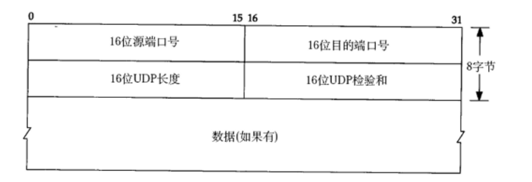

## **协议格式**


<figure markdown="span">
  { width="650" }
</figure>


16位UDP长度，表示整个数据报(UDP首部+UDP数据)的最大长度。

如果校验和出错，就会直接丢弃。

在 Linux 内核中使用结构体 `udphdr` 来组织 UDP 头部：

```c
// 在路径 \include\linux\udp.h
struct udphdr {
	__u16	source; // 源端口
	__u16	dest;   // 目标端口
	__u16	len;    // UDP 报长度
	__u16	check;  // 校验和
};
```

## **特点**

- 无连接: 知道对端的IP和端口号就直接进行传输, 不需要建立连接。

- 不可靠: 没有确认机制, 没有重传机制; 如果因为网络故障该段无法发到对方, UDP协议层也不会给应用层返回任何错误信息。

- 面向数据报: 不能够灵活的控制读写数据的次数和数量。


### **面向数据报**

应用层交给UDP多长的报文, UDP原样发送, 既不会拆分, 也不会合并。与字节流不同的是，面向数据报的 UDP 发送后一定保证接收方完整的接收到数据。并且，每个报文之间是有分隔的，但是不保证顺序。而字节流的报文之间是没有分隔的，但是保证顺序。

在 Linux 内核中使用 `sk_buff` 来组织每一份 UDP 数据报，用一个双向列表来维护在缓冲区中的所有 UDP 数据报：

```c
struct sk_buff {
	// 维护双向链表
	struct sk_buff		*next;
	struct sk_buff		*prev;

	struct sock		*sk;
	struct net_device	*dev;   // 将时间交给指向的底层设备

    // ..... 其他字段

	unsigned char		*head, // 整个缓存区的开始
				*data,      // 数据在缓冲区中的开始位置
				*tail,      // 数据在缓冲区中的结束位置
				*end;       // 整个缓冲区的结束
};

```

用UDP传输100个字节的数据，如果发送端调用一次sendto, 发送100个字节, 那么接收端也必须调用对应的一次recvfrom, 接收100个
字节; 而不能循环调用10次recvfrom, 每次接收10个字节。

## **UDP的缓冲区**


UDP没有真正意义上的 发送缓冲区. 调用sendto会直接交给内核, 由内核将数据传给网络层协议进行后续的传输动作。

UDP具有接收缓冲区. 但是这个接收缓冲区不能保证收到的 UDP 报的顺序和发送 UDP 报的顺序一致; 如果缓冲区满了, 再到达的 UDP 数据就会被丢弃;

UDP的socket既能读, 也能写, 这个概念叫做 全双工。
