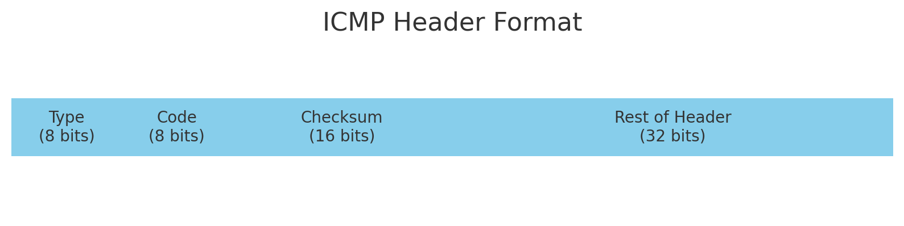

**ICMP (Internet Control Message Protocol 网际控制报文协议)**主要用于网络设备之间的诊断和错误报告。ping命令就是基于ICMP协议。

## **协议格式**

<figure markdown="span">
  { width="700" }
</figure>

- **Type (8 bits)**: 指示 ICMP 报文的类型，例如回显请求（Echo Request，类型 8）和回显应答（Echo Reply，类型 0）。

- **Code (8 bits)**: 指示特定的 ICMP 报文类型的子类型，例如对于类型 3（目的不可达）的报文，代码字段可以指示具体的错误原因。

- **Checksum (16 bits)**: 校验和，用于检测报文在传输过程中是否出现错误。

- **Rest of Header (32 bits)**: 该部分根据具体的 ICMP 报文类型和代码的不同而有所变化，例如在回显请求和应答报文中，这部分包括标识符和序列号。

| 类型 | 名称 | 代码 | 描述 |
|:------:|:------:|:------:|:------:|
| 0    | 回显应答 (Echo Reply) | 0    | 无特定子类型 (对 ping 的回答)|
| 3    | 目的不可达 (Destination Unreachable) | 0    | 网络不可达 (Network Unreachable) |
|      |                             | 1    | 主机不可达 (Host Unreachable) |
|      |                             | 2    | 协议不可达 (Protocol Unreachable) |
|      |                             | 3    | 端口不可达 (Port Unreachable) |
|      |                             | 4    | 需要进行分片但设置了不分片位 (Fragmentation Needed and Don't Fragment was Set) |
|      |                             | 5    | 源站路由失败 (Source Route Failed) |
|      |                             | 6    | 目的网络未知 (Destination Network Unknown) |
|      |                             | 7    | 目的主机未知 (Destination Host Unknown) |
|      |                             | 8    | 源主机被隔离 (Source Host Isolated) |
|      |                             | 9    | 通信管理受限网络禁止 (Communication with Destination Network is Administratively Prohibited) |
|      |                             | 10   | 通信管理受限主机禁止 (Communication with Destination Host is Administratively Prohibited) |
|      |                             | 11   | 目的网络不可到达，服务类型禁止 (Destination Network Unreachable for Type of Service) |
|      |                             | 12   | 目的主机不可到达，服务类型禁止 (Destination Host Unreachable for Type of Service) |
|      |                             | 13   | 通信被过滤 (Communication Administratively Prohibited) |
|      |                             | 14   | 主机优先权违反 (Host Precedence Violation) |
|      |                             | 15   | 优先权筛选 (Precedence cutoff in effect) |
| 4    | 源抑制 (Source Quench) | 0    | 无特定子类型 |
| 5    | 重定向 (Redirect) | 0    | 重定向数据报到网络 (Redirect Datagram for the Network) |
|      |                        | 1    | 重定向数据报到主机 (Redirect Datagram for the Host) |
|      |                        | 2    | 重定向数据报到服务类型和网络 (Redirect Datagram for the Type of Service and Network) |
|      |                        | 3    | 重定向数据报到服务类型和主机 (Redirect Datagram for the Type of Service and Host) |
| 8    | 回显请求 (Echo Request) | 0    | 无特定子类型 |
| 9    | 路由器通告 (Router Advertisement) | 0    | 无特定子类型 |
| 10   | 路由器请求 (Router Solicitation) | 0    | 无特定子类型 |
| 11   | 时间超时 (Time Exceeded) | 0    | 传输中生存时间 (TTL) 为 0 时超时 (TTL equals 0 during transit) |
|      |                         | 1    | 在分片重组过程中超时 (Fragment reassembly time exceeded) |
| 12   | 参数问题 (Parameter Problem) | 0    | IP 头部错误 (Pointer indicates the error) |
|      |                          | 1    | 缺少必需选项 (Missing a required option) |
|      |                          | 2    | 错误的长度 (Bad length) |
| 13   | 时间戳请求 (Timestamp Request) | 0    | 无特定子类型 |
| 14   | 时间戳应答 (Timestamp Reply) | 0    | 无特定子类型 |
| 15   | 信息请求 (Information Request) | 0    | 无特定子类型 【已废弃】 |
| 16   | 信息应答 (Information Reply) | 0    | 无特定子类型 【已废弃】 |
| 17   | 地址掩码请求 (Address Mask Request) | 0    | 无特定子类型 |
| 18   | 地址掩码应答 (Address Mask Reply) | 0    | 无特定子类型 |
| 30   | 追踪路由 (Traceroute) | 0    | 无特定子类型 【实验性的，不常用】 |

## **ICMP 应用**

### **ping**

ping（Packet InterNet Groper）用来测试主机或路由器间的连通性。

### **traceroute**

用来测试 IP 数据报从源主机到目标主机要经过那些路由器。Windows 版本为 tracert。

实现原理：依次发送 TTL = 1，TTL = 2，TTL = 3... 的 IP 报文，每当报文 TTL 减为 0 时，到达的路由器就会返回一个差错报文，就得到对应路由器的 IP 地址，直到 IP 返回的目标 IP 的地址，就停止发送。