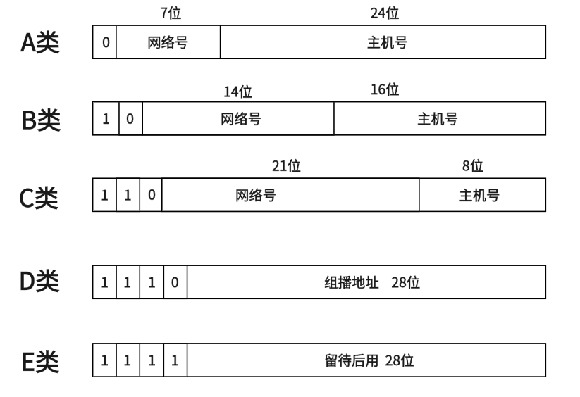
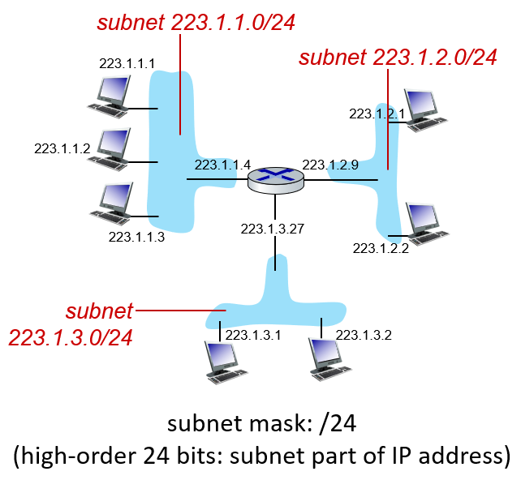
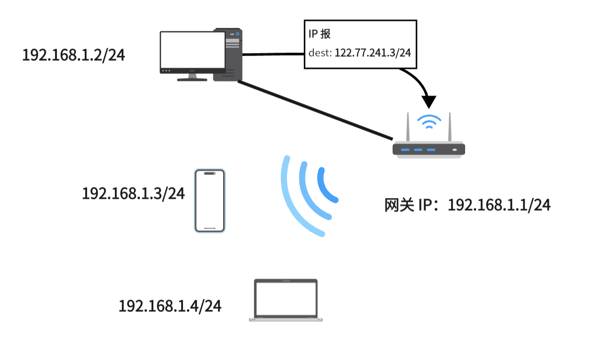
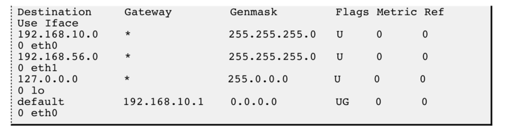
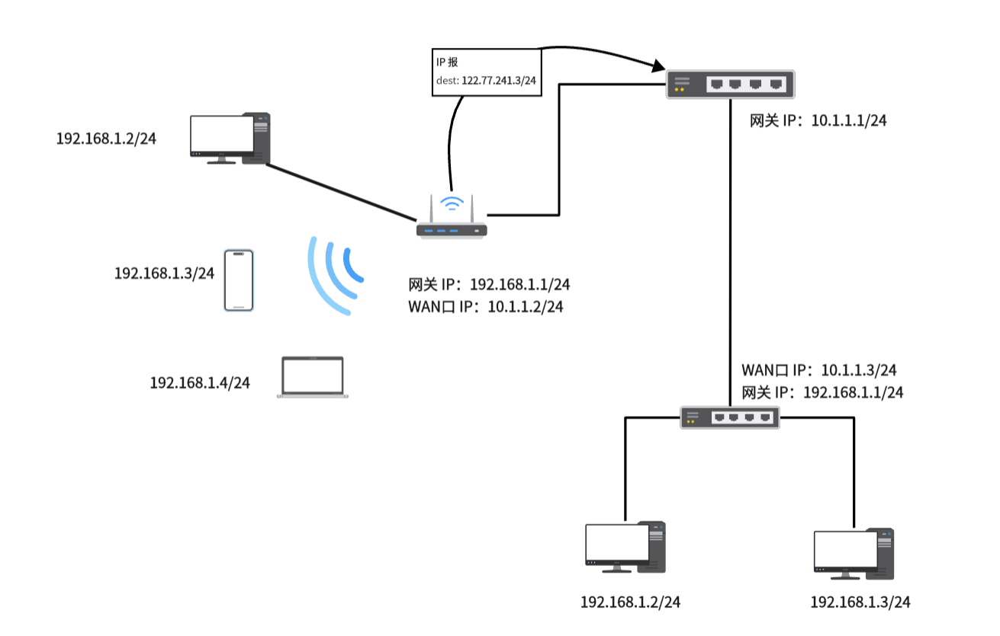
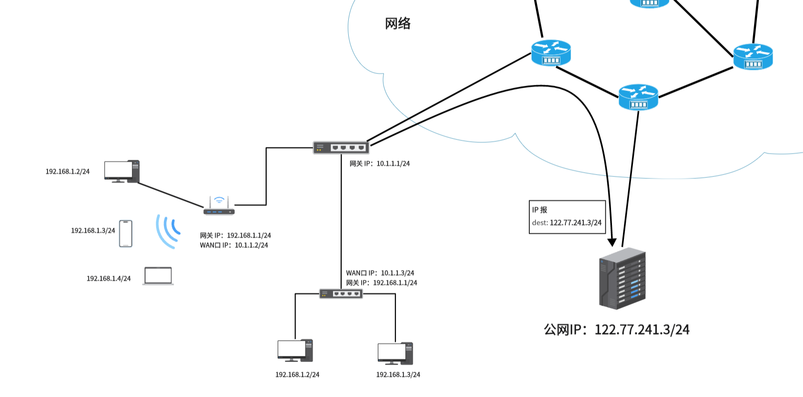

## **简介**

IP（Internet Protocol，互联网协议）是网络层最重要的协议之一，负责在网络中传输数据包。它定义了数据包的格式和处理方式，是TCP/IP协议栈中的核心协议。

IP 协议负责的是网际的数据传输，也就是将数据从一个网络中的主机传递到另一个网络中的主机中。

## **协议格式**

<figure markdown="span">
  { width="500" }
</figure>

- 版本(version): 指定IP协议的版本, 对于IPv4来说, 就是 4。

- 首部长度(header length): 标识了 IP Header 的长度，单位是 4Byte，也就是说首部长度是 $len \times 4$Byte。一个没有选项的首部这里的值是 $(0101)_2$。

- 8 位服务类型(Type Of Service): 3位优先权字段(已经弃用), 4位 TOS 字段, 和 1 位保留字段(必须置为0). 4位TOS分别表示: 最小延时, 最大吞吐量, 最高可靠性, 最小成本. 这四者相互冲突, 只能选择一个. 对于 ssh/telnet 这样的应用程序, 最小延时比较重要; 对于ftp 这样的程序, 最大吞吐量比较重要。

- 16 位总长度(total length): IP数据报整体占多少个字节。

- 16 位标识(id): 唯一的标识主机发送的报文. 如果IP报文在数据链路层被分片了, 那么每一个片里面的这个 id 都是相同的。

- 3 位标志字段: 第一位保留(保留的意思是现在不用, 但是还没想好说不定以后要用到). 第二位置为1表示禁止分片, 这时候如果报文长度超过MTU, IP模块就会丢弃报文. 第三位表示"更多分片", 如果分片了的话,最后一个分片置为1, 其他是0. 类似于一个结束标记。

- 8 位生存时间(Time To Live, TTL): 数据报到达目的地的最大报文跳数. 一般是64. 每次经过一个路由, TTL -= 1, 一直减到0还没到达, 那么就丢弃了. 这个字段主要是用来防止出现路由循环。

- 8 位协议: 表示上层协议的类型。TCP 为 $(0000 0110)_2$，UDP 为 $(0001 0001)_2$，对于所有可能的值参见 [wiki](https://en.wikipedia.org/wiki/List_of_IP_protocol_numbers){target="_blank"}。

- 16位头部校验和: 用于检测 IP 数据报首部是否出现差错，计算方法通 TCP，UDP。

- 32位源地址和32位目标地址: 表示发送端和接收端。

- 选项：略。IPv6 中考虑到效率因素舍弃了选项字段。

## **IP 地址的划分**

??? note "点分十进制"
    IP 地址是一个 32 位的二进制数，为了便于人类阅读通常采用**点分十进制（dotted-decimal notation）**的方式书写，即将 32 位中每 8 位划分位一个十进制数，用点隔开：

    eg:$(11000001 00100000 11011000 00001001)_2 = 193.32.216.9$

IP 地址分为两个部分, 网络号和主机号：

- 网络号: 保证相互连接的两个网段具有不同的标识。

- 主机号: 同一网段内, 主机之间具有相同的网络号, 但是必须有不同的主机号。

在建网初期，IP 地址被划分为如下几类：

<figure markdown="span">
  { width="500" }
</figure>

这样大概计算一下：

A 类网络可以容纳的主机数量是 $2^{24}-2=16,777,214$ 个，但数 A 类网络的数量只有 $2^{7}=128$ 个。

B 类网络可以容纳的主机数量是 $2^{16}-2=65534$ 个，B 类网络的数量有 $2^{14}=16,384$ 个。

C 类网络可以容纳的主机数量是 $2^{8}-2=254$ 个，c 类网络的数据有 $2^{21}=2,097,152$ 个。

这里减 2 是要减去 广播地址（主机号全 1） 和 网络地址（主机号全 0）。还有比较特殊的 IP 是 127.0.0.1 ，它常用用于本机环回(loop back)测试

随着 Internet 的飞速发展,这种划分方案的局限性很快显现出来,大多数组织都申请 B 类网络地址, 导致 B 类地址很快就分配完了, 而 A 类却浪费了大量地址。因为子网中大多数情况下不会有 B 类或 A 类中那么多主机。

针对这种情况提出了新的划分方案, 称为 **CIDR(Classless Interdomain Routing)**，

<figure markdown="span">
  { width="400" }
</figure>

**子网掩码（network mask）**也是一个 32 二位的二进制数，它由若干位前缀 1 和若干位后缀 0 组成。通常为了书写便捷，会将子网掩码中 1 的个数直接写在 IP 地址后面：a.b.c.d/x，如图中所示那样：223.1.1.1/24

当我们要只要一个 IP 地址的网络号时，只需拿子网掩码与 IP 地址做按位与（AND），结果就是网络号，以上图 subnet 223.1.1.0/24 中 223.1.1.1 主机为例，它的网络号计算方式如下：

$$
\begin{matrix}
IP\space Address:&1101 1111\space 0000 0001\space 0000 0001\space 0000 0001  \\
network\space mask:&1111 1111\space 1111 1111\space 1111 1111\space 0000 0000 \\
network:&1101 1111\space 0000 0001\space 0000 0001\space 0000 0000
\end{matrix} 
$$

最后算出的网络号写成点分十进制就是：223.1.1.0。

有了子网掩码，可以更灵活的划分网络和主机号，适用于各种场合，在一定程度上缓解了 IPv4 地址不足的问题（因为提高了地址利用率）。

## **内网 IP与公网 IP**

我们通常使用的 IP 地址都是内网 IP，只能唯一标识子网中的主机，也就是说只能用于一个子网内的通信，想要跨网通信只能使用公网 IP。

如果一个组织内部组建局域网，IP地址只用于局域网内的通信，而不直接连到公网上，理论上使用任意的IP地址都可以,但是 RFC 1918 规定了用于组建局域网的私有IP地址：

- 0.* ,前8位是网络号,共 16,777,216 个地址

- 172.16. 到 172.31.,前12位是网络号,共 1,048,576 个地址

- 192.168.*,前16位是网络号,共 65,536 个地址 

包含在这个范围中的, 都成为私有IP, 其余的则称为全局IP(或公网IP)。

我们从一个子网开始，逐步理解公网和内网。

### **网关**

当你在家中安装了一个路由器时，事实上就完成了一个子网的构建。对于每一个接入网络的设备，它们会通过 DHCP 协议自动获取一个内网 IP。这样在这个局域网中的设备之间就可以正常通信了。

现在假设家中局域网中的主机 192.168.1.2/24 要向一个公网 IP：122.77.241.3/24 发送数据，会发现目标 IP 并不是本子网中的主机。

想要和其他网络中的主机进行通信，就必须指定本网络中的一个路由器，由该路由器帮忙做转发，被指定的路由器在子网中的 IP 地址就被成为**默认网关（Default gateway）**。

<figure markdown="span">
  { width="400" }
</figure>

当主机发现目标主机不在子网中时，会把消息发给默认网关，也就是 192.168.1.1/24，让其帮忙转发到其他网络中去寻找该 IP。

### **路由器**

一份数据在到达终点前会经过许多路由器，而路由器作用是确定数据的下一条路径是到哪一个路由器的，也就是**路由**。

这里在理解路由器时，不要把它想象的太过神秘，其实就可以把它看作是一台电脑，和我们的个人电脑类似，只不过它有着更多的网络接口，用来将不同的数据转发到下一跳路由器。我们的个人电脑其实也有路由功能，在最开始发出数据时用于判断该数据是发给当前子网中设备的，还是给其他网络中设备的。

实现路由功能依赖于路由器内部的一张路由表。我们可以使用 `route` 命令 ，查看我们主机的路由表，如下图就是一张路由表：

<figure markdown="span">
  { width="600" }
</figure>

路由表的 Destination 是目的网络地址,Genmask 是子网掩码,Gateway 是网关 IP，Iface 是对应网络的发送接口。

当路由器拿到一个目的 IP 时，在路由表中逐条对比网络号，当找到有相对网络号时，就将数据转发到该发送口，如果没有比配的网络号，说明该 IP 不处于当前子网中，就将数据转发给网关，也就是下一跳路由器。

在上面的例子中，子网中并不存在对应的网络号，所以路由器将数据转发给该子网的网关 10.1.1.1/24。

<figure markdown="span">
  { width="600" }
</figure>

最后在网络中经过多次这样的路由转发，数据就会到达对应的服务器：

<figure markdown="span">
  { width="800" }
</figure>

