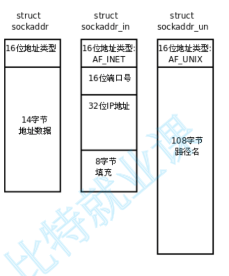

## **概念**

套接字（Socket）是一种用于在计算机之间进行通信的软件组件或接口。它提供了一种标准化的方式，使得应用程序能够通过网络连接进行相互之间的通信。可以理解为一套用于网络通信的系统调用。

套接字有以下几种：

- unix socket: 域间通信，通过文件路径实现同一台设备上不同进程间的通信。

- 网络 socket: ip + port 的方式实现网络通信

- 原始 socket: 用于实现一些网络工具。


## **Socket 接口**


### **创建**

用下面函数可以创建一个 socket 文件。

```cpp
#include <sys/types.h>          /* See NOTES */
#include <sys/socket.h>

// 创建 socket 文件描述符
int socket(int domain, int type, int protocol);
```

- `domain`：指定套接字的协议族，可以是 `AF_INET（IPv4）`、`AF_INET6（IPv6）`、`AF_UNIX`（UNIX域套接字）等。

- `type`：指定套接字的类型，可以是` SOCK_STREAM`（流式套接字，用于TCP协议）、`SOCK_DGRAM`（数据报套接字，用于UDP协议）等。

- `protocol`：指定协议类型，可以是 `IPPROTO_TCP`（TCP协议）、`IPPROTO_UDP`（UDP协议）等。通常设置为0，让系统自动选择合适的协议。

返回值为 socket 的文件描述符。


### **绑定**

在使用 Linux 套接字编程时，创建套接字之后需要将套接字与一个特定的网络地址和端口号绑定 (bind) 起来，这样才能够通过该地址和端口号访问该套接字。


```cpp
#include <sys/types.h>
#include <sys/socket.h>
#include <netinet/in.h>
 
int bind(int sockfd, const struct sockaddr *addr, socklen_t addrlen);
```

- `sockfd`：要绑定的套接字文件描述符。

- `addr`：指向用于绑定的 sockaddr 结构体变量的指针，包含了网络地址和端口号等信息。

不同的网络协议的地址格式并不相同，我们可以通过强转成struct sockaddr确定同一个类型。

<figure markdown="span">
  { width="300" }
</figure>

这里 struct sockaddr 相当于基类，用于指向不同协议族的地址格式。如果机器上有多个网卡，可能会有多个 IP 地址，想让程序接收所有 IP 发来的消息，就要在绑定时将 ip 地址设为 `INADDR_ANY` 或是 `0.0.0.0` ，这样就会接收所有发到指定端口的信息。

- `addrlen`：sockaddr结构体的长度。

On success, zero is returned.  On error, -1 is returned, and errno is set appropriately.

### **UDP 接口**


`UDP`（User Data Protocol，用户数据报协议） 套接字是无连接协议，必须使用 `recvfrom` 函数接收数据，`sendto` 函数发送数据。

- **收数据**

```cpp
#include <sys/types.h>
#include <sys/socket.h>

ssize_t recvfrom(int sockfd, void *buf, size_t len, int flags,
                struct sockaddr *src_addr, socklen_t *addrlen);
```


- `sockfd`：这是已经创建并绑定的套接字的文件描述符。

- `buf`：这是一个指向缓冲区的指针，用于存储接收到的数据。

- `len`：这是缓冲区 buf 的大小，以字节为单位。

- `flags`：这是一些标志位，用于修改 recvfrom 的行为。常见的标志位包括 MSG_PEEK（查看当前数据但不从输入队列中删除）和 MSG_DONTWAIT（非阻塞模式，如果没有数据可读则立即返回错误），设为 0 表示阻塞式等待。

- `src_addr`：这是一个指向 struct sockaddr 的指针，用于存储发送方的地址信息。如果对这个信息不感兴趣，可以设置为 NULL。

- `addrlen`：这是一个指向 socklen_t 的指针，用于存储 src_addr 结构体的实际大小。在调用 recvfrom 之前，你应该将这个值设置为 src_addr 结构体的大小（例如，对于 IPv4 地址，可以使用 sizeof(struct sockaddr_in)）。


- **发数据**

```cpp
#include <sys/types.h>
#include <sys/socket.h>

ssize_t sendto(int sockfd, const void *buf, size_t len, int flags,
                const struct sockaddr *dest_addr, socklen_t addrlen);
```

- `sockfd`：已经创建好的socket文件描述符。  
- `buf`：指向要发送数据的缓冲区。  
- `len`：要发送的数据的长度。  
- `flags`：发送时使用的标记，通常设置为0。  
- `dest_addr`：指向要发送数据的网络地址的结构体指针（如`struct sockaddr_in`）。  
- `addrlen`：`dest_addr`结构体的长度。


??? code "echo server by UDP"
    分文件编写，makefile 构建，实现用户端输入什么，服务端返回什么。
    === "udpServe.cpp"

        ```cpp
        #include <string>
        #include <sys/types.h>
        #include <sys/socket.h>
        #include <netinet/in.h>
        #include <arpa/inet.h>
        #include <strings.h>    // for bzero()
        #include <iostream>
        #include <sys/types.h>
        #include <unistd.h>

        class udp_server
        {
            std::string _ip;
            uint16_t _port;
            int _socketfd;
        public:
            udp_server(std::string ip,uint16_t port)
                :_ip(ip)
                ,_port(port)
            {
                // 创建套接字文件
                _socketfd = socket(AF_INET,SOCK_DGRAM,0);
                if(_socketfd < 0)
                {
                    std::cerr << "Socket build failed." << std::endl;
                    exit(0);
                }

                // 绑定 ip + port
                sockaddr_in local;
                bzero(&local,sizeof(local)); // memset()
                local.sin_family = AF_INET;
                local.sin_port = htons(_port);
                local.sin_addr.s_addr = inet_addr(_ip.c_str());

                int ret = ::bind(_socketfd,(sockaddr*)&local,sizeof(local)); 
                if(ret != 0)
                {
                    std::cerr << "Socket bind failed." << std::endl;
                    exit(0);
                }
            }

            void start()
            {
                char buffer[1024];
                for(;;)
                {
                    sockaddr_in sender;
                    socklen_t len = sizeof(sender);
                    ssize_t n = recvfrom(_socketfd,buffer,sizeof(buffer) - 1,0,(sockaddr*)&sender,&len);
                    if(n > 0)
                    {
                        buffer[n] = 0;
                        std::cout << "client say #" << buffer << std::endl;
                        // 原样发回去
                        sendto(_socketfd,buffer,n,0,(sockaddr*)&sender,len);
                    }
                }
            }
        };


        int main(int argc,char* argv[])
        {
            // 服务端的 ip 和端口
            std::string ip(argv[1]);
            uint16_t port = atoi(argv[2]);
            udp_server server(ip,port);
            server.start();
            return 0;
        }
        ```
    
    === "client.cpp"

        ```cpp
        #include <sys/types.h>     
        #include <sys/socket.h>
        #include <netinet/in.h>
        #include <arpa/inet.h>
        #include <iostream>
        #include <strings.h> // for bezero
        #include <string>

        int main(int argc,char* argv[])
        {
            // 服务端的 ip 和端口
            std::string ip(argv[1]);
            uint16_t port = atoi(argv[2]);
            
            // 选择 UDP 协议
            int sockfd = socket(AF_INET,SOCK_DGRAM,IPPROTO_UDP);
            if(sockfd < 0)
            {
                std::cerr << "Socket build failed." << std::endl;
                exit(0);
            }

            /**
             *  用户端的 Socket 也要绑定（bind）ip 和 port，但是不需要我们显示绑定
             *  要 OS 自动分配端口给我们的进程
             *  这是因为我们 OS 中会有很多进程，用户自己分配端口的话很容易遇到端口被占用的问题
             *  在我们第一次向 服务器 发送信息时， OS 会为我们自动分配一个空闲端口。
            */
            std::string msg;
            sockaddr_in recver;
            bzero(&recver,sizeof(recver));
            recver.sin_family = AF_INET;
            recver.sin_addr.s_addr = inet_addr(ip.c_str());
            recver.sin_port = htons(port);
            socklen_t len = sizeof(recver);
            char buffer[1024];
            for(;;)
            {
                std::cout << "Please say somthing#";
                std::cin >> msg;
                ssize_t n = sendto(sockfd,msg.c_str(),msg.size(),0,(sockaddr*)&recver,len);
                if(n > 0)
                {
                    // UDP 是一种全双工的通信方式
                    int ret_n = recvfrom(sockfd,buffer,sizeof(buffer) - 1,0,(sockaddr*)&recver,&len);
                    if(ret_n > 0)
                    {
                        buffer[n] = 0;
                        std::cout << "Server return#" << buffer << std::endl;
                    }
                }
            }


            return 0;
        }
        ```
    
    === "Makefile"

        ```makefile
        all:server client
        server:udpServe.cpp
            @g++ -o server udpServe.cpp -std=c++11

        client:client.cpp
            @g++ -o client client.cpp -std=c++11

        .PHONY:clear

        clear:
            @rm -rf server client
        ```

### **TCP 接口**

TCP（Transport Control Protocol，传输控制协议） 是一种有连接的可靠传输协议，在做数据交换前要先进行连接。

- **监听**

让执行流监听指定 socket 文件描述符，以接收客户端发起的连接请求。

```cpp
#include <sys/types.h>          /* See NOTES */
#include <sys/socket.h>

int listen(int sockfd, int backlog);
```

- sockfd：需要设置为监听模式的套接字描述符

- backlog：指定等待连接队列的最大长度，即同时能够处理的客户端连接请求的最大数量，超过这个数量的连接请求将被拒绝

- **创建连接**

accept函数用于从处于监听状态的套接字队列中取出一个已经完成了三次握手的连接请求，并创建一个新的套接字用于与客户端进行通信。

```cpp
#include <sys/types.h>          /* See NOTES */
#include <sys/socket.h>

int accept(int sockfd, struct sockaddr *addr, socklen_t *addrlen);
```

- `sockfd`：处于监听状态的套接字描述符

- `addr`：输出型参数，指向一个 sockaddr 结构体的指针，用于存储客户端的地址信息

- `addrlen`：输出型参数，客户端的 addr 结构体的长度，需要在调用前初始化为sizeof(struct sockaddr)

调用成功返回值：返回一个新的套接字描述符，用于与客户端进行通信，这个新的套接字描述符是唯一的，只能用于与这个客户端进行通信。调用失败返回值：失败返回-1，并设置errno变量以指示错误类型。

- **建立连接**

connect函数用于客户端与服务器建立连接，自动帮客户端的套接字与其ip、port进行绑定。

```cpp
#include <sys/types.h>          /* See NOTES */
#include <sys/socket.h>

int connect(int sockfd, const struct sockaddr *addr,
            socklen_t addrlen);
```

- sockfd：需要连接的套接字描述符。

- addr：指向目标地址的指针，包括目标计算机的IP地址和端口号。

- addrlen：addr结构体的长度，需要在调用前初始化为sizeof(struct sockaddr)

调用成功返回值：返回0。调用失败返回值：失败返回-1，并设置errno变量以指示错误类型。