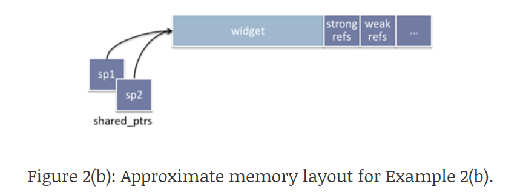

## **关于 `make_shared`**

只有两种情况，我们不能使用 `make_shared`。

1. 如果我们要设置特殊的删除器（deleter），`make_shared` 不支持定制删除器。

2. 如果我们已经有了原始指针，通常是继承自 `unique_ptr`，你就可以直接使用 `shared_ptr` 的构造函数。

其他所有情况，都建议使用 `make_shared`，这因为 `make_shared` 通常更安全高效且简洁可读。简洁可读不必多说。安全高效从何而来？

### **高效**

首先我们要知道，`shared_ptr` 由两部分组成：**原始指针**和**控制块**。

```cpp
// 编译器 gcc 11.4.0 下的源码
element_type*	   _M_ptr;         // Contained pointer.
__shared_count<_Lp>  _M_refcount;    // Reference counter.
```

控制块中是**引用计数**和**弱引用计数**


```cpp
_Atomic_word  _M_use_count;     // #shared
_Atomic_word  _M_weak_count;    // #weak + (#shared != 0)
```

弱引用计数是给 `weak_ptr` 用的，因为 `weak_ptr` 要知道原始指针是否释放，所以在所有 `weak_ptr` 都释放前，控制块不能释放。

知道 `shared_ptr` 后，我们来看 `make_shared` 和 普通构造的区别。普通构造通常要进行两次内存分配（allocate）。

```cpp
std::shared_ptr<Obj> sp1{ new Obj };
```

创建对象一次，创建控制块一次。并且两块地址可能在物理内存上相隔很远：

<figure markdown="span">
  { width="450" }
</figure>

使用元素时通常也会用到引用计数，所以如果物理内存相隔比较远，导致不在一个缓存行上，可能会导致多一次的访存。而使用 `make_shared` 通常是更高效的，因为 `make_shared` 内部会一次为我们创建好 原始指针 和 控制块，二者的空间是连续的：

<figure markdown="span">
  { width="450" }
</figure>

但这也会导致原始指针释放的延迟，因为我们不能释放部分的内存，所以只能等所有的 `weak_ptr` 也都释放后，才能释放整个内存块。

### **安全**

这里的安全主要指的是异常安全，考虑以下述例子：

```cpp
void F(const std::shared_ptr<Lhs> &lhs, const std::shared_ptr<Rhs> &rhs) { /* ... */ }

F(std::shared_ptr<Lhs>(new Lhs("foo")),
  std::shared_ptr<Rhs>(new Rhs("bar")));
```

由于 C++ 允许对子表达式进行任意顺序的求值，因此一种可能的顺序是：

1. `new Lhs("foo")` 
2. `new Rhs("bar")`
3. `std::shared_ptr<Lhs>`
4. `std::shared_ptr<Rhs>`

当 `new Rhs("bar")` 出现异常时，会打断后续 `std::shared_ptr` 的构造，这样会导致 `new Lhs("foo")` 还未交给`std::shared_ptr<Lhs>` 管理，就被跳过了，最终导致内存泄漏。

而 `std::make_shared` 就不会有这样的问题：

```cpp
F(std::make_shared<Lhs>("foo"), std::make_shared<Rhs>("bar"));
```

但自 C++17 以后， `std::shared_ptr` 构造不再会出现这样的问题了，因为 C++17 以后要求，函数的每个参数的表达式必须完整执行完，才可以执行其他参数的表达式。但是这里还是要说，不要显示的调用 `new`!!!不要显示的调用 `new`!!!不要显示的调用 `new`!!!

在构造 `unique_ptr` 时，C++ 标准库提供了 `make_unique`，与 `make_shared` 类似的，只有上述两种情况不能使用 `make_unique`。

`make_unique` 不用考虑内存分配次数的问题，因为没有控制块的存在。但是要考虑异常安全，所以这里依然建议使用 `make_unique`。

## **`shared_ptr` 还是 `unique_ptr`?**

当你不知道要使用 `shared_ptr` 还是 `unique_ptr` 时，建议先使用 `unique_ptr`，原因如下：

- **更灵活**，无论何时，你发现 `unique_ptr` 不能满足你的需求时，你看使用 `std::move` 或 `.release()`，来获得原始指针，去构造一个 `shared_ptr` 或是第三方的智能指针，甚至手动维护这个原始指针（当然这并不推荐）。

- **更高效**，`unique_ptr` 实现是比 `shared_ptr` 更简单的，不用维护控制块，相应的消耗就少。

<hr>

参考：

[智能指针 Made By CYB](https://2418071565.github.io/C%2B%2B/c%2B%2B11/%E6%99%BA%E8%83%BD%E6%8C%87%E9%92%88/){target="_blank"}

[GotW #89 Solution: Smart Pointers](https://herbsutter.com/2013/05/29/gotw-89-solution-smart-pointers/){target="_blank"}

[Difference in make_shared and normal shared_ptr in C++](https://stackoverflow.com/questions/20895648/difference-in-make-shared-and-normal-shared-ptr-in-c){target="_blank"}