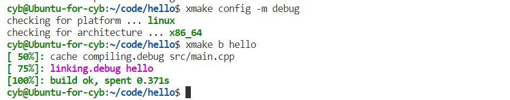
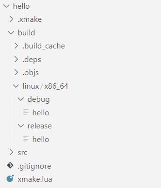
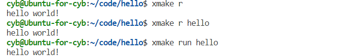

## **简介**

**[官网链接](https://xmake.io/#/zh-cn/){target="_blank"}**

xmake 是一个基于 Lua 的轻量级跨平台构建工具，使用 xmake.lua 维护项目构建，相比 makefile/CMakeLists.txt，配置语法更加简洁直观，对新手非常友好，短时间内就能快速入门，能够让用户把更多的精力集中在实际的项目开发上。

xmake 还有内置的包依赖管理，通过 lua 语言的简单配置，即可实现对 C/C++ 三方库的管理， xmake 还有其自带的官方库 xrepo。

xrepo 是一个基于 Xmake 的跨平台 C/C++ 包管理器。

它基于 xmake 提供的运行时，但却是一个完整独立的包管理程序，相比 vcpkg/homebrew 此类包管理器，xrepo 能够同时提供更多平台和架构的 C/C++ 包。


## **快速使用**


### **创建项目**

```shell
xmake create [项目名] [-l 项目使用的语言] [-P 已有项目路径]
```

我使用 `xmake create hello` 来创建官方为我们准备的示例项目，其项目结构如下：

```
hello
├── src
│   └── hello.cpp
└── xmake.lua
```

这里可以大致看一下 xmake.lua 的内容

=== "hello.cpp"

    ```cpp
    #include <iostream>

    int main(int argc, char** argv) {
        std::cout << "hello world!" << std::endl;
        return 0;
    }
    ```
=== "xmake.lua"

    ```lua
    add_rules("mode.debug", "mode.release") -- 添加调试模式和发行模式

    target("hello")    -- 构建目标
        set_kind("binary")  -- 目标类型
        add_files("src/*.cpp")  -- 构建目标所需源文件
    ```

它规定了一个要构建的目标 "hello" ，以及这个目标的类型和所需源文件。

一个项目中可以有多个 target 目标。目标的种类可以是：可以执行程序 "binary"，静态库 "static"，动态库 "shared"。


### **构建项目**


使用如下命令来构建指定 target，当我们省略 target 时，xmake 会为我们构建所有的 target。 

```shell
xmake build [target_name]
xmake b [target_name]
```

<figure markdown="span">
  { width="850" }
</figure>


这里构建时，是处于 release 模式下，说明 xmake 默认的构建模式就是 release。想要切换为 debug 可以使用以下命令：

```shell
xmake config -m debug
```

<figure markdown="span">
  { width="850" }
</figure>

构建的项目可执行程序会放下如下路径：


  { width="250" }

### **运行程序**

```shell
xmake run [target_name]
xmake r [target_name]
```

与 build 相同的，如果我们省略 target ，他会运行所有的 target。


{ width="550" }

### **清理缓存**

```shell
xmake clean [target_name]
xmake c [target_name]
```

清理对应目标的缓存，注意如果你处于 debug 模式下，只会清理 debug 的缓存，处于 release 同理。