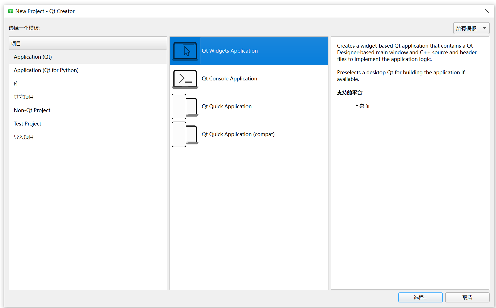
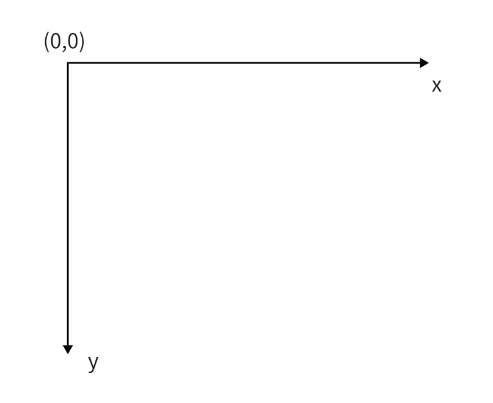
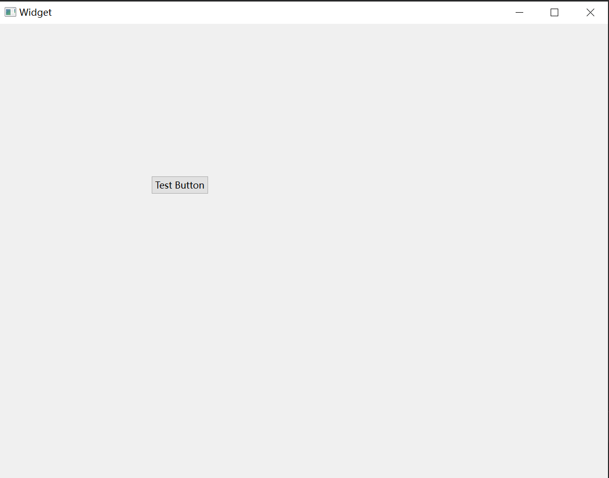

# 初识Qt

## **Qt Creator界面**


## **项目创建**

### **项目模板**

<figure markdown="span">
  { width="800" }
</figure>


|项目模板 | 说明|
|:-:|:-:|
|Application |Qt 应⽤程序，包括普通窗体程序和 QtQuick 程序|
|库|可以创建动态库、静态库以及 Qt Quick 扩展插件、QtCreator ⾃⾝插件|
|||


### **项目路径**


## **对象树**


## **Qt窗口坐标体系**

在计算机中，大多数情况下坐标系都采用左手系：

<figure markdown="span">
  { width="400" }
</figure>

<!-- <div align="center"></div> -->

Qt 中采用代码创建的空间默认会创建在父窗口或父控件的原点位置，我们可以使用控件中的 move() 成员函数来调整其位置，这个位置也时相对与父窗口或父控件的。

```cpp
Widget::Widget(QWidget *parent)
    : QWidget(parent)
    , ui(new Ui::Widget)
{
    ui->setupUi(this);

    P1 = new QPushButton(this);
    P1->move(200,200);
    P1->setText(QString("Test Button"));
}
```

<figure markdown="span">
  { width="500" }
</figure>
<!-- 
<div align="center"></div> -->

