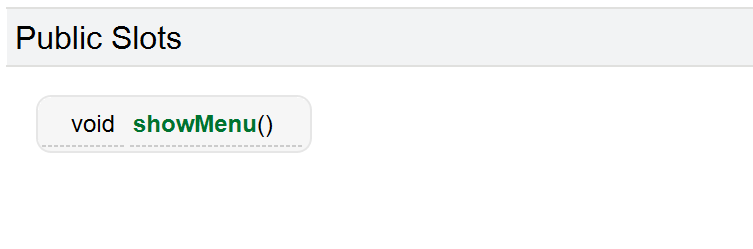
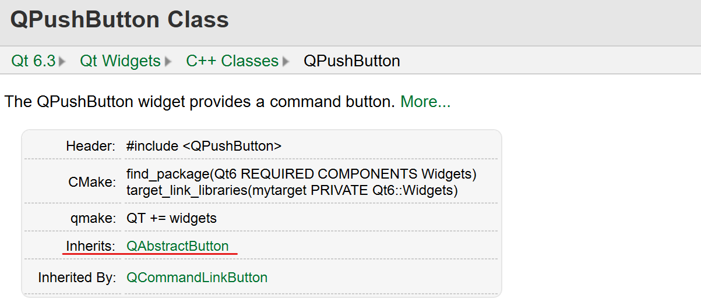
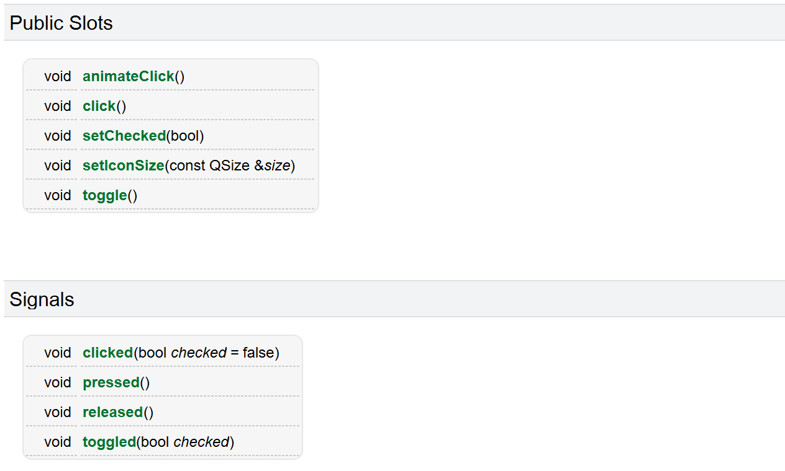

## **概述**

在 Qt 中，用户和控件的一次交互过程被称为一个事件，如用户点击按钮，用户关闭窗口等。每个事件都会产生一个**信号**。并且每个控件都有接收信号的能力，对于每个信号，控件对信号的响应动作被称为**槽**。在 Qt 中槽和信号本质都是一个函数。


## **connect 函数**

我们可以通过 connect 函数将一个信号和一个槽关联起来，每当有控件发出该信号，Qt 就会自动执行关联的槽函数，来对信号进行响应。

### **函数原型**

connect 是 QObject 类中提供的静态成员函数。

> QObject 是 Qt 内置的父类，Qt 中提供的很多类都是直接或间接的继承自 QObject 类的。

下面是  connect 函数原型：

```cpp 
static QMetaObject::Connection connect(
        const QObject *sender, 
        const char *signal, 
        const QObject *receiver, 
        const char *member, 
        Qt::ConnectionType type = Qt::AutoConnection); 
``` 

参数说明：

- sender: 信号发送者
- signal：发送的信号
- receiver：信号接受者
- member：响应信号的槽函数
- type：用于指定关方式，一般不用手动设定

下面我们将一个按钮的 `clicked` 信号与整个窗口的 `close` 槽函数关联到一起，实现点击按钮后关闭窗口的效果。我们以代码实现方式为例，在 Widget 的构造函数加上下面的代码。

```cpp
Widget::Widget(QWidget *parent)
    : QWidget(parent)
    , ui(new Ui::Widget)
{
    ui->setupUi(this);

    QPushButton* P1 = new QPushButton(this);
    P1->setText(QString("P1"));
    P1->move(200,200);

    connect(P1,&QPushButton::clicked,this,&Widget::close);
}
```

但是我们发现了一些问题，传递参数时我们传入的是一个函数指针，观察槽函数和信号函数的函数原型传入的是两个 `void(*)()` 和 `bool(*)()` 的函数指针，但是 connect 函数的参数类型是 `const char*`，在 c++ 中是不允许不同指针类型间的直接赋值的，这里为什么没有报错呢？

这是因为我们这里其实调用的是 connect 的重载函数，我们 `Ctrl + 左键` connect 函数，观察调用的函数原型:

```cpp
template <typename Func1, typename Func2>
static inline QMetaObject::Connection connect(
const typename QtPrivate::FunctionPointer<Func1>::Object *sender, 
                                                    Func1 signal,
const typename QtPrivate::FunctionPointer<Func2>::Object *receiver, 
                                                      Func2 slot,
                                Qt::ConnectionType type = Qt::AutoConnection)
```

这是一个函数模板，使用了 Qt 封装的类型萃取，保证了发出信号的对象类中一定有对应的信号函数，接收信号的对象类中一定有对应的槽函数。这样的 connect 函数有了参数检查的功能，可以避免一些错误。

而想使用上面旧版本的 connect 函数原型，就要使用两个宏 `SIGNAL` 和 `SLOT`，这两个宏可以将函数转化为 `const char*` 类型的指针，书写形式如下：

```cpp
connect(P1,SIGNAL(clicked()),this,SLOT(close()));
```

但是这样书写有些麻烦，我们现在更多使用新版本的 connect 函数。

## **内置信号与槽**

Qt 的大部分控件都有内置的信号和槽，我们通过官方文档查询，我们以 `QPushButton` 为例：

<figure markdown="span">
  { width="600" }
</figure>

我们发现这里只有一个槽函数，没有 `clicked` 信号，这是因为其他信号和槽函数都是从其父类继承而来的，我们点到其父类 `QAbstractButton` 的文档中查看:

<figure markdown="span">
  { width="600" }
</figure>

就可以看到其他的信号与槽函数了。

<figure markdown="span">
  { width="600" }
</figure>


在学习 Qt 的内置信号与槽，遇到没见过的信号与槽都可以通过上述方式来查询文档来了解信号与槽的功能。

## **自定义信号与槽**

### **自定义槽函数**

槽函数其实就是一个普通的成员函数，但是有一定的书写规范：

- 早期的 Qt 版本槽函数必须写在 `[访问限定符] slot:` 下，但是高版本的 Qt 允许槽函数写到类的任何位置。
- 返回值为 void，需要声明，也需要实现。
- 可以有参数，可以发⽣重载。

下面写一个自定义的槽函数，来实现当按钮被点击时，槽函数在控制台输出 `按钮被点击`。

```cpp
// widget.h
class Widget : public QWidget
{
    Q_OBJECT

public:
    Widget(QWidget *parent = nullptr);
    ~Widget();

    void printInfo();
private:
    QPushButton* P1;    // 创建按钮
    Ui::Widget *ui;
};
```

```cpp
// widget.cpp
Widget::Widget(QWidget *parent)
    : QWidget(parent)
    , ui(new Ui::Widget)
{
    ui->setupUi(this);
    // 创建按钮
    P1 = new QPushButton(this);
    P1->setText(QString("P1"));
    P1->move(200,200);
    // 关联函数
    connect(P1,&QPushButton::clicked,this,&Widget::printInfo);
}

void Widget::printInfo()
{
    qDebug() << "按钮被点击\n";
}
```

这样就实现了自定义槽函数，这里先只给出无参的槽函数，后文会介绍有参的槽函数如何实现。

### **自定义信号函数**

信号其实也是一个成员函数，但是它没有定义只有实现，自定义信号时也有一定的书写规范：

- 自定义槽函数必须写到 `signals:` 下。
- 返回值为 void ，只需要声明，不需要定义。
- 可以有参数，也可也发生重载。

自定义的信号需要手动发送，需要 Qt 自定义的关键字 `emit`。在需要发送信号的位置调用 `emit [信号函数];`，来发送信号。事实上 `emit` 是一个空的宏，没有什么意义，只是为了提醒开发人员。

```cpp

```