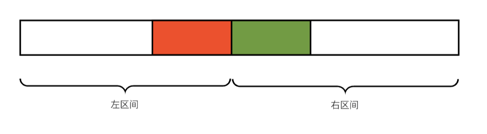

**前置知识：线段树: 熟悉线段树维护区间和操作**

## **问题**

给定一个数组 $a=[a_1,a_2,\dots,a_n]$ ，选出其中的一段连续的非空子数组，使其和最大。

题目连接：[洛谷](https://www.luogu.com.cn/problem/P1115)   [LeetCode](https://leetcode.cn/problems/maximum-subarray/description/)

## **思路**

### **贪心**

贪心思路很容易理解，我们从第一个元素开始，依次累加，记累加值为 $sum$ ，如果累加到一个元素时 $sum < 0$ 了，那么当前的子数组对后续子数组的贡献是负的，那我们何不舍弃掉前面这段子数组，重新开始一段子数组，这样至少不会拖累后面的元素。

如此重复这个过程，每当 $sum < 0$ 就更新 $sum = 0$，并在这个过程中记录最大值即可。

```cpp
class Solution {
public:
    int maxSubArray(vector<int>& nums) {
        int res = INT_MIN;
        int sum = 0;
        for(int i = 0;i < nums.size();i++)
        {
            if(sum < 0)
                sum = 0;
            sum += nums[i];
            if(res < sum)
                res = sum;
        }
        return res;
    }
};
```
时间复杂度为 $O(n)$

### **分治**

我们将每个区间划分为左右两段，以 $m =\left \lfloor \frac{l+r}{2} \right \rfloor $ 为界，分为 $[l,m],[m + 1,r]$ 两段。

那么我当前这个大区间的最大子段和可能值就是：

- 左区间的最大字段和
- 右区间的最大字段和
- 横跨两个区间的最大子段和

我可以想想这三个值可以如何通过子区间得到。对于左右区间的最大子段和，我们要维护的就是区间最大子段和，这不就是小区间的答案吗，在递归合并答案时将子区间的答案返回即可。

对于横跨两个区间的最大子段和，有什么性质呢？

<figure markdown="span">
  { width="=500" }
</figure>

<!-- <div align="center"></div> -->

它一定是由左区间的包含右端点的最大子段和加上右区间的包含左端点的最大子段和。

那么我们在递归求解子问题的过程中就要同时维护一个区间包含左端点的最大子段和 $ls$ 和包含右端点的最大子段和 $rs$。

在维护 $ls$ 时，大区间的 $ls$ 有两种情况，要么就是左区间的 $ls$ ，要么是左区间整体 + 右区间的 $ls$，二者取大即可。 $rs$ 同理。所以我们要额外维护一个区间和 $sum$ ，用来维护 $lr$ 和 $rs$。

所以要维护就是下面四个变量：

- 包含左端点的最大子段和 $ls$
- 包含右端点的最大子段和 $rs$
- 区间最大子段和 $ms$
- 区间和 $sum$

这样计算一个区间的最大子段和，就是在上面所说的三种情况中取最大即可：

$$
ms = \max{}(r.ms\space ,l.ms\space ,r.ls + l.rs)
$$


```cpp
class Solution {
public:
    int maxSubArray(vector<int>& nums) {
        function<tuple<int,int,int,int>(int,int)> dfs = [&](int l,int r)
        {
            // 到叶子节点就直接返回
            if(l == r)
                return make_tuple(nums[l],nums[l],nums[l],nums[l]);

            int m = (l + r) >> 1;
            // 左子区间
            auto [l_ms,l_ls,l_rs,l_sum] = dfs(l,m);
            // 右子区间
            auto [r_ms,r_ls,r_rs,r_sum] = dfs(m + 1,r);

            // 计算当前区间的ms ，ls ,rs , sum
            int ms = max(max(l_ms,r_ms),l_rs + r_ls);
            int ls = max(l_ls,l_sum + r_ls);
            int rs = max(r_rs,r_sum + l_rs);
            int sum = l_sum + r_sum;
            return make_tuple(ms,ls,rs,sum);
        };
        auto [ms,ls,rs,sum] = dfs(0,nums.size() - 1);
        return ms;
    }
};
```
这里分治递归的过程相当于遍历一棵 高度为 $\log{n}$ 的满二叉树，节点个数为 $\sum_{i=1}^{\log{n}}2^{i - 1}$ ，算出最多是 $n-1$ 个节点，所以最后时间复杂度就是 $O(n)$。

熟悉线段树的同学，这里应该就已经看出来了，这个 $dfs$ 函数和线段树建树的过程类似。

## **问题变形**

题目连接：[GSS1](https://www.luogu.com.cn/problem/SP1043)


给定长度为 $n$ 的序列 $a_1, a_2,\cdots,a_n$。现在有 $m$ 次询问操作，每次给定 $l_i,r_i$，查询 $[l_i,r_i]$ 区间内的最大子段和。


### **线段树**

上面分治的思路其实就是线段树建树的过程，因为上面问题没有修改，也不会查询数组子区间的最大子段和，所以建完树直接返回根节点(整个区间)记录的答案即可。

这里查询子数组最大子段和是一个区间合并的过程，就是将线段树上所有在查询区间的节点合并到最终答案中。对节点重载 $+$ 运算，来实现区间和并，会方便很多。区间和并时对数据维护的方法同上文的分治法。


```cpp
struct	S
{
	int l, r;   // 区间左右端点
        // 含义同上文介绍
	ll sum;     
	ll ls,rs,ms;
} f[MAX << 2];
S operator+(const S& a,const S& b)
{
    // 区间和并，与分治法合并区间相同
    S res;
    res.sum = a.sum + b.sum;
    res.ls = max(a.ls,a.sum + b.ls);
    res.rs = max(b.rs,b.sum + a.rs);
    res.ms = max(a.rs + b.ls,max(a.ms,b.ms));
    res.l = a.l;
    res.r = b.r;
    return res;
}
```

因为重载了 $+$ 操作，之后的建树和查询就和维护区间和很类似了。


----------

参考文章：<br>

[线段树与区间最大子段和问题](https://blog.csdn.net/m0_51156601/article/details/124014996)

